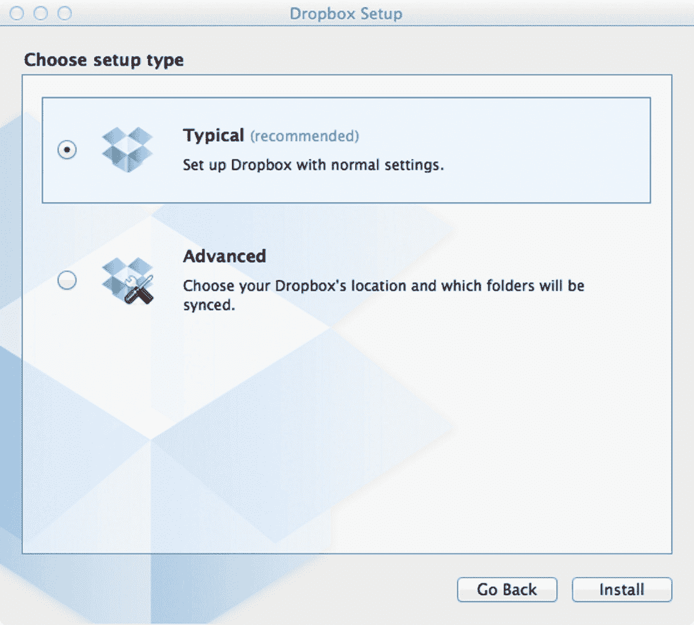
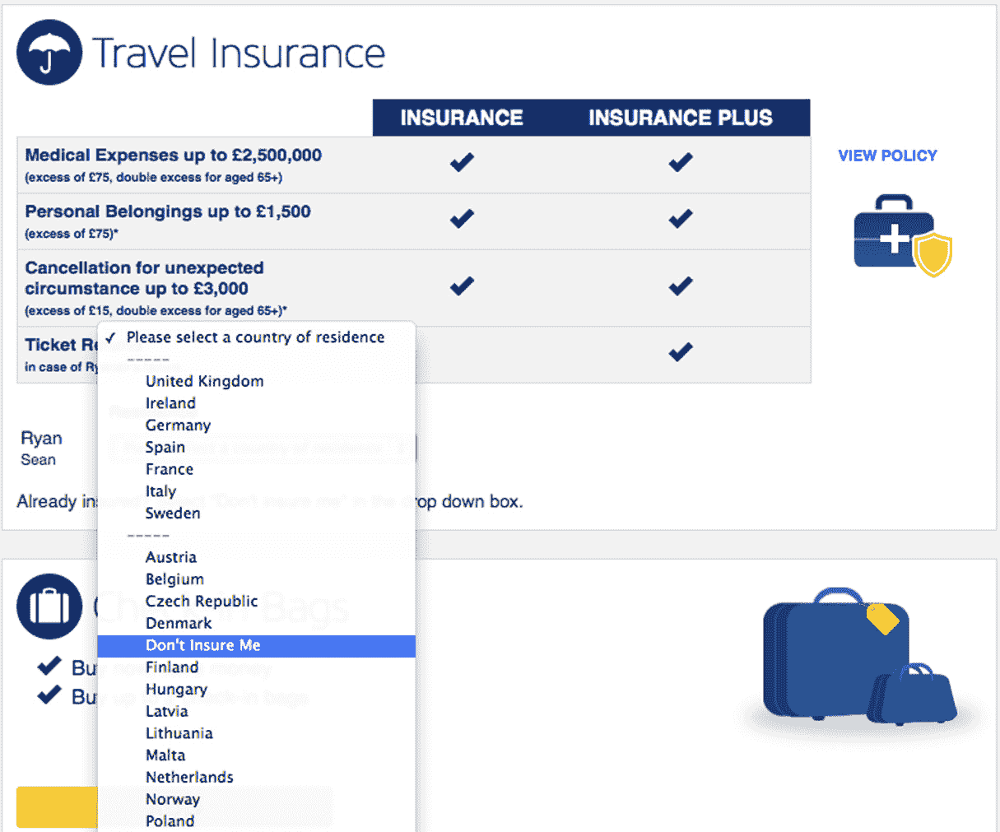
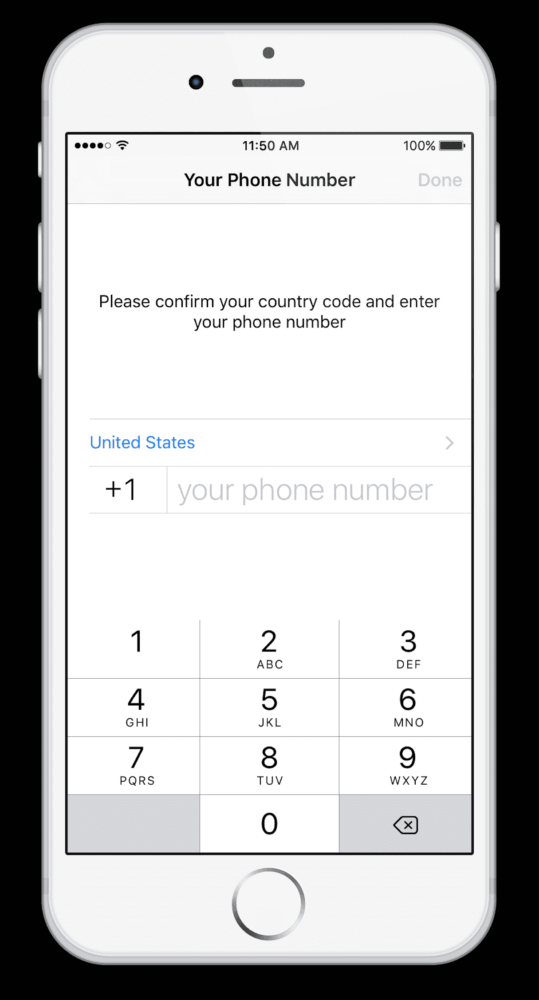
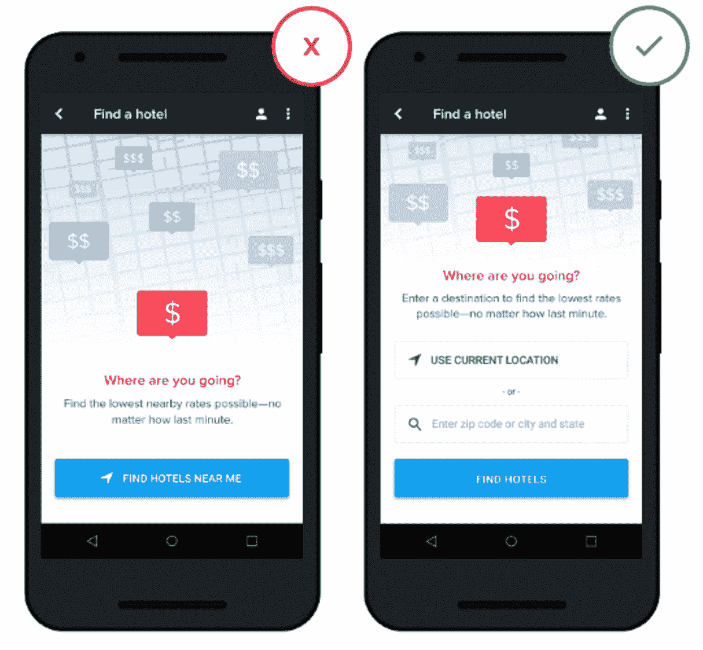

# 如何使用智能默认值来减少认知负荷—用户体验

> 原文：<https://www.shopify.com/partners/blog/cognitive-load?utm_source=wanqu.co&utm_campaign=Wanqu+Daily&utm_medium=website>

如果你问 UX 设计师他们工作的目标，他们可能会告诉你目标是让用户的生活变得简单。当 UX 的设计师在设计一个产品时，他们会尽最大努力去创造一些东西，给用户提供一条最直接的途径去达到他们想要的结果。虽然这个目标听起来很简单，但在现实生活中，有很多障碍阻止用户实现它。

其中一个障碍是任何阻止用户并让他们思考如何继续的东西。史蒂夫·克鲁格有句名言，“不要让我思考”，如果你想遵循他的建议，你需要专注于减少认知负荷。一种方法是使用智能默认值。

**你可能也喜欢:** [无摩擦体验:如何创造顺畅的用户流](https://www.shopify.com/partners/blog/user-flow)。

## 什么是认知负荷？

认知负荷是影响用户完成任务效率的特征。在 UX 设计中，认知负荷表示使用产品所需的心理处理能力。

当我们在计算机的背景下思考时，处理能力的概念就变得清晰了。大多数用户都知道，同时运行太多的程序会降低速度，甚至使计算机系统崩溃，这就是为什么我们通常在不使用程序时关闭它们。当一台计算机显然不能满足我们的需求时，我们就把它升级到一台更强大的机器。

与计算机类似，我们的大脑处理能力有限。但不幸的是，没有简单的方法来提高人脑的实际处理能力。这就是为什么当我们被要求过多考虑如何使用一个产品(高认知负荷)时，我们经常简单地完全放弃这个任务或产品。

产品设计师试图。虽然有很多技术可以让设计者实现这个目标，但为了本文的目的，我们将重点关注其中一种技术:智能默认。

## 引入默认值的概念

当用户执行一项任务时，他们需要回答一系列关于如何执行的问题。问题的数量和认知负荷之间有直接的联系——他们需要问的问题越多，认知负荷就越高。

默认值是现成的值或设置。默认设置促进了认知上的放松——通过减轻用户的选择负担，它们可以帮助消除完成任务过程中的摩擦。

违约有多种形式。最常见的是“一刀切”的静态默认设置。。大多数用户都熟悉安装向导中的通用默认设置。

Dropbox sets the ‘Typical’ option as default when users configure their product.

还有智能默认——智能猜测用户可能会选择什么。智能默认是定制的默认——应用程序使用用户提供的数据来准确猜测他们的响应。

## 违约的基本规则

为了以一种真正有效的方式使用默认值，你需要遵循一条重要的规则，确保你是在帮助用户，而不是阻碍他们。这条规则是，如果需要明确的选择，总是将默认设置为大多数用户(比如说 95%)会选择的选项。

要想出相关的默认值，产品创建者需要了解用户的能力以及他们将使用产品的环境。只有当产品团队花费足够的时间进行用户研究和测试，从用户那里学习，并根据用户的历史数据和使用模式调整默认值时，这才是可能的。

**你可能也喜欢:** [为下一个十亿用户设计](https://www.shopify.com/partners/blog/next-billion-users)。

## 在表单中使用预填充字段

表单是用户界面中使用默认值的首选。填写表格从来都不是一件有趣的事情，尤其是当表格很长的时候。要求用户提供大量数据可能是他们去其他地方的一个强有力的理由，那里的过程更容易。

这就是为什么在表单中使用预先填充的字段对于提高转化率至关重要。无论是创建一个帐户，进行一次购买，还是加入一个电子邮件列表，你的用户的转换体验都应该尽可能无缝。

默认值对表单完成有很大的影响，因为它们减少了用户必须做的工作量。通过提供好的缺省值，你可以让用户免去选择所有相关选项的麻烦。

让我们定义一些在表单中使用默认值的基本规则。

### 利用你对用户的了解

应用程序和在线服务拥有大量用户数据。使用这些数据来创造更好的用户体验至关重要。

例如，假设您正在重新设计一个在线银行应用程序中的汇款表单。用户将使用该表单向他们的朋友和家人汇款。您最初的想法可能是将“金额”字段留空，以便用户可以键入正确的金额。

但是，如果您在默认的上下文中考虑这个元素，您可能会遵循不同的方法。您可能有用户的交易历史，因此您可以根据以前输入的金额建议一个合适的值。

### 不要要求用户已经提供的数据

向用户索要他们过去已经提供的数据是 UX 设计中最常见(也是最可怕)的错误之一。如果很明显数据可以在用户界面的多个地方使用，设计师应该抓住机会这样做。

这比让他们从头开始重新输入所有数据要好得多。记住，工作越少越好。

**你可能还喜欢:** [用户体验设计的七宗罪](https://www.shopify.com/partners/blog/the-seven-deadly-sins-of-user-experience-design)。

### 对于需要用户注意的输入字段，不要使用默认值

当人们与数字产品互动时，他们不是阅读，而是浏览。人们快速浏览表单，不会花时间去分析所有的选项。因此，当您用数据预填充字段时，用户通常会跳过它，以为问题已经有了答案。

然而，如果这是一个重要的问题，这可能并不理想。这里最糟糕的事情是，问题本身可能不会在用户心中注册，如果错误的信息预载在字段中，这可能是糟糕的..键入答案或选择一个值的行为迫使用户阅读并思考这个问题。

### 不要为了自己的利益而预先填充控件

为了自己的利益而不是用户的利益预填充控件通常会适得其反。例如，用户很少喜欢在填写注册表格时自动订阅促销信息——这也违反了 [GDPR 合规指南](https://ec.europa.eu/commission/priorities/justice-and-fundamental-rights/data-protection/2018-reform-eu-data-protection-rules_en)。

When you continuously pick the option that benefits you, not your user, as the default, you'll lose credibility. It's better to use defaults that maximize your users' welfare.

默认设置也为所谓的“黑暗模式”提供了机会黑暗模式被用来提高转化率，但这种技术通常会产生可怕的 UX，尤其是当用户注意到应用程序或网站试图欺骗他们时。瑞安航空公司就是一个例子，它提供一些欧洲最便宜的航班，但一直试图让用户购买保险。

When you would book a flight with Ryanair, the company offers flight insurance, but hides the option to decline it. Users have to scroll the list to find the ‘Don’t insure me’ option, which is hidden between Denmark and Finland.

### 避免对敏感或政治敏感的字段使用默认值

您应该避免在答案可能敏感或带有政治色彩的地方提供默认值，例如性别或公民身份。用数据预先填充这样的字段很容易让用户不舒服或生气。

### 在表单中使用默认值

虽然您应该认识到使用默认值不合适的情况，但在表单的某些地方，默认值几乎总是有助于用户。下面是一些例子。

#### 重用付款详细信息

添加支付细节可能不是最复杂的任务，但仍然需要用户付出一些努力。用户不喜欢每次使用服务时都需要提供支付细节。

当今市场上的许多服务都知道重用支付细节的重要性。一个这样的服务是 UberEats。UberEats 知道，如果他们的用户在结账流程中保存支付细节，他们将获得更多成功的重复交易。该服务通过将最后使用的卡作为任何未来交易的默认支付选项，简化了保存支付细节的行为。

#### 基于用户地理位置数据的预选字段

这种类型的违约与在线商务世界尤其相关。应用程序或网站可以尝试根据用户的位置给出智能建议，而不是让用户提供关于她/他的地址的信息。

一个很好的例子是 Skyscanner。如果用户正在查找航班，Skyscanner 会将始发机场设置为离用户位置最近的机场。

Skyscanner uses the user’s location to autofill the ‘From’ field. It’s likely users will start their journey from the airport nearest to their current location.

同样，如果你问的是电话号码之类的问题，你应该根据用户的位置推荐一个默认的电话分机。通过遵循这一规则，WhatsApp 使输入电话号码的过程变得非常简单。默认情况下，国家/地区代码是根据位置服务预先填写的。

WhatsApp tries to predict the country code field, while allowing users to modify it if they want to.

#### 捐赠表格中的建议值

。这种默认值的一个典型例子是捐赠接口。当用户看到捐款表单上有一个金额的空白字段时，大多数人都不确定他们想捐多少钱。通过提供默认值，可以让用户更轻松地完成任务。例如，迈克尔·J·福克斯基金会为常见的捐赠值提供了一系列按钮选择，并且它有一个预先选择的默认值。如果需要，该表单允许用户设置另一个金额。

Many people don’t know what a typical and appropriate donation looks like. By providing some representative suggestions, designers can guide the user into donating a worthwhile amount. Image: [michaeljfox](https://www.michaeljfox.org/get-involved/donation2.php).

#### 搜索结果的自动完成

默认值与自动完成功能相结合，不仅可以显著加快用户的操作速度，还可以为想要探索某个主题的用户提供提示或指导。Twitter 就是一个很好的例子，它通过在搜索结果中放置建议的搜索短语和匹配个人资料的链接来加快速度，因此用户可以直接进入所需的个人资料。

Twitter uses autocomplete to provide suggested results.

## 应用程序和 web 服务中的默认设置

设计师和开发人员知道让产品开箱后完美地为用户服务是多么重要。默认设置在这个过程中起着至关重要的作用，可以说是产品创建者做出的最重要的决定之一。

当产品创建者选择好的默认设置时，用户会惊喜地发现产品的易用性。但是当产品开发人员选择糟糕的默认设置时，他们会看到很多对产品的抱怨。

**您可能还喜欢:** [使用 CSS 动画来引导更好的电子商务体验](https://www.shopify.com/partners/blog/css-animation)。

### 请记住，默认效果是类似法律的

哈佛大学的一项研究发现，当提供一个默认选择时，大多数人不会偏离它。在他的文章[中，用户会改变他们的设置吗？Jared Spool 说，根据他的观察，只有不到 5%的用户会改变默认设置。](https://www.uie.com/brainsparks/2011/09/14/do-users-change-their-settings/)

这有两个原因。首先，做出一个明确的决定需要努力——要改变一个特定的设置，用户需要弄清楚这个设置到底意味着什么。搞清楚这一点需要用户通常不愿意花费的额外时间。一般来说，人们更喜欢走[阻力最小](http://www.nyu.edu/classes/bkg/objects/inertia.pdf)的路。

此外，一些用户害怕改变，尤其是当他们不确定一个设置如何影响产品的功能时。用户通常会认为默认设置是最佳选择。他们认为产品设计师心中有他们的最佳利益。

因为人们可能会保留默认选项，所以设计师必须确保默认选项符合大多数用户的目标。默认设置应该适合尽可能多的人。因此，设计师必须做到以下几点:

*   进行调查，了解人们如何使用你的产品。不要只是假设用户需要什么——相反，找出如何最好地实现他们的目标，并围绕这个目标建立你的默认设置。
*   将所有关键设置设置为最安全(和最有用)的值。例如，文本编辑器中的自动保存等功能应该默认打开。

### 让用户可以轻松更改默认设置

即使你做了一个很好的、经过充分研究的默认设置，总有一些用户想要别的东西的可能性。当用户想要改变设置时，产品应该允许他们轻松地去做。例如，您的应用程序可能会基于定位服务自动检测位置，但它也应该允许用户在需要时更改它。

As mentioned above, auto-detection of location can save users time. However, there are times when users need to select a different location. Image credit: Google.

### 提供恢复默认设置的选项

Jakob Nielsen 的 [10 用户界面设计可用性启发法](https://www.nngroup.com/articles/ten-usability-heuristics/)之一是，用户经常错误地选择系统功能，需要一个清晰的“紧急出口”来离开不想要的状态。

这就是为什么设计良好的用户界面支持撤销和重做选项。该界面应支持一个“恢复默认值”选项，这使得它很容易从自定义设置回到默认设置。该选项将允许用户进行实验，而不必担心破坏系统。

Google Chrome allows users to restore settings to the original defaults.

## 使用默认值构建可用性

乍一看，默认是 UI 的一个看似微妙的元素。作为用户，我们往往不会注意到他们。但是这些小东西蕴含着巨大的力量。它们可以加速产品的使用，甚至影响我们的行为。所以在设计产品的时候。

你认为哪些默认值最重要？在下面的评论中告诉我们吧！