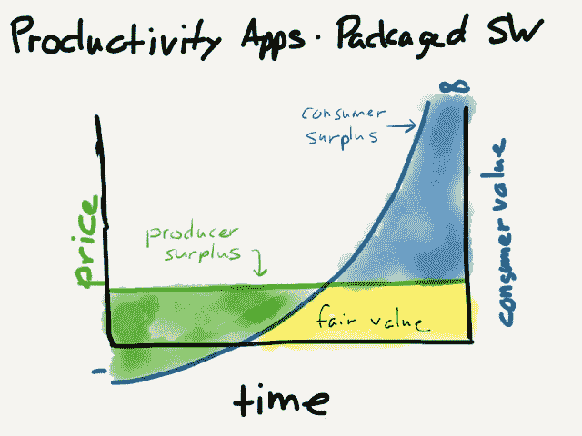
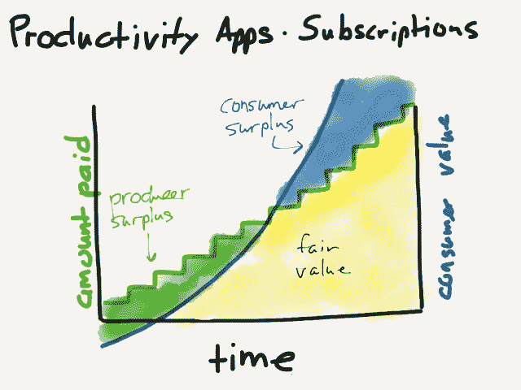

# Adobe 的订阅模式&为什么平台所有者应该关注——本·汤普森的策略

> 原文：<https://stratechery.com/2013/adobes-subscription-model-why-platform-owners-should-care/?utm_source=wanqu.co&utm_campaign=Wanqu+Daily&utm_medium=website>

很难夸大 Adobe 宣布其所有产品将通过 Creative Cloud 独家销售的重要性。例如，你再也买不到永远属于你的套装 Photoshop 了。相反，你可以订阅不同的个人应用程序或套件。有趣的是，虽然公司总是推出新的*产品*,但这是 Photoshop 的第 20 个版本！–他们很少提出新的商业模式。

这一举动有几个明显的原因:

*   更平稳的收入流比发布驱动的峰值更可取(问问苹果就知道了！)
*   这将大大减少盗版行为(尽管这可能会产生意想不到的后果)
*   正如向现有客户销售比获得新客户更容易一样，确保现有用户不退订也更容易

然而，还有几个更大的图片因素在起作用。

#### 矮胖子的电脑

正如我昨天提到的，我们雇佣电脑来做的工作越来越多地由专用设备来完成。如果 Adobe 想要在一个用户每天与多达五种不同设备进行交互的世界中发挥作用，那么每种设备的许可模式显然是不可持续的。

进入 SaaS 模式。用户可以在任意数量的设备上使用 Adobe 产品。最终，这是一个明显且必要的转变，这是对 Adobe 的褒奖。(更新:只能在两台 PC 上使用应用，平板电脑应用还是要付费的。还是比现在好，但是“kudos”大概应该是单数——[Kudo](https://twitter.com/whshep/status/332593217562370048 "Not a word!")？)

即便如此，他们的积极态度——不会再有打包软件了——似乎令人惊讶，但事实是 Adobe 可能对他们的新模式感到兴奋。

#### 生产力货币化的问题

生产力应用从来都不适合打包软件模式。

原因与所谓的经济过剩有关。来自[维基百科](http://en.wikipedia.org/wiki/Economic_surplus):

> 经济剩余是指两个相关的量。消费者剩余是消费者获得的货币收益，因为他们能够以低于他们愿意支付的最高价格购买产品。生产者剩余是指生产者通过以高于他们愿意出售的最低价格的市场价格出售而获益的数量。

我已经举例说明了打包软件的情况:

Productivity apps sold as packaged software have a lot of surplus

想象一下这在 Photoshop 中的表现:

*   消费者 A 很少编辑照片，这意味着一个照片编辑应用对他来说可能值 20 美元。然而，他还是花了 499 美元买了 Photoshop。在这种情况下，Adobe 实际上多收了 479 美元。消费者受到了不公平的待遇。
*   消费者 B 是一名平面设计师。她每天都用 Photoshop，一天用几个小时。没有 Photoshop，*她无法完成她的工作*，她的年薪是 6 万美元。在这种情况下，消费者剩余为 59，501 美元。Adobe 正在做一笔糟糕的交易。
*   消费者 C 是学生。他渴望成为一名摄影师，但这才刚刚开始。他买了 Photoshop，但发现很难使用；事实上，他正在浪费时间试图解决这个问题。然而，随着时间的推移，他变得熟练，最终成为专家。经济盈余从生产者转移到消费者，尽管没有交易。

你如何给产品定价才能最好地利用这三种截然不同的消费者？如果你定价太高，你可能永远不会收购消费者 A 或 C(而消费者 C 是一个大损失)。如果你定价太低，你实际上是在补贴你的消费者，这可能会让他们感到温暖和模糊，但不是你的股东。

#### 为什么订阅更好

对于用户和 Adobe 来说，转向订阅极大地改善了这种模式。

The subscription model more closely matches revenue with value, meaning less surplus.

再次考虑我在上面列出的三种类型的消费者:

*   消费者 A. [2](#fn2-306 "To be fair, it’s <a href="http://www.adobe.com/products/photoshop/buying-guide.html">significantly cheaper</a> to pay annually, which defeats some of the advantages") 他可以“试用”Photoshop，如果他最终没有使用它，他可以简单地终止订阅。更重要的是，将会有更多的消费者 As，其中一些将会继续订阅。 [3](#fn3-306 "A lot of Consumer As buy a version of Photoshop and hold onto it for years. They are understandably upset by this change, but the truth is Adobe probably doesn’t mind losing them, given the other benefits of subscriptions")
*   消费者 B 将立即获得大量收益，但随着她在整个职业生涯中使用 Photoshop，Adobe 将会顺其自然，每月而不是每隔几年获得收入。
*   消费者 C 和 A 差不多:Photoshop 会平易近人很多，顾客 C 也会多很多。当他们成为真正的用户时，Adobe 也会随之改变。

此外，Adobe 有很好的动机来维护应用程序以减少流失，用户总是拥有最新的版本。这真的是双赢。 [4](#fn4-306 "So why did Adobe wait so long? Truthfully, the technology just wasn’t there until the past few years")

#### 思考应用

几乎所有生产力应用程序都面临着 Adobe 面临的挑战。

*   生产力应用对一些用户来说是不可或缺的(因此也是无价的)
*   生产力应用程序通常有很高的学习曲线
*   出色的生产力应用需要大量的前期投资
*   生产力应用需要定期维护和升级

不幸的是，应用商店经济学在这里并不真正起作用。

*   如果你的价格很低，你需要大量的产品来弥补前期成本
*   如果你的价格很高，用户就不太可能购买你的应用，特别是因为可能有一个学习曲线
*   如果你不能随着时间的推移赚钱，你的用户提取的价值比你获得的收入要多得多。如果你是一个用户，这很好，直到你喜欢的公司因为赚不到钱而卖掉。麻雀是典型的例子。有多少麻雀爱好者会乐意每月支付 5 美元来获得该应用程序并不断更新？

试用确实减轻了一点痛苦，特别是如果你追求高价格的选择，但它们没有解决时间不匹配的问题:随着生产力应用程序变得更有价值，开发者没有获得更多的收入。

#### 为什么平台所有者应该关心

在很大程度上，我倾向于对开发者抱怨应用商店政策充耳不闻。iOS，Android，Windows Phone 等的用途。难道*不是*为了让开发者的日子好过；分别是苹果、和微软，以吸引用户为目的。采用对开发者友好的策略只有在吸引更多用户的程度上才有意义，而开发者想要的大部分都不符合条件。

这是个例外。平台所有者应该增加对生产力应用的订阅支持。 [6](#fn6-306 "Apps can obviously implement this on their own on the server, but that’s impractical for many small shops that specialize in these types of apps. I’m talking about full-blown app store support.")

让生产力应用程序赚钱如此棘手的是，它们对一些消费者来说是不可或缺的，但对另一些消费者来说却是势不可挡的。然而，对平台所有者来说，这是不可或缺的一部分。如果用户开始依赖仅在一个平台上可用的某些生产力应用程序，并且一般来说，移动生产力应用程序更有可能是一夫一妻制的，那么该用户实际上被绑定到该平台，并且在升级时甚至不会考虑另一个平台。

智能手机的增长机会越来越多地出现在旧智能手机用户身上(相对于新智能手机用户)。留住这些用户应该是每个平台的首要任务，最好的方法之一是完全支持生产力应用的订阅模式。这将使他们更加成功，从而更具粘性，最终有利于平台的长期利益。

### *相关*