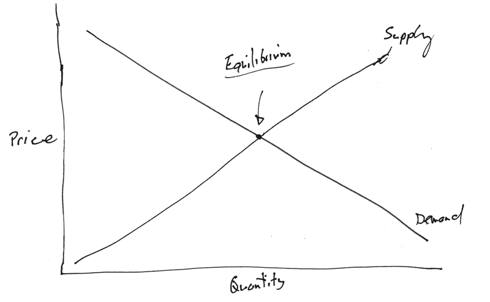

# 没有足够的人关注这一经济趋势|比尔盖茨

> 原文：<https://www.gatesnotes.com/Books/Capitalism-Without-Capital?utm_source=wanqu.co&utm_campaign=Wanqu+Daily&utm_medium=website>

到了我在哈佛大学第一年的第二学期，我开始去上我没有报名的课，并且几乎不再去上我报名参加的任何一门课——除了一门叫做“Ec 10”的经济学导论课我被这门学科迷住了，教授非常出色。他教给我们的第一件事就是供求图。当我在大学的时候(这比我愿意承认的时间要长)，全球经济基本上是这样运转的:

根据这张图表，你可以做出两个假设。第一个在今天仍然或多或少是正确的:随着对一种产品的需求增加，供应增加，价格下降。如果价格过高，需求就会下降。两条线相交的最佳点称为平衡。均衡是神奇的，因为它最大化了对社会的价值。商品价格实惠，数量充足，利润丰厚。每个人都赢了。

这张图表的第二个假设是生产的总成本随着供给的增加而增加。想象一下福特公司发布了一款新型汽车。第一辆车的制造成本要高一些，因为你必须花钱设计和测试它。但是之后的每辆车都需要一定的材料和劳动力。你制造的第十辆车和第 1000 辆车的制造成本是一样的。20 世纪大部分时间里主导世界经济的其他事物也是如此，包括农产品和房地产。

软件不是这样的。微软可能会花很多钱来开发一个新程序的第一个单元，但之后的每个单元实际上都是免费生产的。与过去推动我们经济发展的商品不同，软件是一种无形资产。软件并不是唯一的例子:数据、保险、电子书，甚至电影都以类似的方式工作。

世界经济中不符合旧模式的部分越来越大。这对于从税法到经济政策到哪个城市繁荣哪个城市落后的一切都有重大影响，但总的来说，管理经济的规则没有跟上。这是全球经济中没有得到足够重视的最大趋势之一。

如果你想理解为什么这很重要，乔纳森·哈斯克尔和斯蒂安·韦斯特莱克的精彩新书《没有资本的资本主义》是我所见过的最好的解释。他们首先将无形资产定义为“你不能触摸的东西”这听起来显而易见，但这是一个重要的区别，因为无形行业的工作方式不同于有形行业。你不能接触的产品在竞争和风险方面，以及你如何评价制造它们的公司方面，有一套非常不同的动态。

哈斯克尔和韦斯特莱克概述了无形投资行为不同的四个原因:

1.  这是沉没成本。如果你的投资不成功，你就没有像机器这样的实物资产可以出售以收回部分资金。
2.  它往往会产生溢出效应，被竞争对手利用。优步最大的优势是它的司机网络，但也经常会遇到一位优步司机同时为 Lyft 提供服务。
3.  它比实物资产更具可扩展性。在第一个单元的初始费用之后，产品可以无限复制，几乎不需要任何费用。
4.  它更有可能与其他无形资产产生有价值的协同效应。哈斯克尔和韦斯特莱克以 iPod 为例:它结合了苹果的 MP3 协议、小型化硬盘设计、设计技巧，以及与唱片公司的许可协议。

这些特质没有一个是天生的好或坏。它们只是与制成品的工作方式不同。

哈斯克尔和韦斯特莱克以一种直截了当的方式解释了这一切——这本书几乎像教科书一样，没有大量的评论。他们不会表现得好像这种趋势有什么邪恶之处，也不会开出强硬的政策解决方案。相反，他们会花时间让你相信这种转变的重要性，并就各国如何跟上这个“欧共体 10 国”供求图表越来越不相关的世界提供广泛的想法。

这本书令人大开眼界，但并不适合所有人。尽管哈斯克尔和韦斯特莱克擅长解释事物，但你需要对经济学有所了解才能理解他们所说的。然而，如果你上过经济学课，或者经常阅读经济学家的金融部分，你应该不会有任何困难去理解他们的观点。

这本书向我强调的是，立法者需要调整他们的经济决策，以反映这些新的现实。例如，许多国家用来衡量无形资产的工具已经落后于时代，所以他们对经济的了解并不全面。美国直到 1999 年才把软件纳入 GDP 计算。即使在今天，GDP 也不包括对市场研究、品牌和培训等方面的投资，这些都是公司投入巨资的无形资产。

衡量并不是我们落后的唯一领域——许多国家现在都应该讨论许多重大问题。商标法和专利法是过于严格还是过于宽松？竞争政策是否需要更新？税收政策应该如何改变(如果有的话)？在一个没有资本也能实现资本主义的世界里，刺激经济的最佳方式是什么？我们需要真正聪明的思想家和杰出的经济学家来深入研究所有这些问题。《没有资本的资本主义》是我看过的第一本深入探讨这些问题的书，我认为这应该是决策者的必读之作。

投资界接受建立在无形资产基础上的公司需要时间。在微软的早期，我觉得我在向人们解释一些完全陌生的东西。我们的商业计划涉及一种不同于投资者习惯的看待资产的方式。他们无法想象长期来看我们会产生什么样的回报。

今天，任何人都需要被告知为什么软件是合法投资的想法似乎是不可思议的，但自 20 世纪 80 年代以来，情况发生了很大变化。我们思考经济的方式也该改变了。