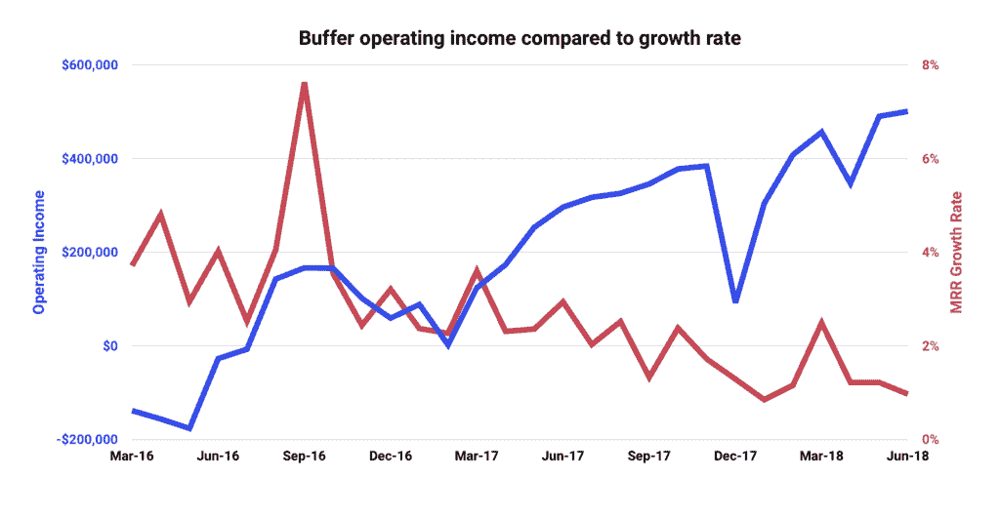
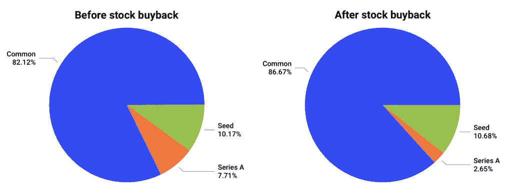

# 我们花了 330 万美元收购投资者:为什么以及如何做

> 原文：<https://open.buffer.com/buying-out-investors/?utm_source=wanqu.co&utm_campaign=Wanqu+Daily&utm_medium=website>

上个月，Buffer 花了 330 万美元——大约是我们银行所有现金的一半——收购了我们主要的风险投资(VC)投资者。

开始这次收购的对话、谈判和过程是我在缓冲之旅中迄今所做的最重要的决定之一，也是一年多工作的高潮。这是 Buffer 的一个关键转折点，让我们真正走上了可持续的长期增长之路。

这里是我们如何为公司决定这条道路的完整旅程，包括对我们 16 位首轮投资者中的 7 位进行股票回购所涉及的所有细节和数字。

## Buffer 的融资历史

以下是我们自 2010 年成立以来为 Buffer 筹集的资金汇总:

*   【2010 年 10 月: Buffer 诞生了，最初是靠收入支撑的
*   【2011 年 8 月: Buffer 被 AngelPad startup accelerator 接受，初始投资为 12 万美元
*   【2011 年 12 月: Buffer 筹集了 330，000 美元的小规模种子资金，使资金总额达到 450，000 美元
*   【2014 年 12 月: Buffer [筹集了 350 万美元的首轮融资](https://buffer.com/resources/raising-3-5m-funding-valuation-term-sheet/)，使融资总额达到 395 万美元
*   【2018 年 7 月: Buffer 买断了主要 A 轮投资者(代表 350 万美元融资中的 230 万美元的投资者)

总的来说，我们采取的方法是在筹集资金时保持盈利并获得可观的收入。因此，我们能够以良好的条件筹集资金，并保持相当大的控制权。每一轮之后，由于加速招聘，我们最终陷入了负现金流，但总是有一个可管理的计划让我们恢复盈利。

## 寻找并与非传统风险投资合作

回到 2014 年，当我们进行首轮融资时，我和我的联合创始人的目标是组织一轮非典型融资。正如在[我们的融资公告](https://buffer.com/resources/raising-3-5m-funding-valuation-term-sheet/)中提到的，有几件事让我们的首轮融资不同于传统的初创公司首轮融资:

*   筹集相对较少的资金(当年收入为 460 万美元时，融资额为 350 万美元)
*   不放弃通常的 20-30%的公司股份(我们以 6000 万美元的估值筹集了 350 万美元，放弃了 6.2%的股份)
*   不放弃控制权(没有投资者董事会席位)
*   利用流动性降低风险，走长线(350 万美元中的 250 万美元是给创始人和早期团队的)
*   在筹集资金后的五到七年内不会被首次公开募股所束缚

在我们寻找对我们的条件满意的独特投资者的过程中，我们找到了 Collaborative Fund，他们同意通过投入 60%的资金来领导我们的首轮融资。在他们的带领下，我们找到了其他投资者，他们也以不同的方式处理事情，我们对结果感到非常自豪。

在 A 系列赛的时候，我们感觉好极了。我们的 ARR(年度经常性收入)约为 460 万美元，收入每年增长约 150%。我们当时觉得我们可以“拥有一切”，在很多方面我们做到了:我们以理想的条件获得了风险投资，我们保持了控制权，我们获得了一些流动性，我们继续以完全透明和完全远程的团队方式运营。根据我们的增长率，我们没有预见到给 A 轮投资者带来巨大回报的任何问题，并且非常兴奋地进行一些更大的赌注，看看我们可以在哪里获得缓冲。

尽管我们的目标是看到这种增长趋势继续下去，但我们公开表示，我们可能不想进一步融资、出售公司或 IPO。我们是透明的，我们希望能够继续质疑做事的方式。具体来说，我们沟通过，我们希望期权能够通过发行给出回报，而不是退出。

合作基金[建议我们在首轮融资的结构中考虑这些不同的途径](https://www.collaborativefund.com/blog/with-noses-pressed-against-the-glass/)。我们为 A 轮投资者增加了下行保护，即有权在初始投资五年后的任何时候要求他们的投资获得 9%的年利息回报。当时，我没有意识到这一条款会变得多么重要。甚至我们的法律顾问也评论说，这不是他经常看到的事情。

## 缓冲资本的演变及其与风险投资的契合

自从首轮融资以来，Buffer 经历了一段有趣但有些坎坷的几年。在 2015 年年中，为了保持我们的高增长率，并与拥有更多资金的初创公司相媲美，我们迅速壮大了团队，并试图加快产品开发的步伐。我们发现自己在经济上挣扎，在不断增长的开支之后却没有足够快的回报。我们的银行存款余额下降的速度让我们意识到我们没有正确掌握我们的财务状况。我们的财务状况给我们带来了一个关键的转折点:我们是通过筹集更多资金还是通过削减支出来解决这个问题？在我最痛苦的决定之一中，我们选择在没有外部资金的情况下解决问题，并进行了一轮裁员以实现盈利。

在做出这些艰难的决定并改变一些基本的内部运作后，我们在几个月内就开始盈利了。虽然盈利能力令人兴奋，但我们的增长率却受到了影响。在领导团队中，我们开始讨论我们想要达到的增长率。在过去，我们“拥有一切”,并在创造独特文化的同时实现了增长，拥有完全远程的团队和高度的透明度，但现在我们开始觉得必须在这两者之间做出选择。有人建议，可以去掉一些我认为有价值的基本要素，创造一个提高增长率的生产力环境。我拒绝在我们文化的透明度和远程工作方面妥协，所以我们开始探索更慢的增长目标，以及这对 Buffer 的未来意味着什么。最终，[我的联合创始人 Leo 和我们的 CTO Sunil 在 2017 年初基于这个基本的愿景决策离开了公司](https://buffer.com/resources/change-at-buffer/)。

Our efforts to become profitable to break out of financial struggles, compared with our growth rate decreasing over time.

由于裁员、领导错位和最终离职等混乱事件，我注意到我们的一些核心价值观崩溃了，是什么让我们与众不同。对我来说，这些是基本的价值观，不仅塑造了缓冲的感觉，也塑造了我们的表现。我决定继续努力，做出一些改变，重新赢得团队的信任。

这些调整并不容易。除了提高我们的盈利能力和实现长期可持续发展，我还必须弄清楚，如果没有我的联合创始人，我的角色会有什么不同，以及如何单独有效地管理领导团队。这是完全值得的，因为我们实现了这一切，同时坚持我们的核心价值观和独特的工作方式。我们选择了平静的公司成长，让团队成员团结起来，有时间变得富有成效，而不是让团队的很大一部分完全是新人来缓冲。我们变得非常有利可图，并开始致力于长期项目，以使我们的产品供应和收入来源多样化。这与更传统的风险投资支持的创业路径形成对比，后者有一个烧钱率，依赖于持续的融资，目标是最大限度地提高增长率。我们本可以聘请外部高层领导，大幅壮大团队，推动超高速增长，但我认为这不是 Buffer 的最佳路径。

随着几个月的过去，我们在长期可持续发展方面取得了进展，我们的净利润率从几个月的亏损增长到 7%，并持续超过 25%。我们开始有几个月有 30 万到 50 万美元的利润，银行余额开始快速增长。然而，这带来的挑战是我们的增长率下降了。这是我愿意做的一个交易。自然，增长率的下降，加上我的联合创始人的离开，开始了与 Collaborative Fund 的一些具有挑战性的对话。Buffer 不再走传统的风险投资道路，我完全理解这是如何让我们在我们的主要投资者眼中变得不那么有趣的。

2017 年上半年，我与 Collaborative Fund 进行了多次对话。他们的投资进行了大约两年，鉴于 Buffer 重新关注可持续增长的道路，前面提到的 9%回报下行保护的话题自然出现了。下跌保护提供了一个时间框架和回报保证。在进一步讨论这个问题时，当我被问及如果 Buffer 无法承担 9%的年回报率，我是否会辞去 CEO 一职时，我吃了一惊。虽然从纯商业角度来看，这可能是一个合理的问题，而且我相信我们能够交付，但这让我震惊不已。从那以后，我们曾经的交流水平开始下降，这引发了我的许多反思和一些不眠之夜。

## 为什么我们选择收购我们的主要风险投资者

到 2017 年底，很明显 Buffer 已经不太适合风投融资了。每个月，我们都通过提高利润率来增强我们的财务可持续性。我们还努力创造和推广一种文化，让团队成员可以享受他们的工作多年，而不会导致精疲力尽。

健康的利润使我们的银行余额从 200 万美元增长到 500 多万美元，我们可以看到我们正在朝着能够为我们的 A 轮投资者提供 9%的下行保护回报的方向前进。到目前为止，我们的种子投资者已经支持该公司将近六年了，一些人开始问他们什么时候能得到回报。

A 轮股票包括一项保护条款，这意味着未经 A 轮多数股东的批准，Buffer 不能为其他股东(种子或普通股)提供流动性。为了让 Buffer 能够更自由地为早期投资者和团队成员提供流动性，我们知道第一步是买断 A 轮投资者并调整这项保护条款。

通过为我们的首轮投资者进行股票回购，我们将能够释放这种能力，给其他股东带来回报，我们将使公司走上长期可持续发展的道路。我相信 Buffer 的市场仍然敞开着继续增长的大门，我已经爱上了我们的工作方式以及与我一起工作的令人难以置信的团队和客户。我开始认真寻求收购我们的风险投资者。

## 我们如何准备和实施股票回购

收购我们的主要风险投资者的第一个关键步骤是建立现金储备，使之成为可能。我们做到这一点的方法之一是确保我们的收入增长率超过我们的招聘率。接下来，我联系了合作基金和我们首轮融资中的其他几个关键投资者，讨论下行风险保护。我发起了讨论，然后把它交给了我们的财务总监 Caryn Hubbard。

Caryn 做得很好，与投资者进行了富有成效的对话，并逐渐与他们达成了大家都能同意的协议。我们最终确定的条款非常接近 A 轮条款中预先确定的 9%的回报率。我们将日期提前，并提议我们可以在他们投资的三年半后而不是五年后提供这一回报。

作为交易的一部分，我们还修改了 A 轮股票的保护条款，以允许 Buffer 在未来有能力向种子投资者和普通股股东(主要是早期团队成员)提供流动性。为了实现这一目标，我们需要每一组股东的具体批准门槛:

*   60%的 A 轮股东同意
*   50%优先股股东的批准(A 轮和种子投资者的组合)
*   50%的股东(包括普通股)同意

这需要一些微妙的沟通和投资者关系工作，Caryn 和我一起工作。总的来说，一旦我们解释了推进股票回购的原因以及未来可能出现的情况，就很容易获得批准。由于我个人拥有超过 45%的股票，一旦我们有了投资者，满足最终的批准门槛就很简单了。

Caryn 与我们的法律顾问密切合作，将这些批准的文件放在一起，并确保我们考虑了每个角度。股票回购是作为要约收购设立的，并遵循特定的要约收购规则。一个关键的概念是，每个股东都收到相同的信息，以决定是否出售股票。

于是，我们开始了股票回购程序。我们给了每一个 A 轮股东以约定回报出售股票的选择权。最终估价为 8080 万美元，三年半的回报率为 40.5%。

作为要约收购的一部分，所有投资者都有 20 天的时间来决定是否出售。一旦我们收到了投资者的所有回复，我们就开始处理交易(这是我们有史以来最大的一笔电汇！)和我们的法律顾问通过转让股票完成交易。

## 收购首轮投资者的影响

我们的两家主要风投公司占了 60%的 A 轮股份。除此之外，还有五名投资者选择出售他们的股份，总计占该公司回购的 A 轮股份的 67.29%。

现在股票回购已经完成，Buffer 的所有权已经发生了一些变化。A 轮投资者现在持有 2.65%的流通股，而那些持有普通股或种子股的投资者的持股比例增加了约 5%。

注意:这些图表不包括我们的员工股票期权池。Buffer 的所有团队成员都有股票期权，当他们行使这些期权时，其他流通股就会被稀释。目前，还有 10%的缓冲资金被分配给股票期权。

回购对我们银行余额的影响是 330 万美元。交易后，我们的余额保持在 400 多万美元的健康水平。我们的净利润一直保持在每月 40 万至 50 万美元左右，银行存款已经超过 500 万美元。如果您想在我们的季度透明度报告中了解更多财务信息，请点击。

## 感谢阅读

我们非常乐意给投资者回报，也让我们的股东群体朝着我们正在走的道路更好地团结起来。我很感激许多首轮投资者，尤其是种子期的天使投资者，选择留在船上继续前进。为了给其他投资者和团队成员提供流动性，我们将考虑未来的股票回购机会以及替代资金来源。

我相信小型企业市场仍然为 Buffer 继续增长敞开大门，我致力于继续打造我们客户喜爱的优秀产品，并培养信任、自由和灵活的工作场所文化。这些都是驱使我并形成我更深层次的个人目标的东西。此次股票回购是朝着正确方向迈出的又一步，对我来说，这意味着这将是一项非常长期的努力。现在，比以往任何时候都更清楚的是，由于来自付费客户的收入，我们有特权继续下去。

我真的相信，作为一个行业，我们应该更多地谈论这些话题，我希望我们的经验可以对那些可能正在考虑类似道路的人有用。我邀请你对这篇文章发表评论，分享你对这个话题的想法。