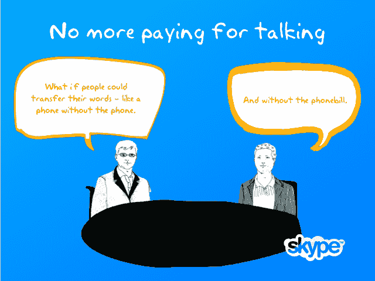

# “他们怎么会这么好？”:Skype | Ars Technica 的奇怪故事

> 原文：<https://arstechnica.com/information-technology/2018/09/skypes-secrets/?utm_source=wanqu.co&utm_campaign=Wanqu+Daily&utm_medium=website>

从一个公司的幻灯片中，这是一个艺术家对 Skype 想法形成的印象。(Zennströ在左边，紧挨着 Friis。)

15 年前的这个星期——2003 年 8 月 29 日——Skype 首次上线。当然，从那以后，这项服务经历了

[a number of big changes](https://arstechnica.com/gadgets/2018/07/microsoft-killing-off-the-old-skype-client-adding-built-in-call-recording/)

。这项服务的起源故事最初发生在 2013 年 9 月 2 日，当时 Skype 与微软的合作关系还很新，还在雷德蒙公司之前

[closed its London office](https://arstechnica.com/information-technology/2016/09/microsoft-shuts-down-skype-office-in-london-as-it-develops-yet-another-client/)

。但是考虑到 Skype 最近的周年纪念日(以及 Ars 员工的劳动节周末)，我们重新推出了它。下面的故事似乎没有变化。

“我不在乎 Skype！”百万富翁贾恩·塔林告诉我，他摘下蓝色太阳镜，在爱沙尼亚塔林老城一家舒适的露天餐厅找了个座位。“这项技术已经有 10 年的历史了——对于互联网时代来说，这是一个永恒。另外，我现在有更重要的事情要做。”

塔林有五个孩子，他称 Skype 是他的第六个孩子。那么他为什么不再关心自己的创作了呢？

2003 年 8 月 29 日，Skype 首次上线。根据 Telegeography 的数据，到 2012 年，Skype 一年内的跨境语音和视频通话量高达 1670 亿分钟，比 2011 年增长了 44%。这一分钟数的增长“是全球所有国际航空公司总和的两倍多。”也就是说，Skype 今天对全球最大的电信公司构成了严重威胁。这也让贾恩·塔林和其他早期的跳伞运动员变得富有。

但是在这个过程中发生了一些变化。Skype 不再是那个拒绝在办公室挂招牌、躲避国际律师、在董事会会议室保留儿童泳池的暴发户。这是一个全球品牌如何真正开始的真实故事，由推出它的人比以往任何时候都更详细地讲述。

<iframe type="text/html" src="https://www.youtube.com/embed/FNJAq7UpplU?start=0&amp;wmode=transparent" frameborder="0" allowfullscreen="">视频</iframe>

Skype 的起源...躺在一个简单的太空驾驶游戏里？

## 在 2000 年...

2000 年，当网络热席卷美洲时，一个名为 Everyday.com 的娱乐和新闻门户网站召集了欧洲革命者的六重奏。

事情开始于瑞典电信 Tele2 的两个人——一个叫 Niklas Zennströ的瑞典人和一个叫 Janus Friis 的丹麦人。Zennströ是 Tele2 的 23 号雇员；弗里斯在一家丹麦运营商的客户服务部工作。

Tele2 的瑞典所有者 Jan Stenbeck 决定推出每日门户网站，并迅速推出。由于瑞典人遇到了麻烦，Tele2 爱沙尼亚办事处的营销总监 Stefan Berg 建议找一些爱沙尼亚人来做这项工作。1999 年 5 月，Tele2 在一份日报上刊登了一则广告，招聘有能力的程序员，并开出每天 5000 爱沙尼亚克朗(约 330 美元)的天价——超过当时爱沙尼亚人一个月的平均收入。

这项工作由 Jaan Tallinn、Ahti Heinla 和 Priit Kasesalu 获得，他们是爱沙尼亚的同学和技术爱好者。自苏联时代起，他们就对 Fidonet(一种先于互联网的计算机网络)感兴趣。他们创办了一家小公司 Bluemoon，制作电脑游戏，如*[【Kosmonaut】](http://www.bluemoon.ee/history/kosmonaut/)*。(1989 年， *Kosmonaut* 成为第一款在国外销售的爱沙尼亚游戏。)这个游戏为它的创造者赚了 5000 美元，这在当时对任何一个爱沙尼亚人来说都是一大笔钱。但是到了世纪之交，这三个朋友身无分文，蓝月亮面临破产。

由于缺钱，他们申请并得到了这份电话工作。这项工作所需的 PHP 编程语言对他们来说是新的，但该团队在一个周末就学会了，并且比 Tele2 要求的更快地完成了他们的测试任务。

Skype 六重奏的最后一位成员 Toivo Annus 受雇在塔林管理 Everyday.com 的发展。网站将很快完成，Zennströ和 Friis 在卢森堡和阿姆斯特丹工作，Annus 和 Bluemoon 三人组在塔林工作。

Tele2 对爱沙尼亚人感到兴奋，但 Everyday.com 门户网站在商业上失败了。Zennströ和 Friis 离开了 Tele2，在阿姆斯特丹住了一段时间。无家可归的 Friis 住在 Zennströ的客房里，他们把厨房变成了临时办公室。

Zennströ和 Friis 一起研究新的商业理念。由于美国当时对围绕 Napster 的丑闻很感兴趣，Zennströ和 Friis 计划了类似的事情。但 Napster 激怒了音乐和电影行业，Zennströ和 Friis 希望与他们合作。他们毫不怀疑他们的新产品应该在哪里诞生——显然是在塔林。Kazaa 出生了。

## Kazaa

Kazaa 的 P2P 文件共享程序允许文件从一台计算机直接传输到另一台计算机，而无需中间服务器，从而解决了 Napster 的一个问题。Jaan Tallinn 在塔林郊区 Mustamä的 pruse Puiestee 上的一栋九层苏联风格的砖楼里开发了这个项目。这个公寓实际上是 Jaan Tallinn 的家，当时，塔林是一个在家工作的父亲。(他在 2012 年才卖掉公寓，并告诉我他考虑在墙上挂一块纪念牌，上面写着，“Kazaa 就是在这里创造的。”)

Kazaa 于 2000 年 9 月投入使用，迅速成为互联网上下载量最大的程序。这项服务以每秒一个用户的速度吸引用户。海因拉、塔林和卡塞萨鲁在他们的总部喝着美酒，心想，“这就是世界上一半的互联网流量通过你的软件的感觉。”

但在商业方面，曾斯特伦和弗里斯未能与美国电影和音乐公司达成协议。Kazaa 因支持盗版而被起诉。“偷来的”音乐、电影和色情作品正通过该应用程序传播，Kazaa 的所有者很快发现自己躲过了一大群凶猛的美国律师。

曾斯特伦多次逃避法院传票。有一次，他去斯德哥尔摩剧院看戏，一个陌生人走近他。那个人递给曾斯特伦的妻子一束花，并拿出一个信封，里面装着传唤曾斯特伦的传票。传票未能及时送达。他在伦敦也遭到了类似的追捕，这次是被一辆摩托车追着，但是服务又失败了。

当 Zennströ和他的团队去塔林访问时，他是乘渡轮去的，因为他太害怕坐飞机了(现在他显然已经克服了这一点，因为他拥有一架私人飞机和一切)。一旦到了那里，他仍然对来访者感到紧张。一位爱沙尼亚同事回忆道:“当有人从门里进来，我们不确定是谁时，尼克拉斯会藏在桌子底下。”

蓝月亮男孩开始加密他们所有的信件和硬盘。电子邮件的存储时间不会超过六个月。没有人想知道比他们绝对需要知道的更多的东西。曾斯特罗姆换电话号码的频率和换袜子的频率一样高。

对编码者海因拉、塔林和卡塞萨鲁的指控从未被提起，但他们作为“重要的信息来源”参与了 Kazaa 的诉讼。加州法院要求对这些人进行审问，并没收 Kazaa 的商业机密。起初，爱沙尼亚政府拒绝了这一请求，但在第二次上诉后，这三人在美国律师在场的情况下接受了审讯。

对爱沙尼亚人来说，Kazaa 诉讼就像玩火——有点危险，但仍然令人兴奋——他们的名字开始出现在国际媒体上。

由于害怕被捕，曾斯特伦和弗里斯好几年都没有飞往美国，尽管 Kazaa 很快就被卖给了澳大利亚商人(至少在纸面上是这样)，其总部也搬到了岛国瓦努阿图。两人多年来未能与美国和解，他们最终的救赎花了弗里斯和曾斯特罗姆一大笔钱。两人最终为音乐和电影产业贡献了超过 1 亿美元的支出。

 

奥塔维

