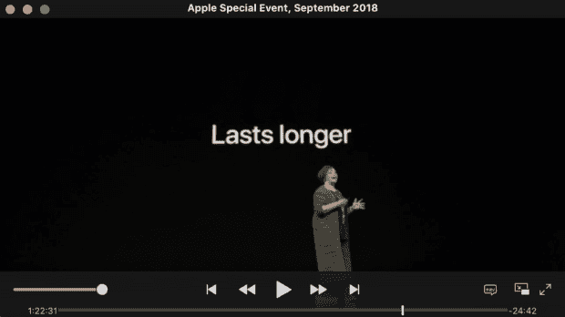
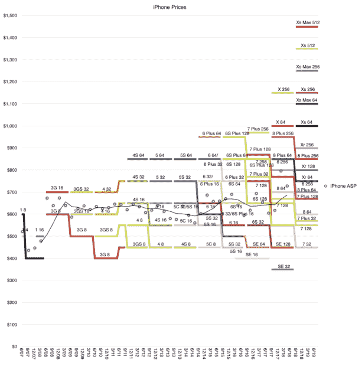

# 持续时间更长–asym co

> 原文：<http://www.asymco.com/2018/09/13/lasts-longer/?utm_source=wanqu.co&utm_campaign=Wanqu+Daily&utm_medium=website>

我认为丽莎·杰克逊在 2018 年 9 月 iPhone 发布会上的演示可能是最有趣和最深刻的。

丽莎·杰克逊是苹果公司负责环境、政策和社会倡议的副总裁。此前，杰克逊女士曾担任美国环境保护署(EPA)署长。在苹果任职期间，她负责苹果所有设施向 100%可再生能源的过渡。

这个目标已经实现，这是一个值得祝贺的非凡成就。但是她的演讲值得注意，因为她设立了一个新的目标。

她为苹果设定了一个目标，不再需要从地球上开采新材料。

她说，要实现这一目标，苹果必须做三件事:

1.  为所有产品采购回收或可再生材料。
2.  确保苹果产品尽可能长久。
3.  在长时间使用后，确保正确回收它们。

我认为这第二点会博得满堂喝彩。

为了强调第二点，她说苹果现在努力设计和制造尽可能耐用的产品。这意味着持久的硬件与持久的软件相结合。她指出，iOS 12 甚至可以在已经五年的 iPhone 5S 上运行。因为 iPhones 的寿命更长，所以您可以继续使用它们，或者在升级后将它们传递给将继续使用它们的人。

她说“让 iPhones 继续使用”是对这个星球最好的事情。

在演示的这一点上，我想知道是否每个人都会冲出房间，打电话给他们的经纪人卖出苹果股票。投资耐用品硬件公司的一个前提是，价值取决于升级的频率。如果产品不被频繁替换，它们就不会产生收入，销售这些产品的公司在市场饱和后最终会增长非常缓慢。智能手机业务肯定已经接近饱和，让苹果产品更耐用意味着更换产品的收入会减少。这种对替代率和寿命延长的担忧被分析师用来贴现未来的现金流，如果这些寿命延长，目标价格就会下降。

那么苹果为什么要这么做呢？作为一种商业模式，这种关注持久性的逻辑是什么？这对环境可能有好处，但对底线有好处吗？

当然，没有环境就没有生意，我们都应该为可持续发展而努力。但这是一个存在主义的观察，而且是防御性的。要做的重要决定是，苹果正在打赌**可持续发展是一项增长业务**。

从根本上来说，苹果是在赌*会有*的顾客而不是*向*他们销售产品。

苹果公司作为一家公司的目的是创造和保护客户，创造和保护产品。这是根本的，但没有得到充分的认识。

为了理解这是如何工作的，如果你看下面的定价图，你可以把它理解为一个市场份额减少而价格增加的故事。但是如果你明白产品的每一个进步都增加了可吸收的效用，那么每次使用的成本就会保持稳定或者下降。

如果 1200 美元的 iPhone 的使用时间是每天使用时间的两倍，那么 1200 美元的 iPhone 可能比 600 美元的 iPhone 便宜。这款售价 1200 美元的手机以两倍的价格提供了 4 倍的效用，使其价格减半。通过制造更耐用的产品，无论是硬件还是软件，客户群都得到了满足和保护。

实际上，最初的买家可能会转售 iPhone，二手设备可能会再次出售。这意味着一部 iPhone 的一生中可能会有三个用户，因此它最终可能会将苹果的受众扩大两倍甚至三倍。

扩大后的受众可以获得配件、可穿戴设备等附加产品，当然还有服务。这些剩余的商业模式肯定是有利可图的，甚至可能比 iPhone 更有利可图。

总的来说，苹果有 13 亿台设备在使用，用户可能多达 10 亿。这个基数肯定会扩大，而且随着耐用设备和软件的出现，这个基数会扩大得更快。

这是一种硬件即平台和硬件即订购的模式，其他任何硬件公司都无法与之匹敌。它不仅高度负责，而且高度可防御，因此是一个伟大的企业。有计划的淘汰是一件糟糕的事情，不值得辩护。

因此，苹果现在优先考虑设备和软件寿命的声明非常重要，我认为这是 2018 年 iPhone 发布会期间最重要的声明之一。