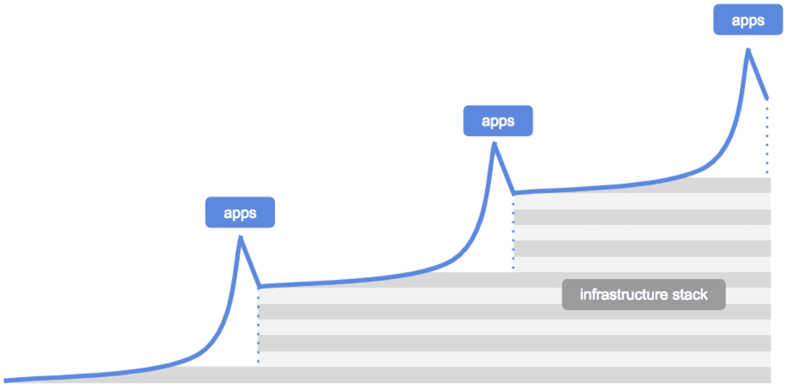
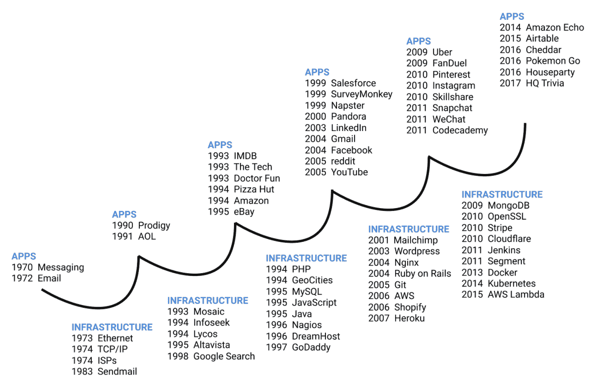
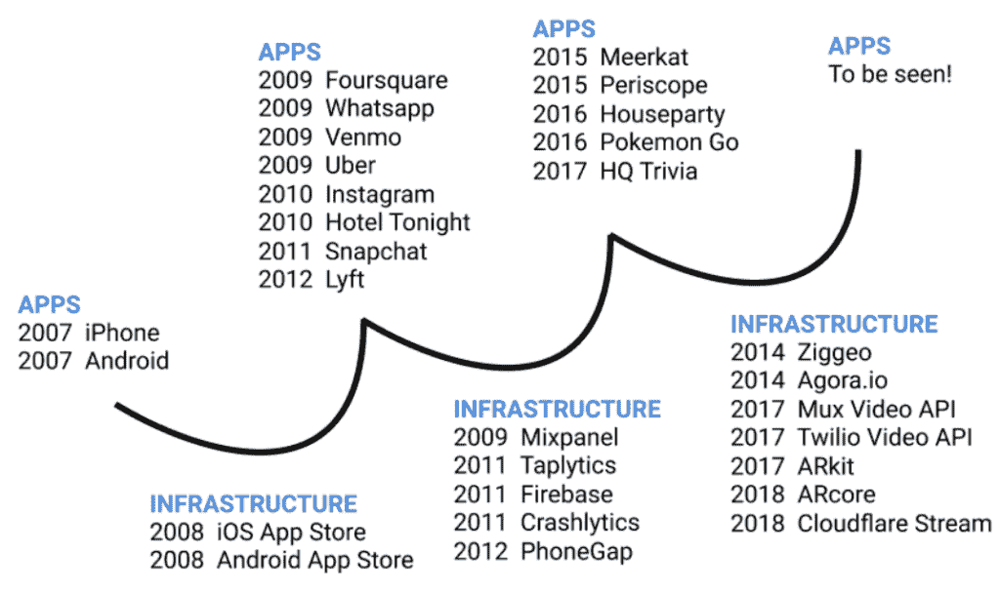
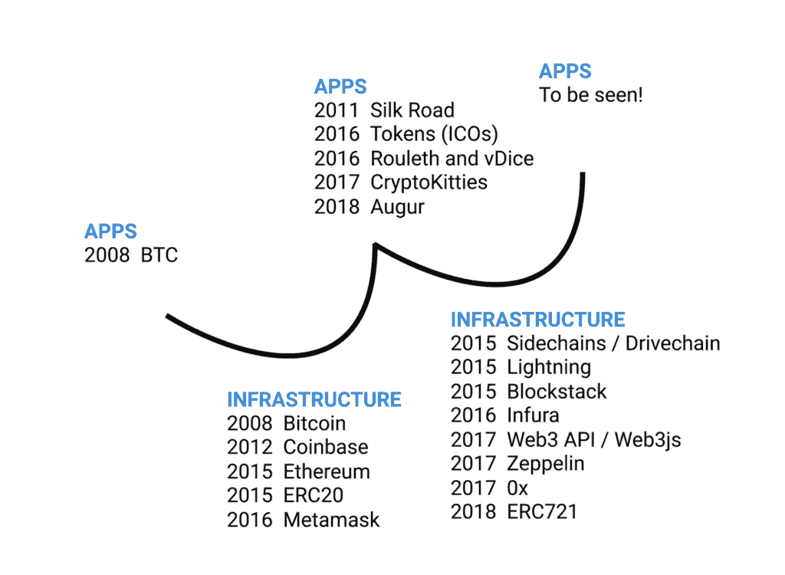

# 基础设施阶段的神话|联合广场投资公司

> 原文：<https://www.usv.com/blog/the-myth-of-the-infrastructure-phase?utm_source=wanqu.co&utm_campaign=Wanqu+Daily&utm_medium=website>

Web 3.0 社区中的一个常见说法是，我们正处于基础设施阶段，现在要做的正确的事情是构建基础设施:更好的基础链、更好的链间互操作性、更好的客户端、钱包和浏览器。理由是:首先，我们需要一些工具，让构建和使用在区块链上运行的应用变得容易，一旦我们有了这些工具，我们就可以开始构建这些应用了。

但当我们与正在构建基础设施的创始人交谈时，我们不断听到他们面临的最大挑战是让开发者在基础设施上构建应用。如果我们真的处于基础设施阶段，为什么会这样呢？

我们的假设是，事情实际上并不是这样的。我们不是处于基础设施阶段，而是处于另一轮*应用-基础设施周期*。事实上，新技术的历史表明，应用产生基础设施，而不是相反。这并不是说，我们首先建立所有的基础设施，一旦我们有了我们需要的基础设施，我们就开始构建应用程序。恰恰相反。

这甚至成为一个话题的很大一部分原因是，现在每个人都知道“平台”通常是最大的价值机会(对脸书、亚马逊/AWS、Twilio 等来说都是如此。)——因此，人们自然会急于建立一个捕捉价值的主要平台。这在分布式 web 中可能更真实，在分布式 web 中，价值通常(但不总是)在[协议层](https://www.usv.com/blog/fat-protocols)而不是位于顶层的应用程序中积累。

但是，正如我们将看到的:平台是从应用= >基础设施= >应用= >基础设施的迭代循环中发展而来的，很少是在外部真空中构建的。

首先，应用激发基础设施。然后，该基础架构支持新应用。

我们在重大平台转变的一系列事件中看到的是，首先有一个突破性的应用程序，然后这个突破性的应用程序激发了一个阶段，在这个阶段，我们可以构建更容易构建类似应用程序的基础架构，以及允许消费者广泛采用这些应用程序的基础架构。有点像这样:

Apps and infrastructure evolve in responsive cycles, not distinct, separate phases.

例如，灯泡(应用程序)是在电网(基础设施)出现之前发明的。你不需要电网来拥有灯泡。但要让消费者广泛接受灯泡，你需要电网，所以灯泡这一突破性应用首先出现在 1879 年，随后从 1882 年开始出现电网。(USV 团队读书俱乐部现在正在阅读关于灯泡发明的[夜晚的最后几天](https://www.amazon.com/Last-Days-Night-Novel/dp/0812988922))。

另一个例子:飞机(应用程序)是在机场(基础设施)出现之前发明的。你不需要机场来拥有飞机。但是，要让消费者广泛采用飞机，你确实需要机场，所以飞机这一突破性的应用程序首先出现在 1903 年，并激发了一个阶段，在飞机出现后，人们在 1919 年建立了航空公司，在 1928 年建立了机场，在 1930 年建立了空中交通管制。

Sometimes all the infrastructure you need is a beach and some spare parts.

互联网也遵循同样的模式。我们从第一批应用程序开始:信息(1970 年)和电子邮件(1972 年)，然后激发基础设施，使信息和电子邮件更容易被广泛的消费者采用:以太网(1973 年)，TCP/IP (1973 年)，和互联网服务提供商(1974 年)。然后是下一波应用程序，即门户网站(1990 年的 Prodigy，1991 年的 AOL)，门户网站激励我们建立基础设施(20 世纪 90 年代初的搜索引擎和网络浏览器)。然后是下一波应用程序，是像 1994 年的 Amazon.com 这样的早期网站，这导致了一个阶段，我们建立像编程语言(1994 年的 PHP，1995 年的 Javascript 和 Java)这样的基础设施，使建立网站变得更容易。然后是下一波更复杂的应用，如 Napster (1999 年)、Pandora (2000 年)、Gmail (2004 年)和脸书(2004 年)，这导致基础设施更容易构建更复杂的应用(2004 年 NGINX 和 Ruby on Rails，2006 年 AWS)。如此循环往复。 

我们在最新的移动应用中也看到了这种模式:首先，我们有一套非常依赖流媒体视频的流行移动应用:Snapchat (2011 年)、Periscope (2014 年)、Meerkat (2015 年)和 Instagram Stories (2016 年)。现在，我们看到一些公司正在建立基础设施，使移动应用程序可以轻松添加视频:Ziggeo (2014 年)，Agora.io (2014 年)，Mux (2017 年)，Twilio Video API (2017 年)，Cloudflare Stream (2018 年)。

 

这个循环也正确地解释了 Web 3.0 中的事件顺序。我们从第一款突破性应用开始:比特币网络(作为第一个基础设施)之上的 BTC (2008)，紧随其后的是丝绸之路(2011)，这是最臭名昭著的早期加密应用。这激发了新的基础设施，如 Sidechains 和 Drivechain (2015 年)，以太坊智能合约和 ERC20 (2015 年)，Lightning (2015 年)，使构建新应用变得容易，以及比特币基地(2012 年)和 Metamask (2016 年)等基础设施，使消费者能够采用这些新应用。这种新的基础设施然后实现了下一波应用:tokens/ICOs (2017 年)和早期的 dapps(2016 年的 Rouleth 和 vDice，2017 年的 CryptoKitties)，它们激发了新的基础设施:Infura (2016 年)和 Web3js 和 Zeppelin (2017 年)。我们现在正在等待下一个大型应用程序，它们将有助于引导下一波基础架构。 

**相邻的可能**

各大平台发展的共同主题(电力、汽车、飞机、网络、移动等。)是我们利用现有的工具来建造我们能建造的东西。在《好主意从何而来》一书中，Steven Johnson 称之为*邻近的可能性。*换句话说，你可以打开隔壁房间的门，但你不能真的跳过步骤，从前门廊打开后门。很难成功建立远远领先于应用市场的基础设施。

每当 apps => infrastructure 循环重复时，新的应用程序就成为可能，因为基础设施是在之前的循环中构建的。例如，YouTube 可以在 2005 年建立，但不能在 1995 年建立，因为 YouTube 只有在 21 世纪初部署了宽带等基础设施后才有意义，这发生在易贝、亚马逊、AskJeeves 和我最喜欢的 Neopets 等网站首次走红后的基础设施阶段。

Chris Dixon 和 Fred Wilson 在 a16z 播客的最近一集中谈论了这个概念。Chris 有一个网络时代的棋盘游戏，叫做 Dot Bomb，它取笑 20 世纪 90 年代后期愚蠢的网络公司。他指出，网络时代所有“愚蠢”的想法现在都是十亿美元的独角兽。现在什么是可能的几个 app = >基础设施周期进入互联网是没有意义的只是一两个 app =>基础设施周期进入。

这就是我们所说的基础设施阶段神话的症结所在——如果我们认为“基础设施阶段”与将使用它的应用程序无关，我们就有在投机真空中建设得太超前的风险。我们需要应用= >基础设施= >应用= >基础设施的循环来保持诚实。

随着每个新平台中的周期越来越多，构建和使用这些应用程序变得越来越便宜。在 1995 年建设 usv.com 的成本会比今天高出许多数量级，而今天创建 Web 3.0 应用程序所需的资金、精力和时间比 15 年后还要多。

**开发框架与投资框架**

让我们的投资者戴上帽子，重要的是要区分技术框架和投资框架，前者解释什么时候可以建造，后者解释什么时候可以成为好的投资。

apps = > infra structure = > apps = > infra structure 循环解释了何时可以构建应用或基础架构，但不一定解释何时投资应用，何时投资基础架构。

以灯泡为例。是的，它们是在电网出现之前发明的，但是从投资者的角度来看，在电网出现之前，没有人卖出很多灯泡。

**结束**

我们的一个问题是:为什么应用程序在循环中排在第一位，而不是基础设施排在第一位？一个原因是，除非有应用程序要求您解决他们的基础架构问题，否则创建基础架构没有意义。你怎么知道你正在构建的基础设施解决了一个真正的问题，直到你有了你正在解决的应用团队？现在建立加密基础设施将是一个挑战，直到有一个突破性的加密应用程序，其他开发人员想要模仿，并需要更好的开发工具和基础设施来做到这一点。

在加密领域有一种说法，首先我们需要建立伟大的工具，一旦我们有了工具，我们就可以建立应用程序。但我们希望展示的是，在其他平台转变中，我们能够在伟大的工具出现之前构建最初的几个应用程序(尽管这需要更多的资金和时间)，然后这些早期的应用程序会激励我们构建工具。如此循环往复。

快乐大厦。

***更新(10/5/18):*** *这个帖子得到了很多关注，引发了一些很大的讨论，并产生了一些有用的反馈。*

首先:适当地注意到，我们在这里花了大部分时间回顾历史先例，因此我们在去中心化 web / web3 / crypto 上的图表 a)不可否认地很薄，b)实际上只关注 ETH 生态系统。我们已经更新了图表，使其更加清晰，并纳入了 BTC 生态系统的重要概念。感谢 [Dennis Porteaux](https://twitter.com/DennisPortoMD/) 对这个的[精彩分析。](https://twitter.com/DennisPortoMD/status/1047143498108014592)

第二:我们最喜欢的反馈是，crytpo 网络实际上模糊了应用和基础设施之间的界限，这是由于它们的开放性和互操作性。这是我们最喜欢的方面之一。因此，举例来说，一个“应用”(如 CryptoKitties、任何智能合约或比特币本身)可以成为基础设施，如果有人在其上构建的话。当然，这些网络的组成部分是**only**基础设施(Lightning、Zeppelin 等)，但界限是模糊的。在过去，一个平台(如亚马逊或脸书)必须有意识地决定开放 API 并成为一个平台，而加密应用通常从第一天起就是开放和可互操作的。这只会让 apps= >基建= > apps *= >* 基建周期更紧。感谢[丹尼斯·纳扎罗夫](https://twitter.com/Iiterature/status/1047163184833069061)和[尤塔·斯坦纳](https://twitter.com/jutta_steiner)真正阐明了这一点。