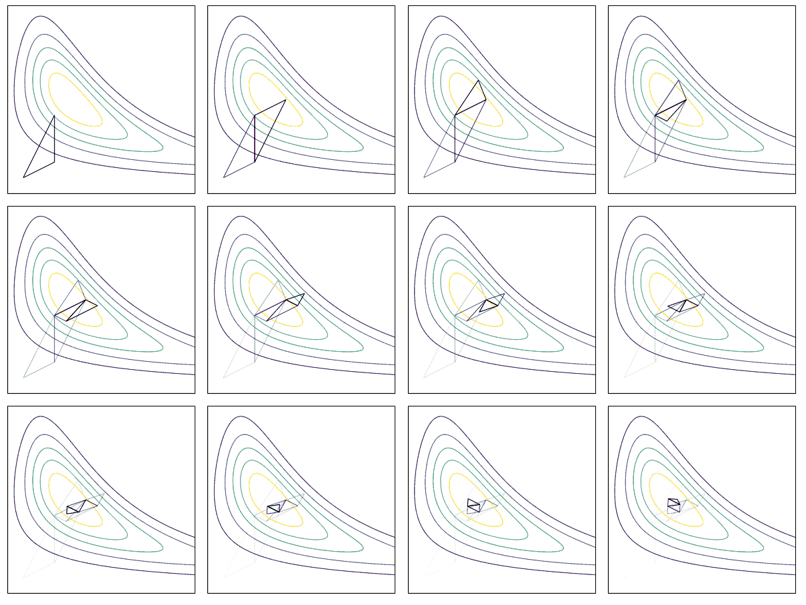
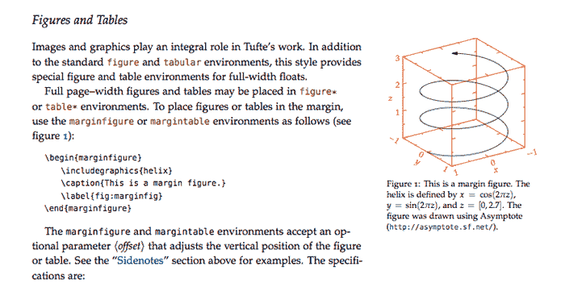
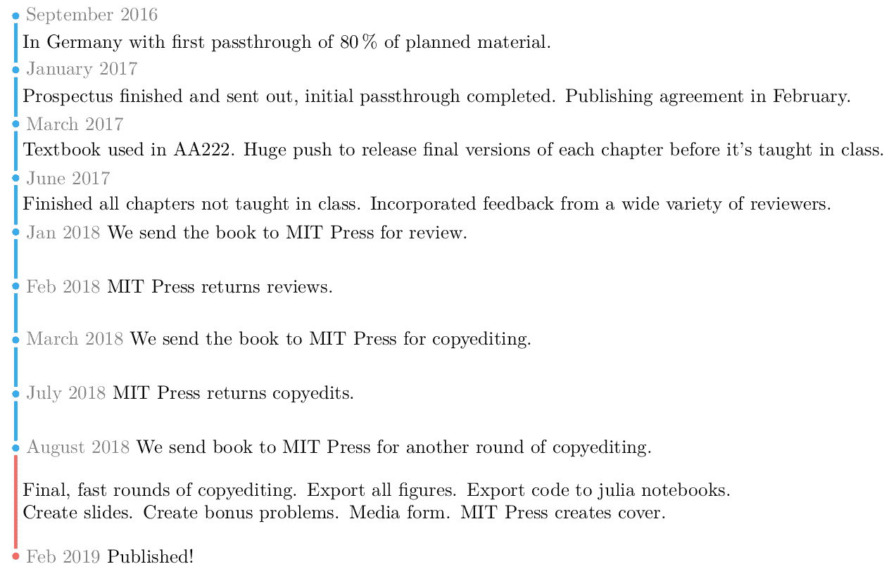
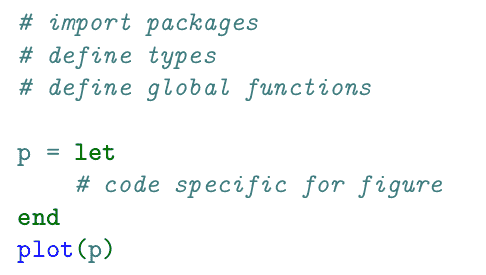

# 我们是如何写教科书的——蒂姆·惠勒

> 原文：<http://tim.hibal.org/blog/how-we-wrote-a-textbook/?utm_source=wanqu.co&utm_campaign=Wanqu+Daily&utm_medium=website>

我和我的合著者已经完成了一本教科书！没错，一本全长、全功能的学术教材。《优化算法》在麻省理工学院出版社网站上有自己的页面，将于 2019 年 2 月出版。

两年多前，也就是 2016 年秋天，我们开始着手这项工作。现在已经接近 2018 年秋季的尾声，正在成为现实。

写一本教科书需要什么？这是一个好问题；一个我肯定不知道答案的问题，一个我现在需要几个小时的回忆和反省来梳理出适当的反应的问题。这篇博文是我对这个问题的回答。我希望它对你有用，无论它有助于理解所涉及的工作范围，提出没有考虑到的方面，还是指出可能对你自己的书有帮助的工具。

# 我们做了什么

我们的书《优化算法》是一本完整的大学水平的学术教科书，基于 Kochenderfer 教授在斯坦福大学的工程设计优化课程的材料。Kochenderfer 教授和我一起写了这本书。

这本书提供了优化的介绍，重点是实用算法。有许多优化书籍涵盖了特定的学科(如结构优化)，或特定的技术(如凸优化)。我们这本书的 21 章跨越了最优化文献，涵盖了最优化的数学和算法基础。与流行的数字食谱书相比，优化算法可能是最好的，这些书涵盖了计算机科学中遇到的各种算法。像数字食谱一样，我们提供真实的代码，不特定于学科，也不特定于领域。

优化算法充满了所有算法的易于理解的朱莉娅实现。这是实际运行的真实代码。我们运行真实的代码——这些算法——来生成许多插图。

[T2】](http://tim.hibal.org/blog/wp-content/uploads/2018/10/newton1.png)

我提到插图了吗？这本书充满了丰富的数据和旁注来解释概念。在我看来，这些插图是传达理解的基础。另外，它们让书看起来很棒。

此图使用小倍数的方法来显示 Nelder Mead 算法是如何进行的。该图由直接写在 LaTeX 文件中的 Julia 代码生成，并在编译期间通过 pythontex 包执行。

我们充分利用侧边空白，在不打断流程的情况下，通过旁注来阐述概念。数字可以放在空白处，我们所有的引用也会出现在空白处。这是受数据可视化之父爱德华·塔夫特的启发。

一切都是用 LaTeX 写的，用 Bitbucket 进行源代码控制。一切都是文本资源。没错。我再说一遍。一切都是文本资源。

所有图形要么直接使用 TikZ 在 LaTeX 文档中定义，要么来自 TikZ 代码，TikZ 代码是在编译期间从 LaTeX 文档中定义的 Julia 代码块生成的。稍后将详细介绍。

tufte-book 类提供的 Tufte 样式为注释和图表提供了较宽的侧边空白。tufte-book 文档中的图像。

总之，优化算法在形式和功能上都是独一无二的。我们的主要卖点是:

*   易于理解的所有算法的 Julia 实现。
*   丰富的数据插图和旁注解释概念，而不中断流程。
*   关于多学科设计优化的一章偏离了传统的学术处理，大大简化了论述。
*   关于代理模型和代理优化方法的章节。
*   面向本科生的连续数值优化的全面概述。
*   关于离散和表达式优化的附加章节。

# 时间表

Kochenderfer 教授和我在 2016 年秋天开始研究优化算法。当时我是他的研究生，刚刚开始研究生院的第三年。

优化算法的时间线。我们只用了两年多一点的时间！文案编辑需要很长时间。

Kochenderfer 教授一直在教 AA222 这门课，当时叫多学科设计优化。Kochenderfer 教授从另一位教授那里继承了它，并将课程的重点从 MDO 转移到更全面的工程设计优化概述。这门课很棒。它得到了很好的评论。Kochenderfer 教授已经教过两次了。问题是，没有关于它的教科书，因为没有真正的教科书涵盖这么多的优化技术。

Kochenderfer 教授已经写了一本教科书《不确定性下的决策》,所以他知道如何去做。问题是，作为一名教授，Kochenderfer 教授的时间非常紧迫。他有课程笔记，但几乎没有时间把它们变成教科书。蒂姆·惠勒出场了。

作为一名研究生，我有更多的空闲时间。也许不会太久。(那些知道科申德弗教授时间表的人可以很容易地辩称，是的，研究生的空闲时间比他多得多。)，但更肯定的是。此外，Kochenderfer 教授能够获得一些资金来编写教科书，这是一个很好的方法。

一个偶然的事件帮助我写了这本书:2016 年秋天，作为学生交流的一部分，我在德国度过。这意味着我远离了我的朋友、家人和同龄人，所以我在晚上几乎没有事情可做。我在飞往德国的航班上认真地开始了这本书，并在那里的所有时间里继续工作，第一次通读了大约 80%的计划材料。

我在晚上写这本书，试图每周完成一章。此后，Kochenderfer 教授彻底审查和编辑了我的文章。效果很好。简而言之，我创造了大量的内容，他编辑了微观和宏观的每一个细节。

有几个步骤是我没有预料到的，或者至少是没有考虑到的。计划书是向出版商推荐这本书的文件，必须放在一起。它列出了书的内容，书的目标读者，它与其他教科书的不同之处，像这本教科书一样的教科书的巨大列表，以及为什么它们不服务于相同的读者或功能，等等。值得庆幸的是，Kochenderfer 教授以前做过这方面的工作。我们在相当早的时候就写了计划书，并附上了我们的第一章以供审阅。

出版商拿到计划书和样本章节，通常会发给该领域的其他教授和专家审阅。他们可能会推荐这本书出版。我了解到大多数教授关心课本，只要它们能在课堂上使用。这是有道理的——教授授课。

我们遇到了一个有趣的问题，从优化专家的角度来看，我们的教科书并没有真正涵盖任何新奇的东西。优化方面的专家不是我们的目标受众。我们写这本书是为了总结出现在各种不同团体中的大量现有工作，而不是呈现任何新颖的研究结果。(新颖的研究通常出现在期刊文章和会议论文中。)一些评论者的反应不温不火，主要是因为这本书没有像以前的书那样深入探讨特定的分区。令人欣慰的是，普遍的共识是，我们涵盖的主题是一个单一的文本独特的广泛。麻省理工学院出版社以前曾与 Kochenderfer 教授合作过，知道他的前一本书是一个巨大的成功，并且直觉地认为这本书也会如此，尽管它的目标读者不是最优化领域的研究生。

我们已经用 AA 222 的书两个季度了。从学生那里获得直接反馈帮助很大。听到所有的赞美也是如此。并不是每个教科书作者都有机会接触到这样一群被俘虏的读者。我认为我们非常幸运。

教材的文案编辑阶段远比我预想的要长。我们合作过的文字编辑非常全面。我非常尊敬他们。他们找到了所有。单身。问题。谁知道北美作家应该用*对*而不是用*对*？当提到数量时应该用 *1* ，当提到代词时应该用*1*。那些*和*和*的规则现在已经永远地印在了我的肌肉记忆中。逗号很复杂。每一个数字，例子和算法都必须在文本中引用。非常感谢审稿人。*

最后一本书超过 500 页。每一页都代表了许多小时的努力。我们写下并重写了每一句话。我们为间距而苦恼。每一个图形都经历了如此多的调整和变化。

我们的书从开始到结束将花费大约两年半的时间。课本需要很长时间。为了把这个时间线放在上下文中，巴斯蒂安·特龙告诉我概率机器人花了 7 年时间。Kochenderfer 教授和我在职业道德、分工、时间安排和勇气方面有一种偶然的协同作用。

# 我们的工具包

我们用什么工具写这本书？我已经提到了一些。

### 乳液

首先，这本书是用 LaTeX 编写的，LaTeX 是一种排版语言，是数学排版的首选工具。一切都是用文字写的。例如:  这个表达，是$x^2$.写的 LaTeX 文档被编译成 PDF。

LaTeX 为我们做了很多工作。数字是自动编号的。数字是从文本中自动引用的。布局自动确定。它运行得如此之好，以至于我们实际上向麻省理工学院出版社提供了最终的 PDF，而不是让他们自己对文档进行任何编辑。从我的理解来说，这是很不常见的。

我们使用 lualatex 来编译我们的书。主要原因是它让我们接触到一些更好的字体和字体工具。我们使用[font spec 包](https://ctan.org/pkg/fontspec)。我们在最新版本的 texlive 上。

### Tufte Style

我们的书使用了 tufte-book 风格。这给了我们一个很大的空间来放置评论和图表。行内评论(像这样)打断了流程。旁注允许我们在尽量减少干扰的同时提供额外的信息。我们还可以包括一些更高级的评论，而不会让读者不知所措。

书中的每一条引文都放在侧边空白处，这样你就可以找到确切的论文，而不必翻到书中的其他页面。每幅图都有标题，我们在文中引用了每幅图。

除了明确的风格，我们还遵循塔夫特哲学原则。整本书使用小倍数的方法来展示一个算法是如何进行的。这涉及到具有相同比例和轴的多个图表，允许人们快速看到它们之间有意义的差异。

我们在整本书中使用了一致的配色方案。事实上，我们试图在整本书的每一个方面尽可能保持一致——符号、排版、我们如何表达事物等等。

### Pythontex

我们使用 [juliaplots.sty](https://github.com/sisl/juliaplots.sty) 来简化我们书中 Julia 代码和情节的整合。它非常容易使用和安装。它在引擎盖下使用了 pythontex。

pythontex 包允许用户在 LaTeX 中显示、执行和执行&显示代码。它最初是为 python 编写的，但现在支持相当多的语言。我们用它来排版所有的 Julia 代码块，并生成书中的许多图形。书中所有的数字都是用文本定义的——要么用 TikZ，要么用 julia 代码，通过 pythontex 生成 TikZ。

Julia 代码块是包含我们代码的 juliaverbatim 环境。编译时，这些块被排版并应用语法高亮。我们使用 [pygments](http://pygments.org/) 包创建了[我们自己的词法分析器](http://github.com/sisl/pygments-julia6)和[语法高亮主题](http://github.com/sisl/pygments-style-algforopt)。

我们使用 pythontex 生成的图形是 jlcode 环境，其结构为:

如果有兴趣深入研究我们是如何构建的，有代码示例和最小工作示例，请告诉我！

### 自定义环境

Kochenderfer 教授是一位乳胶奇才。他创造了几个环境，我们在整本书中都用到。算法在算法环境中，例子在例子环境中。两者都有浅灰色的背景，并支持根据章节自动标记数字。比如第五章的第二个算法环境，自动标注为 Alg 5.2。我相信这两个环境在本质上是相同的——我们只是对算法和例子的计数不同。

我们还有问题和解决方案环境。这些允许我们更好地控制问题和解决方案的位置。在写这一章的时候，最好能将问题和解决方案一个接一个地放在这一章的末尾。在这本书的最终版本中，所有的解决方案都被移到了最后的解决方案部分。同样，问题编号是由 LaTeX 自动生成的。

### Bitbucket

我们使用 [git](https://git-scm.com/) 进行源代码控制，使用 [Bitbucket](https://bitbucket.org) 来托管它。一切都在文本文件中定义，所以我们可以很容易地提交，推，拉等。在我们的仓库里来回移动。拥有一个只有两个人的项目允许我们几乎只在主分支直接工作。在某些情况下，我会转移话题，比如当我彻底检查这本书时，用的是 Julia 1.0 而不是 Julia 0.6。

我们有一个使用 git 钩子监听提交的服务器。每当我们对 master 进行修改时，服务器就会更新它的 git repo，并将整本书以及每一个章节编译成 PDF。我们有自己的密码保护网站，上面有这些 pdf 的链接，我们会发布给潜在的审核者。因此，他们总能看到这本书的最新版本。我们使用 vc 包和 bash 脚本在 PDF 的每一页上自动生成一个包含版本号的页脚，所以你总是知道你在看什么版本。

我们使用 Bitbucket 来跟踪问题。这非常有价值。在这本书的早期版本中，我们在文本中留下了注释和待办事项。一旦我们开始向学生发布章节，我们觉得这是不合适的。因此，我们为每一件我们必须记住要做的小事(或大事)归档。随着时间的推移，问题得到了适当的解决，我们设法缩减了列表。我们有 560 个问题和 2555 个提交。

代码测试使用 Travis-CI 进行，这是一个持续集成框架，每次提交时都会触发。Travis 运行我们编写的测试脚本，在我们的算法环境中测试代码。我们用[工作服](https://coveralls.io)跟踪代码覆盖率，以建立我们已经彻底测试了一切的信心。

### Zendesk

我们使用 Zendesk 来帮助我们跟踪外部问题。任何有反馈的人都可以给 comments@alg4opt.net 发电子邮件。Zendesk 会收到电子邮件，并将其放入自己的便捷发布系统。我们可以很容易地给彼此分配消息，回复作者，完成它们，并在每个消息链中隐藏讨论。

根据我们的电子邮件交流，我们有大约 187 名不是 AA222 学生的评论者。

# 心理因素

也许编写教科书最具挑战性的方面是精神方面。那些编写教科书的人需要长期参与其中。每个句子都要被书写和重写，从不同的角度考虑，可能会被学生或评论家误解，并且需要保持与文本其余部分风格的一致。就调整不同方面而言，你可以进入无尽的兔子洞。可以撰写的新章节或章节、可以探索的新问题和解决方案以及覆盖材料的新方法的列表不断扩大。

最重要的是，所有的介绍和任务写起来并不有趣，但是必须有人来写。通常，一旦一个人认真对待它，它并不是那么糟糕，而且在许多情况下是有启发性的。然而，一个人需要勇气来克服这些时刻。

我遇到的一个问题是批评。没有人喜欢被批评，当写一本 500 页的书时，人们有很多机会指出愚蠢的错误，不那么愚蠢的错误，不清楚的部分，以及你应该考虑包括的部分。不要误解我，我们得到的几乎所有批评都是建设性的。早期接受批评总是会打击我的自我，学会更好地处理这种情况有助于我个人的发展。

最后，与合作者一起写一本教科书需要与某人长时间紧密合作。我很难想象有比科申德弗教授更好的合著者了。他完成这本书的不灭的热情，看似无穷无尽的注重细节的工作能力，以及对我所做的任何事情的及时评论使这本书获得了成功。从来没有偷工减料。没有一个概念是不按顺序解释的。我们合作得非常好。

我非常非常强调，如果你真的考虑与人合作写一本书，你必须找到一个真正合得来的人。因为你们会一起制作美丽的产品很长一段时间。

# 结论

我对优化算法如何演变成今天的样子感到非常高兴。这是一项令我无比自豪的成就。我希望它对某些人有用，希望是许多人，因为这是所有这一切的总体目的。