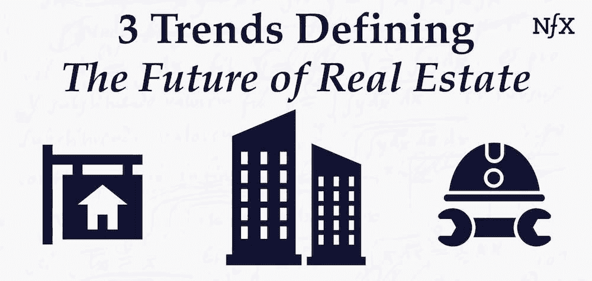
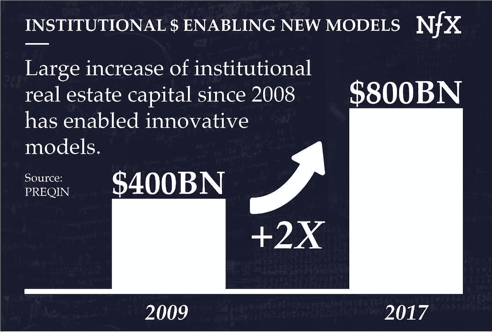
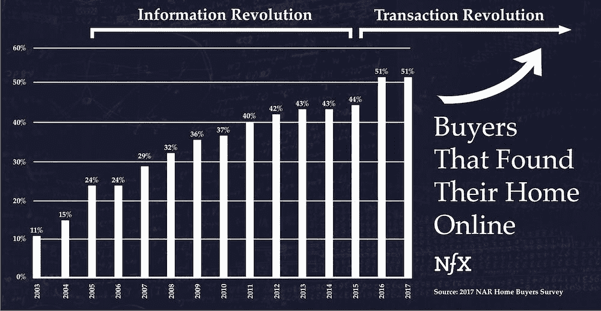
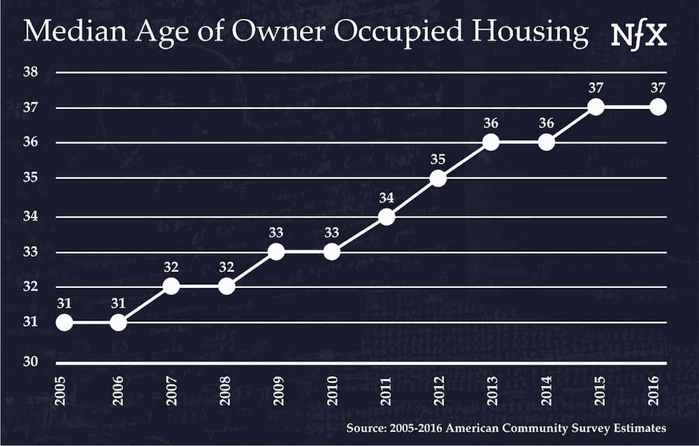
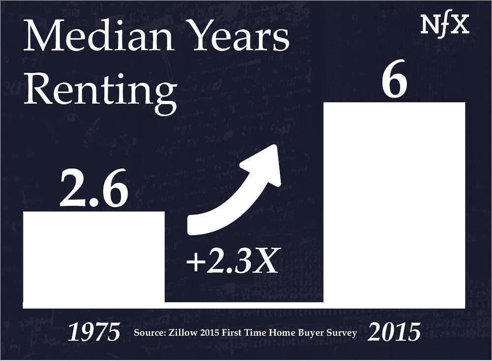

# PropTech:我们看到了一个巨大的机会

> 原文：<https://www.nfx.com/post/proptech-massive-opportunity?utm_source=wanqu.co&utm_campaign=Wanqu+Daily&utm_medium=website>

<noscript>T3】</noscript>

房地产涉及我们做的每一件事。这是物理空间的经济学——它通过定义我们生活和做生意的环境来塑造我们的生活。在过去的几十年里，科技已经做了很多事情来彻底改变信息流(谷歌)、通信(脸书、苹果)、商品(亚马逊)、资本(PayPal、Venmo)和运输(Lyft、优步)。但房地产比所有这些类别的总和还要大，房地产技术可能给我们的生活带来的变革比你想象的更大、更深远。

尽管房地产是迄今为止世界上最大的资产类别，但围绕它的大多数业务类别仍处于技术应用的早期阶段。尽管如此，在过去 15 年里，市值 10 亿美元的房地产科技公司比几乎任何消费服务类别(仅次于电子商务)都要多。世代趋势和不断变化的消费者行为正在为新一波具有高增长潜力的房地产科技创业公司创造机会。我们在 NFX 的目标之一是让这些创业公司为这个重要的市场带来深刻的颠覆性变化。

*在*[*slide share*](https://www.slideshare.net/NFXvc/proptech-the-future-of-real-estate-120333866/NFXvc/proptech-the-future-of-real-estate-120333866)*上查看此演示文稿。* ‍

**房地产的巨大规模经常被低估**
全球房地产估价约为228 万亿美元，这一数字比全球股票和证券化债务的价值高出整整 79 万亿美元。2017 年，仅美国住宅房地产价值[31.8 万亿](https://www.zillow.com/research/total-value-homes-31-8-trillion-17763/)美元，2017 年房屋销售价值总计约[1.77 万亿](https://www.nar.realtor/research-and-statistics/quick-real-estate-statistics)美元。加上我们估计的 15 万亿美元的美国商业房地产资产总额和每年 4850 亿美元的美国租赁市场。在许多方面，土地仍然是财富的同义词。

近年来涌入该行业的债务资本的注入，标志着房地产业的一个历史性拐点。自 2009 年以来，机构对房地产的投资翻了一番，从 4000 亿美元增加到 8000 亿美元。债务资本的显著增长使得新的商业模式得以兴起，如果没有这种债务融资的盈余，这些商业模式是不可能出现的。在这种背景下，我们认为房地产科技领域的初创公司至少有三个主要的机会领域:

1.  替代交易模式
2.  另类生活
3.  技术支持的建设、管理和维护

<noscript>T3】</noscript>

### 机遇 1:替代交易模式的兴起

大约从 2005 年到 2015 年的十年间，随着购房者越来越多地开始在网上搜索房屋，技术在购房过程中的应用进入了第一阶段。2005 年后，随着面向消费者的在线房地产产品 [Trulia](https://www.nfx.com/post/the-nfx-of-trulia-building-a-3-5-billion-marketplace/) 和 Zillow 的推出，公众第一次可以获得全面、易于访问的在线房地产信息。

Trulia 和 Zillow 通过在消费者开始搜索或列出待售房屋时向他们提供信息，改变了房地产交易。这让消费者牢牢地掌握了主动权。自 2015 年以来，[大多数购房者](https://www.nar.realtor/research-and-statistics/quick-real-estate-statistics)在网上初始化并找到他们的房子，然后过渡到一个复杂且很大程度上类似的交易过程。这将会改变。

<noscript>T3】</noscript>

#### **2015 &超越:交易模式的新世界**

随着消费者越来越习惯于更多的控制，获得更多的信息，并对房地产行业(与其他行业相比)的缓慢变化感到沮丧，一批新的公司已经出现，以改善消费者的交易体验。

目前的交易过程非常昂贵(包括佣金、所有权成本和其他费用在内，成本高达数万美元)。同样也很耗时:平均来说，买房需要 [4.3 个月](https://wp.zillowstatic.com/31/ZG_CHTR_2017_FINAL-53c1e5.pdf)，卖房需要 [2.8 个月](https://www.zillow.com/research/zillow-group-report-2016-13279/)。

由此产生的资产类别的流动性不足和消费者的挫败感为创新创造了明显的机会。NFX 投资组合公司 [Ribbon](https://www.ribbonhome.com/) (与房屋购买方的代理人合作)和 OpenDoor(房屋出售方)等初创公司已经开始转型，随着房地产交易的性质继续变化，将不可避免地出现更多公司。

但是这个领域在很大程度上仍然是开放的。消费者对资本提供者(抵押贷款)和经纪人角色的看法将越来越模糊，我们预计将出现一系列成功、独特的品牌，提供差异化的产品服务于各种细分市场。

我们还希望看到一系列的创业公司，使这些房地产品牌(传统和数字)能够实现他们的价值主张。鉴于这些平台日益垂直化和复杂化，将会出现专注于特定领域(如数据、融资、运营等)的创业公司。并将在他们的领域内获得成功。NFX 投资[半径代理](https://www.nfx.com/post/3-reasons-why-nfx-invested-in-radius/)，一个[市场网络](https://www.nfx.com/post/10-years-about-market-networks/)为房地产专业人士提供帮助，帮助他们发展业务，并为消费者提供一个平台，为他们找到最好的代理，就是一个例子。

### 机遇二:另类生活的兴起

房地产租赁，又称租赁市场，代表着技术颠覆的另一个巨大机会，因为供应(实物住房库存)和需求(快速变化的消费者偏好)之间的不匹配越来越严重。

在供应方面，住房库存正在老化。自住住房的年龄中位数从 2005 年的 31 岁上升到 2015 年的 37 岁。新房建设速度正在放缓，住房存量停滞不前。美国只有 19%的自有住房建于 2000 年之后，大部分(53%)建于 1980 年之前。

<noscript>T3】</noscript>

在需求方面，消费者行为正在迅速转变。自 1970 年以来，美国男性初婚年龄中位数从 23 岁上升至 29 岁，女性从 21 岁上升至 27 岁。人们在首次买房前租房的时间也相应增加，2015 年达到了中位数 6 年，高于 20 世纪 70 年代的 2.6 年。

<noscript>T3】</noscript>

‍ **对于一个巨大的市场来说，房租是一个越来越大的负担**
2016 年，近 4300 万美国家庭租房，房租需求不断上升。其中，超过 1/3 的 T4 人将至少 30%的税前收入花在房租上，而 2001 年这一比例还不到 1/5。

除此之外，房租负担正日益影响年轻人。如果技术创新通常首先发生在年轻人身上，而年轻人最大的一笔支出是房租，那么住宅租赁市场就有可能成为所有市场的母体**。**

有大量老化的单户住宅，专门为已婚家庭的永久居住而建造，然而对不同居住设施的需求却大量且快速增长。这为新一波服务提供商的到来创造了机会，他们可以重新调整现有服务的用途，并添加额外的服务来满足新的需求。

这已经开始发生了。Airbnb 显然是更广泛的生态系统中的一个重要参与者，尽管它主要是一家旅游公司。其他公司如 [Lyric](https://www.nfx.com/post/how-its-built-nea-nfx-on-the-15-5-million-series-a-in-lyric) (一家 NFX 投资组合公司)、Sonder 和 Pillow 也纷纷效仿，更加关注垂直整合的短期租赁。

另一家 NFX 投资组合公司 Zeus 正在将类似的策略应用于企业住房，而 HubHaus 和 Common 等合住初创公司正在经营带有增值服务的长期租赁业务。

毫无疑问，在价值 4850 亿美元的租赁市场上，提供替代生活选择的新公司将继续出现。我们预计会出现一系列拥有独特产品、品牌和价值主张的公司，其中许多公司会做得相当好。同样，这些业务运营复杂，最成功的企业将能够避免仅仅建立租赁套利业务的陷阱，这种业务难以扩展且周期性脆弱，但能够建立深度竞争护城河、[强大的网络效应](https://www.nfx.com/post/network-effects-manual/)和独特的防御能力。

### 机遇 3:技术驱动的建设、管理和维护的兴起

设计、建造和维护这一巨大资产类别的费用和麻烦是房地产行业第三大机会。

在住宅方面，随着消费者转向在线服务提供商，而不是传统的承包商和物业管理公司，我们开始看到物业管理和维护方式正在发生变化。家居装饰和室内设计的技术解决方案(如 Houzz)也在兴起，家具(如羽毛)和其他辅助服务的新所有权模式也在兴起，用于越来越多的临时居住安排。

房屋建设和维护也将经历大范围的中断。美国人每年花费 3400 亿美元用于家庭装修和改造，预计到 2023 年暖通空调市场将达到 2510 亿美元(T2)。美国每年的建筑价值为[1.3 万亿美元](https://www.census.gov/construction/c30/c30index.html)。

与此同时，传统的在位者仍然在这个巨大的市场中占有多数份额。家得宝和劳氏的年销售额约为 1700 亿美元。大多数建筑仍然是通过传统的承包商和建筑公司完成的，尽管 3D 打印和像 [Katerra](https://katerra.com/) 这样的公司的异地建筑的兴起正在开始改变这种情况。

新的催化剂最终将彻底颠覆建筑市场，创造另一波新的尖端房地产科技创业公司。人工智能、图像识别和机器人技术将在中长期内大幅降低建筑的资本和时间成本，其连锁反应将波及整个房地产行业。

展望未来，这些技术的兴起以及自动驾驶汽车、无人机或机器人送货、分散式工作空间和其他宏观趋势的激增可能会导致我们利用生活和工作空间的方式发生彻底转变。

### 我们觉得有趣的其他领域

#### **国际市场**

美国房地产资产仅占估计全球市场的 14%左右。在美国和其他地方诞生的新的科技房地产概念无疑将被输出到国际市场，在那里许多同样的成功可以被一个地区一个地区地复制和本地化。国际扩张的过程将类似于我们看到的前几次颠覆消费者服务类别的技术浪潮。典型的扩张始于美国，然后转移到国外，谷歌、亚马逊和优步的国际变体开始主导当地市场并创造巨大价值。然而，在房地产方面，我们预计会有更多的地区性赢家:房地产法差异很大，创造了独特的本地市场。这种市场分割将限制国际现有企业的优势，为本土初创企业带来明显的机遇。

#### **商业地产**

技术进入商业房地产(CRE)的机会是巨大的，并且在很大程度上尚未开发，无论是在供应还是数据方面。一些现有的 CRE 技术公司专注于数据资产(comps、平面布置图和其他财产特征)，其他公司致力于交易，还有一些公司仍然是共享办公空间的先驱(例如 WeWork)。该行业的一些领域比其他领域经历了更多的数字化，但我们预计在未来十年内会看到许多价值数十亿美元的公司。

#### **区块链**

就商业模式而言，区块链公司的技术问题更少，上市问题更多。我们感兴趣的公司有强大的上市战略，将区块链带入房地产，我们认为这有明显的好处:

*   房地产交易的低交易量使其比其他高交易量(如货币)更适合区块链技术
*   与房地产交易和所有权相关的高额模拟成本，如产权保险，可以通过使用廉洁的公共数字账本来降低

在这一领域工作的初创公司面临的挑战将是找到一种建立消费者信任和行业信息的方法，没有这种方法，产品就无法生存。

#### **交通遇上房地产**

我们正处于一场长期交通革命的风口浪尖，这场革命将改变我们对道路、汽车和车库的看法。汽车拥有量预计将下降，专用于停车的物理空间将被改造。交通电气化和自动化的第二个影响是为创业公司创造了塑造我们的家庭、通勤和生活的机会。

### 改变我们生活和工作的地方

不断变化的消费者预期、债务融资渠道的增加、新兴技术和生活方式的转变正在合力颠覆房地产行业。传统的家庭和办公室将被卷入这场变革，一切——从建造方式、销售方式到所有权模式——都将发生革命性的变化。

房地产技术正在构建未来。