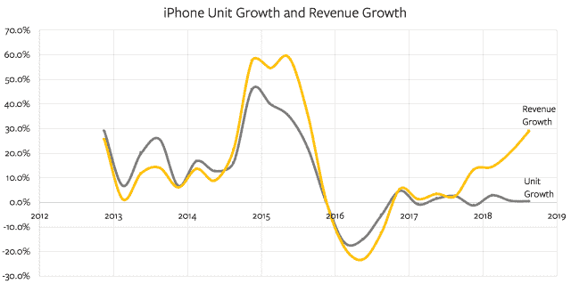
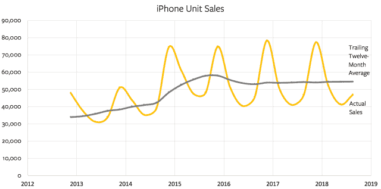
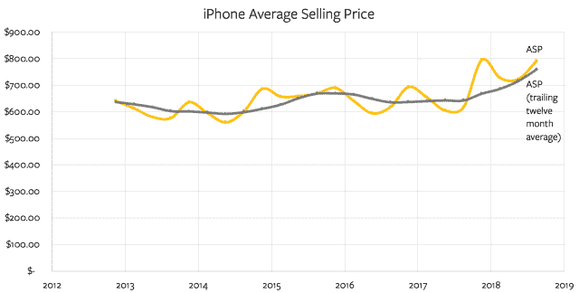

# 苹果的社交网络——本·汤普森的策略

> 原文：<https://stratechery.com/2018/apples-social-network/?utm_source=wanqu.co&utm_campaign=Wanqu+Daily&utm_medium=website>

俗话说“没有消息就是好消息”，但对苹果来说，“没有消息的消息就是坏消息。”从[彭博](https://www.bloomberg.com/news/articles/2018-11-02/apple-silence-on-iphone-unit-sales-sparks-concern-shows-future):

> 苹果公司(Apple Inc .)的股票经历了自 2014 年以来最糟糕的一天，因为人们担心其重要产品 iPhone 的增长正在放缓。在第四财季，苹果表示，iPhone 的销量几乎没有同比增长，尽管这一时期推出了新的旗舰设备。与此同时，苹果表示，将在 2019 财年停止提供 iPhones、iPads 和 MAC 的单位销售，这是向更多地成为服务企业迈出的一步。尽管一些专家称赞此举是突显一种强大的新商业模式的一种方式，但许多分析师抱怨称，这是试图掩盖智能手机市场停滞不前的痛苦。

在智能手机领域，苹果长期以来一直是个例外，所以决定不报告单位销量并没有什么不同寻常；然而，苹果一直将自己定位为非凡的选择——最好的选择——这种方法多年来取得了值得夸耀的销售数字。

#### iPhone 销量和收入增长的历史

然而，事实是，在过去几年里，孤立的单位销售确实没有如实反映苹果的业务；具体来说，他们低估了这一点。考虑过去六年 iPhone 的收入增长和单位增长:

[T2】](https://i0.wp.com/stratechery.com/wp-content/uploads/2018/11/Screen-Shot-2018-11-05-at-5.43.32-AM.png?ssl=1)

在 iPhone 问世的最初几年，iPhone 的单位增长和收入显然高度相关，当时该系列唯一的价格差异与旗舰设备的存储量有关。然而，随着苹果开始在产品线中保留旧机型，由于平均售价缓慢下降，收入增长略低于单位增长。

然后，iPhone 6 出现了:不仅“大屏幕 iPhone”非常受欢迎，而且应该指出的是，这是中国所有移动运营商推出的第一款手机，它还首次包括一种配置——749 美元的 iPhone 6 Plus——其基础价格高于 iPhone 传统的 649 美元。结果是收入增长第一次大大超过了单位收入的增长。

iPhone 6S 是一个相反的故事:尽管苹果认为 iPhone 6 的销售数字代表了新的常态，但事实上苹果已经吸引了大量的旗舰手机买家。最终，该公司在高估销量后，不得不冲销 20 亿美元的 iPhone 6S 库存；与此同时，老款手机(包括 iPhone 6)仍然销售良好，因此单位增长再次超过了收入增长。

然而，事实证明，6S 是新的常态:从那以后，iPhone 的销量基本持平:

[T2】](https://i0.wp.com/stratechery.com/wp-content/uploads/2018/11/Screen-Shot-2018-11-05-at-5.44.14-AM.png?ssl=1)

改变的是苹果的定价:iPhone 7 Plus 比 iPhone 6S Plus 贵 20 美元。然后，去年出现了大的飞跃:iPhones 8 和 8 Plus 的价格都比它们的前辈高(分别为 50 美元和 30 美元)；更重要的是，他们不再是旗舰。这个称号属于 999 美元的 iPhone X，鉴于有多少苹果粉丝只会买最好的，平均售价飙升:

[T2】](https://i0.wp.com/stratechery.com/wp-content/uploads/2018/11/Screen-Shot-2018-11-05-at-6.02.33-AM.png?ssl=1)

尽管如此，即使单位增长已经停滞了整整三年(不仅仅是去年，因为许多报告，包括上面的那份报告，陈述有误)，报告这些数字有助于苹果讲述它的故事:毕竟，你需要单位数字来计算平均售价。

然而，这些报告的正确之处在于，未来的单位销量绝对是苹果更愿意避免的故事:单位销量增长的可能性很小，尽管苹果通过 iPhone XS Max 将定价推得更高，但它可能不会走得更远，这意味着基于平均售价的收入增长故事也可能即将结束。

#### 今天在苹果公司

到目前为止，我一直专注于 iPhone，理由很充分:上个季度，它占苹果收入的 59%；对于该公司的假日季度，它可能会接近 70%。然而，该公司也将停止报告 MAC 和 iPads 的单位销售。这是紧接着上周的产品发布会之后，苹果公司推出了新的 MacBook Air、Mac Mini 和 iPads Pro 所有这些产品的价格都明显高于其前身。

这并不令人惊讶:Mac 系列的价格多年来一直在上涨，而 iPads Pro 则由起价 329 美元的强劲入门级产品来平衡。Mac 和 iPads Pro 的现实都是小众产品，小众客户愿意为更好地满足他们需求的产品支付更高的价格。 [1](#fn1-3790 "Well, theoretically anyways, in the case of the MacBook Pro")

然而，上周的活动更有意思的是，中间的十分钟专门用于苹果零售，这比宣布的产品更能揭示苹果新的增长故事。

苹果公司首席执行官蒂姆·库克是这样介绍这个细分市场的:

> 现在，苹果公司有办法激发我们用户的创造力，包括在我们的商店里。我们商店的使命一直是通过教育和激励顾客走得更远来丰富他们的生活。我们进一步发挥他们创造力的新方式之一是通过我们的今日苹果会议。

*今天在苹果*是[在 2017 年 4 月的新闻发布会](https://www.apple.com/newsroom/2017/04/today-at-apple-bringing-new-experiences-to-every-apple-store/)上宣布的，并在 [iPhone X 主题演讲](https://youtu.be/P_JY6tl4KyY?t=589)中首次被提到。然而，上周的演讲真正强调了今天在苹果的*或许是理解苹果思考未来增长机会的最佳方式。零售高级副总裁安吉拉·阿伦茨解释道:*

> 我们从苹果 DNA 的核心部分开始，也就是人们最常使用他们的设备并相信我们会教给他们的东西，比如摄影、音乐、游戏和应用程序开发。随着苹果继续开发课程，如人人都能编码，人人都能创造，我们将这些课程和技术嵌入到我们今天在苹果为所有客户(包括教育工作者和企业家)编写的*程序中。我们在所有 505 个零售点举行会议，比如几个月前开业的澳门 Apple Cotai Central。在这里，顾客们正在参加一个名为“照片漫步”的活动，他们在这里学习新功能，如人像照明和深度控制，同时以一种真实的社交方式一起探索这座城市…*
> 
> 随着我们继续推动旗舰产品的设计，使其成为更好的聚集地，让每个人都受到欢迎，我们也在为本地人才创造全球平台。摄影师、音乐家、开发者和艺术家分享他们的创作天赋…
> 
> 自 18 个月前在苹果推出 Today 以来，我们每周举办超过 18，000 场会议，全球数百万好奇的创意人员参加了这些会议。随着 Apple Store 应用程序的最新发布，我们让您更容易发现您身边发生的事情。只需点击“会议”标签，你就会看到你所在城市的苹果会议的最新动态。它还会根据你所拥有的产品推荐课程，以及音乐实验室、儿童时光和照片散步等标志性项目。

今天苹果公司最引人注目的是它的野心和它的价格:免费。当然，这在实践中是不正确的，因为人们需要一个苹果设备来真实地参与(甚至需要一个苹果 ID 来注册)，但这提出了一个问题，即苹果客户在购买苹果产品时支付的是什么？苹果今天在苹果上强调*的目的是，客户不仅仅是购买 iPhone 或 iPad 或 Mac，而是购买与苹果的持续关系。*

#### 苹果的社交网络

更广泛地说，这解释了首席财务官卢卡·马埃斯特里(Luca Maestri)在收益电话会议上不再报告单位销售额的理由[:](https://seekingalpha.com/article/4217359-apple-aapl-q4-2018-results-earnings-call-transcript?part=single)

> 第三，从 12 月季度开始，我们将不再提供 iPhone、iPad 和 Mac 的单位销售数据。正如我们多次声明的那样，我们的目标是制造丰富人们生活的优秀产品和服务，并提供无与伦比的客户体验，使我们的用户高度满意、忠诚和参与。

“参与”是一个有趣的词汇选择，因为参与是一个通常与脸书这样的社交网络相关的目标。原因显而易见:用户参与度越高，他们使用社交网络的次数就越多，这意味着他们可以展示的广告就越多。社交网络通过聚集来自供应商和用户自己的内容来实现这一点，并不断调整算法，试图让你不停地点击，然后回来再点击。

这是一个对苹果来说一直陌生的世界:它过去在其平台上促进社交互动的尝试只作为笑话的笑柄而令人难忘(iTunes Ping 任何人？).这并不奇怪:苹果的文化和产品方法[与创建和发展传统社交网络所必需的文化和方法](https://stratechery.com/2016/apples-organizational-crossroads/)是对立的。苹果希望完全控制并发布尽可能完美的产品；一个社交网络需要一种迭代的方法，这种方法被设计来处理不断的可变性和边缘情况。

然而，这就是为什么今天在苹果公司的*是引人注目的，特别是阿伦茨提到以一种“真正的社交方式”将人们聚集在一起——她不可能比[更强烈地强调](https://youtu.be/bfHEnw6Rm-4?t=2154)这个词“真实”。苹果实际上是试图在现实世界中建立一个社交网络，由苹果推动和控制，并押注客户将继续付费获得访问权。*

#### 苹果每用户平均收入

非常明确地说，我并不认为今天苹果公司的*是智能手机市场饱和或苹果公司达到价格上涨极限的答案。该公司显然依赖于“服务”收入，主要是指应用商店收入，其中很大一部分来自游戏的应用内购买，以及越来越多的订阅，一些由苹果公司提供(如 Apple Music)，但大多数是由第三方提供的。*

然而，这种“真实世界社交网络”的框架确实提供了对苹果新报告不足之处的洞察。从下个季度开始，苹果将把服务收入和相关的销售成本分开，这很好；更深入地了解苹果的增长动力显然是合适的。

然而，缺少的是服务的单位销售额，特别是苹果拥有的活跃客户数量，以及每用户的相关收入。这是对社交媒体公司至关重要的确切指标，从某种程度上来说，苹果的增长来自于随着时间的推移不断货币化其现有的用户群，这在这里也是有意义的。

可以肯定的是，一个准确的数字将非常包括设备收入:我在[苹果的中年](https://stratechery.com/2018/apples-middle-age/)中指出，该公司的增长是基于通过更高的平均售价从现有用户群中获得更多的钱，销售更多的设备(即 Apple Watch、AirPods、HomePod 等)。)，并增加服务收入；从某种程度上说，苹果只专注于设备错过了故事，这是正确的，只专注于服务也是误导。

#### 苹果的优先事项

不幸的是，库克已经在去年 2 月的另一次收益电话会议上宣布这个数字不会出现:

> 我们不会公布用户数量，因为我们认为查看用户数量的正确方式是查看活跃设备。这也是我们最精确的衡量标准。这就是我们背后的想法。

这有两个问题:首先，虽然活跃设备的数字是有帮助的，但苹果在 2 月份的财报电话会议上宣布的 13 亿是两年来的第一个数字；此后再未更新。其次，对苹果来说，活跃设备的数量可能更容易衡量，但对投资者来说，它根本没有活跃用户的数量有价值，原因库克上周自己也说过:

> 我们的装机量正以两位数增长，从生态系统和客户忠诚度等角度来看，这可能是一个更重要的指标。第二件事是这有点像如果你去市场，你把你的手推车推到收银员面前，她说，或者他说你有多少单位？就购物车中物品的总价值而言，里面有多少单位并不重要。

然而，这不仅仅是“总体价值”:而是总共有多少客户，以及他们的购物车正在发生变化的方式——例如，安装基数是多少，库克指的增长率是多少？

不幸的是，苹果似乎最关心的是收入和利润。就在库克发表评论之前，马埃斯特里说:

> 最终，我们会从财务角度做出决策，努力优化我们的收入和毛利润，我们认为这是最符合投资者利益的重点。

任何人，尤其是苹果的投资者，都很难抱怨苹果的收入和毛利润，这种情况已经持续了很多年。不过，这些年来，该公司的收入和利润都是基于单位销售额。

现在，苹果认为单位销售额是理解其业务的错误方式，但拒绝提供其想要讲述的故事背后的数字。投资者持怀疑态度是很有道理的:一方面，苹果是否真的能够脱离设备销售而独立估值，另一方面，尽管该公司有着漂亮的说辞和舞台演示，但它是否真的优先考虑了推动收入和利润的因素，而不是收入和利润本身。我确实认为答案是前者；我只是希望苹果能在报道中展示它。

### *相关*