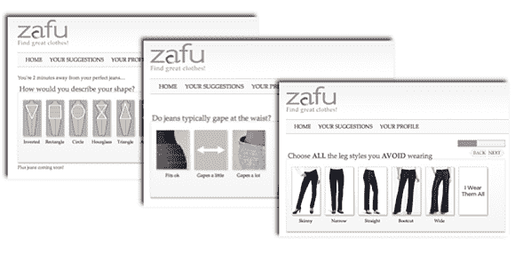

# 设计优秀的数据产品——O ' Reilly

> 原文：<https://www.oreilly.com/ideas/drivetrain-approach-data-products?utm_source=wanqu.co&utm_campaign=Wanqu+Daily&utm_medium=website>

**由[杰瑞米·霍华德](https://twitter.com/#!/jeremyphoward)、[玛吉特·兹韦默](http://www.linkedin.com/pub/margit-zwemer/7/799/236)和[迈克·劳基德斯](http://radar.oreilly.com/mikel/)T7】**

在过去的几年里，我们已经看到了许多基于预测建模的数据产品。这些产品从天气预报到推荐引擎，再到比航空公司本身更准确地预测航班时间的服务。但是这些产品仍然只是进行预测，而不是询问他们希望某人根据预测采取什么行动。预测技术可能很有趣，数学上也很优雅，但我们需要采取下一步行动。这项技术的存在是为了构建能够彻底改变整个行业的数据产品。那么，我们为什么不建造它们呢？

## 学得更快。深入挖掘。看得更远。

为了启动这一进程，我们建议采用已经改变了保险业的四步走方法。我们称之为**传动系统方法**，灵感来自新兴的自动驾驶汽车领域。工程师们首先定义一个明确的**目标**:他们希望一辆汽车在没有人类干预的情况下安全地从 A 点开到 B 点。伟大的预测建模是解决方案的重要组成部分，但它不再独立存在；随着产品变得越来越复杂，它消失在管道中。使用[谷歌自动驾驶汽车](http://spectrum.ieee.org/automaton/robotics/artificial-intelligence/how-google-self-driving-car-works)的人完全不知道数百(如果不是数千)种模型和数 Pb 的数据使其工作。但随着数据科学家构建越来越复杂的产品，他们需要一种系统化的设计方法。我们并不认为动力传动系统方法是最好的或唯一的方法；我们的目标是在数据科学和商业社区内开展对话，以推进我们的共同愿景。

## 基于目标的数据产品

我们正在进入以数据为动力的时代，在这个时代，我们不仅使用数据来生成更多数据(以预测的形式)，还使用数据来产生可操作的结果。这就是动力传动系统方法的目标。说明这一过程的最佳方式是用一个熟悉的数据产品:搜索引擎。早在 1997 年，AltaVista 就是算法搜索界的王者。虽然他们的模型善于找到相关网站，但用户最感兴趣的答案往往被埋没在搜索结果的第 100 页。然后，谷歌出现了，从一个简单的问题开始，改变了在线搜索:用户输入搜索查询的主要目的是什么？

The four steps in the Drivetrain Approach.

谷歌意识到目标是显示最相关的搜索结果；对于其他公司来说，这可能是增加利润，改善客户体验，为机器人找到最佳路径，或者平衡数据中心的负载。一旦我们指定了目标，第二步就是指定我们可以控制系统的哪些输入，我们可以拉动**杠杆**来影响最终结果。在谷歌的例子中，他们可以控制搜索结果的排名。第三步是考虑他们需要什么新的**数据**来产生这样一个排名；他们意识到，关于哪些页面链接到哪些其他页面的隐含信息可以用于此目的。只有在这三步之后，我们才开始考虑建立预测性的**模型**。我们的目标和可用杠杆、我们已经拥有的数据以及我们需要收集的额外数据，决定了我们可以构建的模型。模型将采用杠杆和任何不可控变量作为其输入；模型的输出可以结合起来预测我们目标的最终状态。

谷歌动力系统方法的第四步现在是技术历史的一部分:拉里·佩奇和谢尔盖·布林发明了图形遍历算法 PageRank，并在此基础上建立了一个引擎，彻底改变了搜索。但你不必发明下一个 PageRank 来构建一个伟大的数据产品。我们将展示第 4 步的系统方法，不需要计算机科学博士学位。

## 模型装配线:最优决策群的案例研究

针对正确的预测模型优化可行的结果可能是公司最重要的战略决策。对于保险公司来说，保单价格就是产品，因此最优定价模型对于他们来说就像装配线对于汽车制造一样重要。保险公司在预测方面已经有几个世纪的经验，但就在 10 年前，保险公司常常无法就向每个新客户收取多少费用做出最佳商业决策。他们的精算师可以建立模型来预测客户发生事故的可能性和索赔的预期价值。但是这些模型没有解决定价问题，所以保险公司会根据猜测和市场研究来定价。

1999 年，随着一家名为[Optimal Decisions Group](http://www.lexisnexis.com/risk/solutions/optimal-decisions-toolkit.aspx)(ODG)的公司的成立，这种情况发生了改变。ODG 解决这个问题的方法是早期使用传动系统方法，并实际采用 step 4，这种方法可以应用于广泛的问题。他们首先定义了保险公司试图实现的**目标**:设定一个价格，使新客户在多年时间范围内的利润净现值最大化，并受到某些约束，如保持市场份额。在此基础上，他们开发了一个优化的定价流程，为保险公司的底线增加了数亿美元。【*注:合著者杰瑞米·霍华德创立了 ODG。* ]

ODG 确定了保险公司可以控制哪些**杠杆**:对每个客户收取什么价格，承保什么类型的事故，在营销和客户服务上花费多少，以及如何对竞争对手的定价决策做出反应。他们还考虑了他们无法控制的因素，比如竞争对手的策略、宏观经济状况、自然灾害和客户“粘性”他们考虑需要哪些额外的**数据**来预测客户对价格变化的反应。有必要通过在几个月内随机改变数十万份保单的价格来建立这个数据集。虽然保险公司不愿意在真实客户身上进行这些实验，因为他们肯定会因此失去一些客户，但他们被优化的保单定价可能带来的巨大收益所动摇。最后，ODG 开始设计可以用来优化保险公司利润的**模型**。

Drivetrain Step 4: The Model Assembly Line. Picture a Model Assembly Line for data products that transforms the raw data into an actionable outcome. The Modeler takes the raw data and converts it into slightly more refined predicted data.

ODG 建模器的第一个组件是新政策和续保的价格弹性模型(客户接受给定价格的概率)。价格弹性模型是价格相对于客户接受以该价格为条件的保单的概率的曲线。这条曲线从价格很低时几乎肯定会被接受，到价格很高时几乎不会被接受。

ODG 建模器的第二个组成部分将价格与保险公司的利润联系起来，条件是客户接受这个价格。由于第一年预期索赔的价值，加上获得和服务新客户的任何管理费用，极低价格的利润将出现赤字。将这两条曲线相乘得到一条最终曲线，显示价格与预期利润的关系(见下面的预期利润图)。最终曲线有一个清晰可辨的局部最大值，代表第一年向客户收取的最佳价格。

ODG 还建立了客户保持模型。这些模型预测客户是否会在一年内续保，考虑到价格变化和转向竞争对手的意愿。这些额外的模型允许合并年度模型，以预测未来五年来自新客户的利润。

这套新模型并不是最终答案，因为它只确定了一组给定输入的结果。装配线上的下一台机器是一个**模拟器**，它让 ODG 提出“如果”,看看杠杆如何影响最终结果的分布。预期利润曲线只是可能结果的一部分。为了构建整个表面，模拟器在广泛的输入范围内运行模型。操作员可以调整输入杠杆来回答特定问题，如“如果我们公司在第一年向客户提供低诱惑价格，但在第二年提高保费，会发生什么？”他们还可以探索保险公司控制之外的投入如何影响利润分配:“如果经济崩溃，客户失业怎么办？如果 100 年一遇的洪水袭击他家怎么办？如果有新的竞争对手进入市场，而我们公司没有反应，对我们的底线会有什么影响？”因为模拟是在每份保单的级别上进行的，所以保险公司可以查看一组给定的价格变化对收入、市场份额和其他指标的影响。

模拟器的结果被输入到一个**优化器**，该优化器获取可能结果的表面并识别最高点。优化器不仅能找到最好的结果，还能识别灾难性的结果，并显示如何避免它们。有许多不同的优化技术可供选择(见[见](#sidebar)下面的侧栏)，但这是一个很好理解的领域，具有健壮和可访问的解决方案。ODG 的竞争对手使用不同的技术来寻找最优价格，但是他们都在销售相同的数据产品。重要的是，使用一种与模型装配线相结合的传动系统方法，可以弥合预测模型和可操作结果之间的差距。[cloud physics](http://www.linkedin.com/pub/irfan-ahmad/2/436/6b2)[的 Irfan Ahmed](http://blog.kaggle.com/2012/03/05/irfans-taxonomy-of-predictive-modelling/) 提供了一个很好的预测建模分类法，描述了整个装配线流程:

> “当处理成百上千个单个组件模型以了解整个系统的行为时，必须进行‘搜索’。我认为这是一个复杂的机器(全系统),窗帘拉开，你可以在受控实验下模拟机器的每个重要部分，然后模拟相互作用。请注意不同的层次:单个组件的模型，在给定一组输入的模拟中联系在一起，在搜索优化器中通过不同的输入集迭代。

## 推荐系统的驱动方法

让我们看看如何将这个过程应用到另一个行业:市场营销。我们首先将动力系统方法应用于一个熟悉的例子——推荐引擎，然后将其构建成一个完整的优化营销策略。

推荐引擎是一个常见的数据产品的例子，它基于构建良好的预测模型，但不能实现最佳目标。当前的算法根据购买历史和类似顾客的历史来预测顾客会喜欢什么样的产品。像亚马逊这样的公司将每一笔交易都表现为一个巨大的稀疏矩阵，以客户为行，以产品为列。一旦有了这种格式的数据，数据科学家就应用某种形式的协作过滤来“填充矩阵”例如，如果客户 A 购买产品 1 和 10，而客户 B 购买产品 1、2、4 和 10，则引擎会建议 A 购买产品 2 和 4。这些模型擅长预测客户是否会喜欢某个给定的产品，但它们通常会建议客户已经知道或已经决定不购买的产品。亚马逊的推荐引擎可能是最好的，但是很容易暴露它的缺点。这里有一个“购买了这个商品的顾客也购买了”的截图，来自于对特里·普拉切特的“[光盘世界系列](http://en.wikipedia.org/wiki/Discworld)”的最新书籍的[搜索](http://www.amazon.com/Snuff-Novel-Discworld-Novels/dp/0062011847/ref=sr_1_1?ie=UTF8&qid=1331578104&sr=8-1)

所有的推荐都是针对同一系列中的其他书籍，但很好的假设是，搜索“特里·普拉切特”的客户已经知道这些书籍。提要的第 2 页到第 14 页可能会有一些意想不到的推荐，但是有多少客户会费心去点击呢？

相反，让我们使用传动系统方法设计一个改进的推荐引擎，从重新考虑我们的**目标**开始。推荐引擎的目标是通过给顾客带来惊喜和愉悦来推动额外的销售，如果没有推荐，他或她不会购买*。我们真正想做的是效仿马克·约翰逊的经验， [Zite](http://www.zite.com/) 的首席执行官，他在最近的 [TOC 谈话](http://www.toccon.com/toc2012/public/schedule/speaker/117385)中给出了一个客户推荐经验的完美例子。他走进纽约市的斯特兰德书店，要了一本类似托尼·莫里森的《宠儿》的书。柜台后面的女孩推荐威廉·福克纳的《亚伯索隆·亚伯索隆》在亚马逊上，类似查询的最高结果导致托尼·莫里森的另一本书和几本知名女性作家的书。斯特兰德书店给了我一个精彩但牵强的推荐，可能更多的是基于莫里森的写作特点，而不是莫里森和其他作家之间表面上的相似之处。她透过显而易见的干扰提出了一个建议，这个建议会让顾客带着一本新书回家，并在未来一次又一次地回到 Strand。*

这并不是说亚马逊的推荐引擎不可能做出同样的连接；问题是，这份有帮助的推荐将被深埋在推荐源中，在与《宠儿》有更明显相似之处的书籍之下。我们的目标是避开推荐过滤气泡，这个术语最初是由 Eli Pariser 创造的，用来描述个性化新闻订阅倾向于只显示受欢迎的文章或进一步证实读者现有的偏见。

和 AltaVista-Google 的例子一样，书商可以控制的**杠杆**是推荐的排名。还必须收集新的**数据**，以生成将*导致*新销售的建议。这将需要进行许多随机实验，以便为各种各样的客户收集关于各种各样的建议的数据。

传动系统流程的最后一步是建造**模型装配线**。摆脱推荐泡沫的一个方法是建立一个**建模器**，包含两个购买概率模型，以看到或看不到推荐为条件。这两个概率之间的差异是给定推荐给客户的效用函数(参见下面的推荐引擎图)。在算法推荐了客户已经拒绝的熟悉的书(两个部分都很小)或者即使没有推荐他或她也会购买的书(两个部分都很大并且相互抵消)的情况下，它将是低的。我们可以构建一个**模拟器**来测试我们现有的许多可能的书籍中的每一本书的效用，或者可能只是对类似客户购买的协作过滤模型的所有输出进行测试，然后构建一个简单的**优化器**，根据它们的模拟效用对推荐的书籍进行排序和显示。一般来说，当选择一个目标函数来优化时，我们需要少强调“函数”，多强调“目标”使用我们数据产品的人的目的是什么？我们实际上在帮助他或她做什么选择呢？

## 优化终身客户价值

同样的系统方法可以用来优化整个营销策略。这包括零售商与其客户在实际买卖交易之外的所有互动，无论是推荐产品、鼓励客户尝试在线商店的新功能，还是发送促销信息。做出错误的选择会让零售商付出代价，表现为利润减少(不能推动额外销售的折扣)、主页上稀缺资源的机会成本(用客户不喜欢或没有推荐就会购买的产品占据推荐源的空间)或客户退出(发送太多无益的电子邮件促销，以至于客户将所有未来的通信都过滤为垃圾邮件)。我们将展示如何着手建立一个优化的营销策略来减轻这些影响。

和前面的例子一样，我们首先问:“营销策略试图达到什么目标？”简单:我们希望优化每个客户的终身价值。第二个问题:“我们有什么**杠杆**来实现这个目标？”相当多。例如:

1.  我们可以做出令人惊喜的产品推荐(使用上一节概述的优化推荐)。
2.  我们可以对客户还没有准备好购买或在其他地方购买的产品提供定制折扣或特别优惠。
3.  我们甚至可以打客服电话，看看用户是否喜欢我们的网站，让他们觉得他们的反馈是有价值的。

我们需要收集哪些新的**数据**？这可能会因情况而异，但一些在线零售商正在采取创造性的方法来完成这一步。在线时尚零售商 [Zafu](http://www.zafu.com/) 展示了如何鼓励顾客参与到这个收集过程中来。许多网站都出售设计师设计的牛仔布，但对于许多女性来说，高端牛仔裤是她们从来不会在网上购买的一件衣服，因为不试穿很难找到合适的牛仔裤。Zafu 的方法不是让顾客直接去看衣服，而是先问一系列简单的问题，比如顾客的体型、其他牛仔裤的合身程度以及他们的时尚偏好。只有这样，顾客才能浏览 Zafu 库存的推荐选择。数据收集和推荐步骤不是附加的；它们是 Zafu 的整个商业模式——女式牛仔裤现在是一种数据产品。Zafu 可以修改他们的建议，使之和他们的牛仔裤一样合身，因为他们的系统提出了正确的问题。

从目标开始迫使数据科学家考虑他们需要为**建模者**构建什么额外的模型。我们可以保留我们已经建立的“喜欢”模型，以及推荐和不推荐购买的因果关系模型，然后采取分阶段的方法来添加我们认为会提高营销有效性的其他模型。我们可以添加一个价格弹性模型来测试提供折扣会如何改变顾客购买该商品的概率。我们可以构建一个耐心模型来衡量客户对针对性差的通信的容忍度:他们什么时候会不理会这些通信，直接把我们的信息过滤成垃圾信息？(“如果 Hulu 再给我看一遍同样的狗粮广告，我就不看了！”)购买顺序因果关系模型可用于识别关键的“进入产品”例如，一条经常与特定上衣搭配的牛仔裤，或者经常导致整套销售的系列小说的第一部分。

一旦我们有了这些模型，我们就构建一个**模拟器**和一个**优化器**，并在组合的模型上运行它们，以找出哪些建议将实现我们的目标:推动销售和改善客户体验。

A look inside the Modeler.

## 物理数据产品的最佳实践

人们很容易陷入这样的思维陷阱:既然数据存在于某个抽象的地方，比如电子表格或云中，那么数据产品就是抽象的算法。因此，我们想以向您展示基于目标的数据产品如何已经成为有形世界的一部分来作为结束。关于这些例子最重要的是，设计这些数据产品的工程师们并不是从建造一个 neato 机器人开始，然后寻找一些事情来做。他们从一个目标开始，比如“我想让我的车带我去一些地方”，然后设计了一个隐蔽的数据产品来完成这个任务。工程师们经常静静地站在算法应用的前沿，因为他们长期以来一直在以一种基于目标的方式思考他们自己的建模挑战。工业工程师是第一批开始使用神经网络的人，将它们应用于装配线的优化设计和质量控制等问题。布莱恩·里普利关于模式识别的开创性[著作](http://www.amazon.com/Pattern-Recognition-Neural-Networks-Ripley/dp/0521717701/)将许多想法和技术归功于 20 世纪 70 年代基本被遗忘的工程论文。

当设计一个产品或制造过程时，一个类似传动系统的过程，然后是模型集成、模拟和优化，是[系统工程师](http://www.intercax.com/mbse/)工具箱中熟悉的一部分。在工程中，经常需要将许多组件模型链接在一起，以便它们可以串联起来进行模拟和优化。这些公司有丰富的经验为他们的最终产品中的每个组件和系统建立模型，无论他们是建立一个服务器农场还是一架战斗机。机械系统可能有一个详细的模型，热力系统可能有一个单独的模型，电气系统可能有另一个模型，等等。所有这些系统都有重要的相互作用。例如，电气系统中的电阻会产生热量，需要将其作为热扩散和冷却模型的输入。过多的热量会导致机械部件翘曲，产生应力，这些应力应该输入到机械模型中。

下面的截图摘自[凤凰集成](http://www.phoenix-int.com/resources/white_papers.php)设计的一个模型集成工具。虽然它来自一个完全不同的工程学科，但这个图表非常类似于我们为数据产品推荐的传动系统方法。**的目标**很明确:建造一个机翼。翼盒包括设计**杠杆**如跨度、锥度比和后掠角。**数据**在机翼材料的物理特性中；成本列在应用程序的另一个选项卡中。有一个用于空气动力学和机械结构的**建模器**，它可以被馈送到**模拟器**以产生成本、重量、升力系数和诱导阻力的关键机翼输出。这些结果可以被输入到优化器中，从而制造出一个功能良好且成本低廉的机翼。

Screenshot from a model integration tool designed by [Phoenix Integration](http://www.phoenix-int.com/resources/white_papers.php).

随着预测建模和优化对各种各样的活动变得越来越重要，期待工程师们颠覆那些不会立即出现在数据业务中的行业。例如，短语“传动系统方法”的灵感来自于已经在山景城街道上行驶的[。我们现在可以让数据驱动我们，而不是被数据驱动。](http://en.wikipedia.org/wiki/Google_driverless_car)

假设我们想从旧金山去圣克拉拉参加 2012 年地层会议。我们可以建立一个简单的距离/速度限制模型来预测到达时间，只需要一把尺子和一张路线图。如果我们想要一个更复杂的系统，我们可以建立另一个交通拥堵模型和另一个预测天气状况及其对最安全最高速度的影响的模型。在建立这些模型的过程中，有很多很酷的挑战，但是它们本身并没有把我们带到目的地。如今，使用某种类型的启发式搜索算法来预测各种路线的行驶时间(一个**模拟器**)然后选择最短的一个(一个**优化器**)是微不足道的，但要受到诸如避免过桥费或最大化汽油里程的约束。但是为什么不考虑更大的呢？不是 GPS 单元的女性机器人声音告诉我们走哪条路线，在哪里转弯，而是制造一辆能够自己做出这些决定的汽车需要什么？为什么不将模拟和优化引擎与物理引擎捆绑在一起，全部放在汽车的黑匣子中？

让我们考虑一下这是如何应用传动系统方法的。我们已经定义了我们的**目标**:制造一辆自动驾驶的汽车。操纵杆是我们都熟悉的车辆控制装置:方向盘、油门、刹车等。接下来，我们考虑汽车需要收集哪些**数据**；它需要收集道路数据的传感器以及可以检测路标、红灯或绿灯以及意外障碍物(包括行人)的摄像头。我们需要定义我们将需要的**模型**，例如预测转向、制动和加速效果的物理模型，以及解释路标数据的模式识别算法。

正如谷歌自动驾驶汽车项目的一名工程师在最近的《连线》文章中所说，“我们每秒钟分析和预测世界 20 次。”引文中丢失的是预测的结果。车辆需要使用模拟器来检查它可能采取的行动的结果。如果现在左转，会撞到那个行人吗？如果它在这种天气条件下以每小时 55 英里的速度右转，它会滑出路面吗？仅仅预测将会发生什么是不够的。自动驾驶汽车需要采取下一步:在**模拟**所有可能性后，它必须**优化**模拟的结果，以选择加速和制动、转向和信号的最佳组合，让我们安全到达圣克拉拉。预测只告诉我们将要发生事故。优化器告诉我们如何避免事故。

改进数据收集和预测模型非常重要，但我们想强调的是，首先要定义一个明确的目标，并利用杠杆产生可操作的结果。数据科学开始渗透到我们生活中最基本的元素。随着科学家和工程师越来越擅长将预测和优化应用于日常问题，他们正在扩展可能性的艺术，优化从我们个人健康到我们居住的房屋和城市的一切。为模拟流体动力学和湍流而开发的模型已被应用于改善交通和[行人流量](http://www.economist.com/node/21541709)，通过使用出口和人群控制屏障的位置作为杠杆。这改善了地铁站的紧急疏散程序，降低了体育赛事期间人群踩踏的危险。 [Nest](http://www.nest.com/living-with-nest/) 正在设计智能恒温器，它可以学习房主的温度偏好，然后优化他们的能源消耗。对于机动车辆交通，IBM 与 T4 斯德哥尔摩市合作实施了一个项目，旨在优化交通流量，将拥堵减少了近四分之一，并将市中心的空气质量提高了 25%。特别有趣的是，没有必要建立一个复杂的新的数据收集系统。任何一个有计量交通信号灯的城市都已经有了所有必要的信息；他们只是没有找到一种方法来吸取其中的意义。

在基于目标的数据产品有能力改变生活的另一个领域，硅谷的 CMU 扩展中心有一个正在进行的项目，用于构建数据产品，以帮助自然或人为灾难后的第一反应者。[来自硅谷卡耐基梅隆大学的 Jeannie Stamberger](http://www.cmu.edu/silicon-valley/faculty-staff/stamberger-jeannie.html) 向我们解释了预测算法在灾难应对中的许多可能应用，从文本挖掘和推特情绪分析来确定损害程度，到用于侦察和救援的大量自主机器人，再到帮助多个管辖区协调应对的物流优化工具。这些灾难应用程序是一个特别好的例子，说明为什么数据产品需要简单、设计良好的界面来产生具体的建议。在紧急情况下，一个只是产生更多数据的数据产品用处不大。数据科学家现在拥有预测工具来构建增加公共利益的产品，但他们需要意识到，如果模型不能产生优化的、可实施的结果，那么构建模型是不够的。

## 数据产品的未来

我们介绍了传动系统方法，为设计下一代伟大的数据产品提供了一个框架，并描述了它如何依赖于优化的核心。未来，我们希望在商学院和统计系都能教授最优化课程。我们希望看到数据科学家发布旨在产生理想业务成果的产品。这还是数据科学的黎明。我们不知道未来会开发出什么样的设计方法，但现在，数据科学社区需要围绕一个共享的词汇和产品设计流程进行整合，以用于教育其他人如何从他们的预测模型中获取价值。如果我们不这样做，我们会发现我们的模型只是用数据来创造更多的数据，而不是用数据来创造行动、颠覆行业、改变生活。

我们想要提供数据的产品，还是基于数据提供结果的产品？杰瑞米·霍华德在他的 Strata CA 12 会议“[从预测建模到优化:下一个前沿](http://strataconf.com/strata2012/public/schedule/detail/22657)”中研究了这些问题下面嵌入了该会议的完整视频:

**相关:**