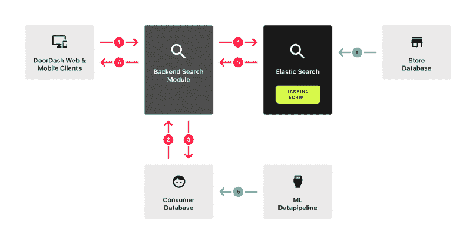

# DoorDash - DoorDash 新闻编辑室提供搜索和推荐功能

> 原文：<https://blog.doordash.com/powering-search-recommendations-at-doordash-8310c5cfd88c?utm_source=wanqu.co&utm_campaign=Wanqu+Daily&utm_medium=website>

软件工程师阿米尔·马纳萨瓦拉和米切尔·科赫

北美各地的顾客来到 DoorDash，从众多他们喜爱的商店中发现和订购商品。我们的使命是根据消费者的个人喜好，为他们展示最好的商店。然而，根据消费者的饮食、口味、预算和其他偏好，“最佳商店”的概念有很大的不同。

为了实现这一使命，我们正在开发搜索产品，根据消费者过去使用 DoorDash 的搜索和订单历史，提供**个性化的发现和搜索体验**。这篇文章详细介绍了我们在搜索生态系统中的个性化方法，这大大提升了从搜索到结账的转换。

### **搜索和推荐挑战**

DoorDash 平台的三方性质(涉及消费者、dashers 和商家)除了一般的搜索和推荐相关问题之外，还提出了许多**有趣和独特的**搜索挑战。一些挑战包括:

*   稀疏性:不是每个消费者都能看到每个商店，这与典型的电子商务推荐问题不同
*   **冷启动问题**:新店或消费者进入系统的情况
*   相关性与多样性之间的权衡
*   在搜索选择中包含准确的**行驶距离**

### **在 DoorDash 搜索概述**

我们使用 [Elasticsearch](https://www.elastic.co/products) 让消费者搜索我们的网站和应用。Elasticsearch 是一个开源的、分布式的、基于 Lucene 的倒排索引，它提供了搜索引擎功能，而不需要重新发明轮子。

对于我们的搜索引擎，有两个主要组件:

首先是**索引模块(离线)**。该组件从数据库中读取 store 对象(在我们的例子中是 Postgres ),并将其写入 Elasticsearch 进行引导，以及对数据库 store 对象进行部分异步更新。

其次是**搜索模块(在线)**。Web 和移动客户端使用指定的消费者位置调用后端搜索 API。在 Django 后端构建一个基于 JSON 的 Elasticsearch 查询来调用 Elasticsearch。该查询在 Elasticsearch 内部执行，以检索相关结果，这些结果被反序列化并返回给客户端。Elasticsearch 查询主要旨在实现两个目的:

*   *选择*:在所有可用的商店中，仅选择那些可从消费者地址订购的商店。这主要是通过弹性搜索的[地理形状](https://www.elastic.co/guide/en/elasticsearch/reference/current/geo-shape.html)特征实现的。我们如何计算地理形状以获得每个地址和商店对的准确行驶距离，这将在另一篇博文中讨论。
*   *排名或评分*:在选择的商店子集中，我们需要根据相关性对它们进行排名。在个性化排名之前，我们进行了一系列排序实验，包括根据受欢迎程度、价格、交付、预计到达时间、评级等进行排名。从实验中得到的主要教训是，没有针对每个用户的全球最佳排名，而是每个用户的“最佳”概念各不相同，这导致我们使用个性化。

### **用于推荐的 ML 建模**

现在我们来谈谈针对个性化的 ML 模型训练和测试。为了在弹性搜索中包含个性化，我们定义了一个基于消费者/商店对的知识推荐系统。对于每一位消费者，我们会根据消费者的订单历史和页面浏览量来评估每个特定商店的推荐质量。

为了帮助我们，让我们定义一些基本术语(注意，Medium 不能很好地处理方程，所以提前为 janky 格式道歉):

*   *c_i* :具有唯一 id 的消费者 *i*
*   *s_j* :具有唯一 id 的商店 *j*
*   d( *c_i* ):消费者数据概况 *c_i*
*   d( *s_j* ):店铺数据简介 *s_j*
*   *f^k*:ml 车型中的第 k 个特征
*   *f^k_ij* :对( *c_i* ， *s_j* )的第 k 特征值

消费者 *c_i* 的数据概况主要是指我们需要作为推荐模型信号的所有数据。我们在数据库中为每个 *c_i* 存储和更新 d( *c_i* ，以便在在线管道中使用。

存储区 *s_j* 的数据配置文件通过索引管道存储在 Elasticsearch 中。

*f^k* 是机器学习模型中的一个特征， *f^k_ij* 是( *c_i* ， *s_j* )对的具体值。例如，我们包括的一个特征是消费者 *c_i* 过去点过的菜和商店 *s_j* 的菜之间有多少重叠。我们将包括基于查看商店页面，价格范围等类似的功能。为了训练，我们为每个 *i* 、 *j* 生成 *f^k_ij* ，使得 *c_i* 、 *s_j* 从前面描述的选择标准中彼此可见，并带有 0/1 标志，这将生成以下格式的数据:

*[0/1 标志，f^0_ij，f^1_ij，f^2_ij，… f^k_ij …]对于每个 I，j，使得 s_j 落在 c_i 的可选范围内。*

正面的例子(在数据模型中标记为 1)是消费者从该商店订购的例子，而负面的例子是尽管该商店对消费者公开，但消费者没有订购的例子。

我们使用该数据来计算消费者从 *s_j* 订购 *c_i* 的概率，由下式给出:

*概率(来自商店 s_j 的 c_i 订单)= 1/(1+e^(-1* ( w_k * f^k_ij)) )* 其中 *w_k* 是第 k 个特征的权重。

我们使用[逻辑回归](https://en.wikipedia.org/wiki/Logistic_regression)模型训练数据，为我们的数据集估计 *w_k* 。

### **弹性搜索中的个性化**

现在让我们讨论一下如何将个性化功能整合到 Elasticsearch 生态系统中，该生态系统实时为我们的应用程序和网站提供服务。为了实现评分，我们必须在 Elasticsearch 中实现上述逻辑回归评分功能。我们通过 Elasticsearch 的[脚本评分](https://www.elastic.co/guide/en/elasticsearch/guide/1.x/script-score.html)功能实现了这一点，该功能用于像我们这样的定制排名用例。这个脚本可以访问 Elasticsearch 中的文档和参数，这些参数可以作为运行时参数在 Elasticsearch 查询中传递。脚本生成的分数随后用于对基于[脚本的排序](https://www.elastic.co/guide/en/elasticsearch/reference/1.7/search-request-sort.html#_script_based_sorting)功能进行排名，以获得所需的排名。

下图描述了描述离线和在线组件的整体架构。

Personalization Search Architecture

#### **离线组件:**

1.  索引管道为 Elasticsearch 索引中的所有商店索引 d( *s_j* )。
2.  ML 数据管道为数据库中的所有消费者写 d( *c_i* )。数据库被离线更新，以反映基于 *c_i* 活动的 d( *c_i* )的变化。

#### **在线组件:**

1.  DoorDash 客户端为 *c_i* 调用搜索后端 API
2.  搜索模块调用数据库为离线 ML 数据管道已经填充的 *c_i* 提取 d( *c_i*
3.  搜索模块在获取 d( *c_i* )时生成弹性搜索查询
4.  搜索模块使用生成的查询命中 Elasticsearch，其中 d( *c_i* )作为参数传递给脚本
5.  Elasticsearch 排名脚本是上面 ML 建模部分描述的逻辑回归评分函数的实现，作为 Elasticsearch JVM 流程的一部分执行。这个脚本本质上是 d( *c_i* )和 d( *s_j* )的函数。该脚本从步骤 4 中获取 d( *c_i* )作为参数，并获取 d( *s_j* )作为索引数据的一部分，该数据是从离线步骤 a 中存储的。
6.  个性化结果被反序列化并返回给客户端

#### 这种设计的优点:

*   **最小延迟影响:**由于搜索是延迟敏感产品，个性化版本不应增加延迟。每个搜索调用只有一次额外的数据库读取(也可以被缓存)。脚本排名功能在 Elasticsearch 内部执行，它是分布式的，并经过缓存优化。我们已经向 100%的客户推出了该功能，对弹性搜索延迟没有任何影响。
*   **水平可伸缩:**更高的搜索量导致更多的堆使用，这可以通过向 Elasticsearch 集群添加更多节点或增加每个节点的头大小来解决。
*   ML 模型变化友好:整体架构适用于任何 ML 模型。我们可以通过实现相应的排名脚本来试验不同的 ML 模型，并基于后端搜索模块的试验调用它，而不改变任何其他部分。
*   **容错:**在任何步骤都无法获得 d( *c_i* )的情况下，我们可以退回到默认选项，使用基线非个性化馈送。

### **未来工作**

我们所做的工作只是皮毛。以下是我们正在努力使搜索引擎变得更好的几个方面:

*   机器学习模型(Machine Learning models):我们正在逻辑回归模型的基础上测试更复杂的 ML 模型，并对个性化模型进行实验，以确定为用户提供多少多样性。
*   **实时功能:**我们正在改进我们的数据管道，使其具备实时功能，并更好地整合来自活动的反馈。

如果你对解决这个领域的挑战性问题充满热情，我们正在招聘[搜索&相关性团队](https://boards.greenhouse.io/doordash/jobs/729570#.WVM4x4nyvBL)和[数据基础设施团队](https://boards.greenhouse.io/doordash/jobs/191998#.WVV0ixPysdU)。如果你对 DoorDash 的其他领域感兴趣，请查看我们的[职业页面](https://www.doordash.com/careers/)。如果有任何意见或建议，请告诉我们。