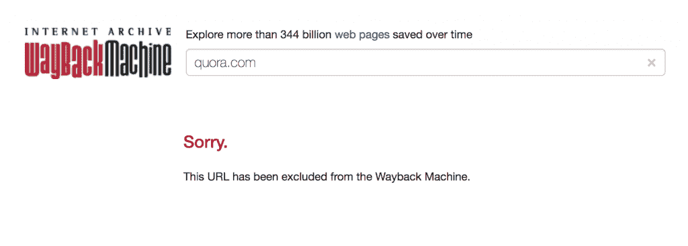

# 为什么你永远不应该使用 Quora-Waxy.org

> 原文：<https://waxy.org/2018/12/why-you-should-never-ever-use-quora/?utm_source=wanqu.co&utm_campaign=Wanqu+Daily&utm_medium=website>

昨天，Quora [宣布](https://www.theverge.com/2018/12/3/18124849/quora-100-million-user-hack-name-email-messages?utm_campaign=theverge&utm_content=chorus&utm_medium=social&utm_source=twitter)1 亿用户账户被“恶意第三方”侵入，包括反对票和直接信息等私人活动

数据泄露是每个在线服务生命周期中令人沮丧的一部分——随着它们越来越受欢迎，它们成为越来越大的目标。几乎每一个主要的在线服务都有安全漏洞:脸书、谷歌、推特、雅虎、Tumblr、优步、Evernote、易贝、Adobe、Target 和索尼都在过去几年里大规模泄露了用户数据。

诸如此类的安全漏洞是使用密码管理器的有力论据，但不是避开你喜欢的服务的令人信服的理由，除非你打算完全退出互联网。

但这似乎是提醒你不应该使用 Quora 的所有其他理由的好时机。

## 积累知识

四年前，[埃里克·米尔](https://konklone.com/post/quora-keeps-the-worlds-knowledge-for-itself)写了一篇关于 Quora 囤积知识的倾向的文章，从那以后一切都没有改变。

根据他们关于页面的[，“Quora 的使命是分享和增长世界知识。”他们每月有 3 亿用户，到目前为止有近 4000 万个问题，他们在增长世界知识方面做得很好，但在分享知识方面做得很糟糕。](https://www.quora.com/about)

Quora 的所有价值都来源于其用户提供的答案，他们不遗余力地打造一个设计良好的寻找和回复问题的平台。

但他们会尽一切努力确保你无法收回那些捐款。

Quora 有:

*   没有公共 API。
*   没有备份或导出工具。
*   在没有帐户的情况下限制访问答案。
*   屏蔽了抓取器和非官方 API，并删除了他们网站上与抓取相关的问题。

相比之下，问答竞争对手的 Stack Overflow 和 Stack Exchange 提供了一个 [API](https://api.stackexchange.com/) ，大量的用户自制工具和[支持社区](https://stackapps.com/)，一个强大的[数据浏览器](https://data.stackexchange.com/)用于查询和导出数据，一个自由的爬行策略，并且不试图将问题和答案隐藏在认证背后。他们甚至主动上传[所有用户贡献内容的匿名数据转储](https://archive.org/details/stackexchange)到互联网档案馆，在知识共享许可下留给后代。

见鬼，甚至 [Ask MetaFilter](https://ask.metafilter.com/) 也允许你导出你的历史，而这大部分是由一个人创建的。

## 封闭保存

如果你想大方一点，你可以说构建 API 或导出工具之类的功能对他们来说不是优先考虑的事情，尤其是当他们还在努力赚钱的时候。

但多年来，Quora 也明确禁止互联网档案馆索引他们的网站。如果你试图在 Wayback 机器的索引中找到任何 Quora 页面，就会看到这个。

Quora 实际上什么也做不了，互联网档案馆会积极地为未来保存他们数百万用户的作品，但他们选择了将他们的网站排除在存档之外。

在他们的 [robots.txt](https://www.quora.com/robots.txt) 文件中，他们详细解释了为什么他们封锁了 Wayback 机器，声称他们这样做是为了保护他们的作者。

> 人们在 Quora 上分享很多敏感信息——有争议的政治观点、工作场所的八卦和薪酬，以及对公司的负面看法。多年来，随着他们换工作或改变观点，重要的是他们可以删除或匿名他们以前写的答案。
> 
> 我们选择退出 wayback 机器，因为包容将允许人们发现公开撰写敏感答案并随后将其匿名的作者的身份，还因为它将防止作者在改变主意发布内容时从互联网上删除他们的内容。据我们所知，网站没有办法有选择地从存档中删除内容，所以这是我们保护作者的唯一方法。如果他们开放一个 API，当作者从 Quora 删除内容时，我们可以从存档中删除内容，但保留其余的内容存档，我们会很乐意选择重新加入。

互联网档案是公共互联网的历史档案，Quora 要求有选择性地修改他们档案的能力是荒谬的。像他们建议的那样的 API 很容易被滥用。

互联网档案无意中成为每个初创公司短视商业计划、灾难性支点或收购失败的应急措施。当你运营一个由社区产生内容的社交平台时，你有更大的责任不要把他们的集体成果付之一炬。这种责任的一部分是参与网络，并回馈你从中获得的东西。

来自 Wayback 机器的[常见问题解答](https://help.archive.org/hc/en-us/articles/360004716091-Wayback-Machine-General-Information):

> 为什么互联网档案馆从互联网上收集网站？什么使得信息有用？
> 
> 大多数社会都很重视保护他们的文化和遗产。没有这些人工制品，文明就没有记忆，也没有从成功和失败中学习的机制。我们的文化现在生产越来越多的数字形式的艺术品。该档案馆的任务是帮助保存这些文物，并为研究人员、历史学家和学者创建一个互联网图书馆。

Quora 的关闭不是一个遥远的可能性，作为一个独特的个人故事和知识的集合，有一个强有力的理由来保留它。大多数风险投资资助的社交平台最终关闭，在许多情况下，唯一留下的残余是志愿者档案员和互联网档案馆保存的东西。

Quora 锁定其社区贡献的所有努力使得当它们消失时难以保存，而总有一天它们会消失。如果你选择向 Quora 投稿，他们会积极争取限制你未来对自己作品的访问。

## 烧掉它

创立近十年后，Quora 的长期前景仍不明朗。他们在四轮融资中筹集了超过 2.25 亿美元，最近一轮是 2017 年 4 月的 8500 万美元 D 轮融资，估值为 17 亿美元。

他们的自助广告平台于去年推出，但尚未公布收益。这是该公司 9 年历史中第一次赚到钱，总比什么都没有强，但其模式的可持续性仍是个问号。

在某个时候，向其投入 2.5 亿美元的投资者会希望获得投资回报。去年，创始人 Adam D'Angelo [表示](https://venturebeat.com/2017/04/21/quora-raises-85-million-to-expand-internationally-and-develop-its-ads-business/)他们希望最终上市。但是市场条件，结合他们广告平台的结果，可能会迫使他们转向不同的方向——一个支点，合并或收购总是有可能的。

当 Quora 关闭时，总有一天它会关闭，所有收集的知识都会丢失，除非他们改变他们的孤立主义精神。

早在 2012 年，Adam D'Angelo [写道](https://blog.quora.com/Our-Mission)“我们希望成为互联网规模的亚历山大图书馆。”

只要 Quora 继续封锁出口，我们可能会看到它以同样的方式结束。

