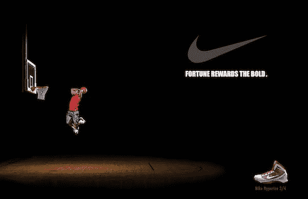
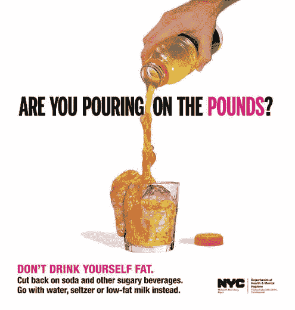

# 广告不是这样的|融化的沥青

> 原文：<https://meltingasphalt.com/ads-dont-work-that-way/?utm_source=wanqu.co&utm_campaign=Wanqu+Daily&utm_medium=website>

有一种迷因，特别是在受过教育的圈子里，关于广告是如何工作的——它如何动摇和诱惑我们，诱使我们温和地购买。

迷因是这样的:

> 广告不是试图说服我们(通过我们理性、分析的头脑)，而是利用我们的情绪。他们的工作原理是在广告产品和情感之间建立积极的联系，比如爱、幸福、安全和性自信。这些关联随着时间的推移而增长和加深，使我们对产品产生好感，并最终更有可能购买它。

这里我们有一个关于广告如何影响消费者行为的理论——一个被提出的机制。让我们称之为**情感盗梦**或者仅仅是**盗梦**，这个词是根据[的同名电影](http://www.imdb.com/title/tt1375666/)创造的，在这部电影中，专家们试图通过操纵他人的梦，在潜意识中向他们的大脑植入想法。然而，就广告而言，*梦*不是最初的载体，而是想法和图像，尤其是那些传达强烈情感的想法和图像。

标签(“情感盗梦空间”)是我自己的，但想法应该足够熟悉。这是因《广告狂人》而流行的广告运作模式，你可以在网上找到类似的账户。例如，《大西洋月刊》的一篇[文章](http://www.theatlantic.com/business/archive/2011/08/why-good-advertising-works-even-when-you-think-it-doesnt/244252/)——标题为“为什么好的广告会起作用(即使你认为它不起作用)”——说

> 广告很少通过争论或号召行动而成功。相反，它创造积极的记忆和感觉，随着时间的推移影响我们的行为，鼓励我们在以后的日子里买东西。

“广告的目标，”文章继续写道，“是播下积极的想法和记忆，将你吸引到这个品牌。”

Lifehacker [在一篇旨在帮助读者减轻广告影响的文章中呼应了这些观点。“广告成功地让我们感受到一些东西，”它说，“这种情感反应会对我们如何思考和做出选择产生深远的影响。”](http://lifehacker.com/5824328/how-advertising-manipulates-your-choices-and-spending-habits-and-what-to-do-about-it)

这无疑是对广告效果的巴甫洛夫式描述。就像巴甫洛夫的狗一样，它们学会了将敲钟与随后的食物递送联系起来，人类也可以被训练做出或多或少的任意联想。如果可口可乐向我们展示了足够多的人们喝了他们的产品后喜气洋洋的画面，我们就会把可乐和幸福联系在一起。然后，过一段时间后，这些好的感觉会如潮水般回到我们身边，我们会更有可能购买可乐。

这种关于广告如何工作的迷因或理论——通过情感启始——已经变得如此根深蒂固，至少在我自己的世界模型中是如此，以至于我总是相信它，从来没有真正思考过它。但是现在我已经停下来思考这个问题，我对它让我们变得如此不理性感到震惊。这表明人类的偏好可以通过一些随意的图片来改变。即使是巴甫洛夫的狗也不是那么容易被操纵的:它们实际上在任意刺激后得到了食物。如果广告也是这样的话——如果一个可口可乐的员工在街上走近你，给你免费品尝，然后给你按摩或者给你 5 美元——那么你当然会学会把可乐和幸福联系起来。

但是大多数广告是没有效力的，无能为力的，仅仅是纸上的墨水或者屏幕上的像素。他们不能喂你，伤害你，或者在晚上给你取暖。因此，如果一个理论(比如《情感盗梦空间》)说，像广告这样平淡、被动的东西会对我们的行为产生如此强烈的影响，我们就应该用这个理论来证明这一点。

社会科学家有一个工具，他们用来推理这样的现象:*经济人*。这是一个人类行为的理想化模型，一个假设的生物(/漫画)做出完全“理性”的决定，其中“理性”是一个定义明确的博弈论概念，意思是(粗略地)自利和效用最大化。换句话说，一个*经济人*——不存在实际的例子，但每个真实的人或多或少都接近它——总是会尽可能地根据自己的偏好做出最大化预期结果的决定。

如果我们(消费者)被情感初始所左右，那么我们似乎违反了这种经济理性的模式。具体来说， *H. economicus* 有固定的偏好或固定的目标——用技术术语来说，固定的“效用函数”这些都是外生的，任何人都无法改变——不是演员本人，尤其是第三方。但是如果《盗梦空间》真的对我们起作用，那么事实上我们的偏好和目标不仅仅是可塑的，而且*很容易*可塑。一个广告人所需要做的就是在产品 X 旁边展示一张漂亮的脸，突然我们就对它充满了渴望。

这当然是夸张的说法。更现实的是，在广告最终开始改写我们的欲望之前，我们需要多次看到它。但这一点仍然有效:外部代理可以在未经我们允许的情况下，改变我们的思想内容，让我们为不属于我们的目标服务。

我知道最近流行强调我们作为人类生物是多么的有偏见和不理性——而且，公平地说，我们的头脑*充满了怪癖。但在这种情况下，广告的先入之见理论对人类的思维有害无益。它把我们描绘成远不如实际的理性。我们可能不符合完美的经济行为模式，但我们也不是受每个拿着广告牌的汤姆、迪克和哈利摆布的傀儡。我们不是*那种*那么容易被操纵。*

我会说，广告不是靠情感开始起作用的。

### 广告中的真实

那么:它们是如何工作的？

情感启始是一种(被提出的)机制，但事实上还有很多这样的机制。它们并不相互排斥:一个典型的广告会同时采用几种不同的技术——其中大部分比情感启始更直接、更光明正大。就我们对这些其他机制的反应而言，我们的行为完全符合人类行为的经济人模型。

这里的指导原则是这些机制传递合法的、有价值的信息。让我们来看看其中的几个。

首先，许多广告仅仅是通过提高知名度来起作用的。这些广告本质上是在告诉客户，“仅供参考，产品 X 是存在的。它是这样工作的。有需要就有。”例如，Liquid Draino 是一种依靠简单意识而蓬勃发展的产品，因为排水管不会经常堵塞，如果你不知道 Liquid Draino 是什么，它有什么作用，你就不会想到使用它。但是这种机制是普遍存在的。几乎每一个广告都是有效的，至少部分是通过告知或提醒顾客关于产品的信息。而如果能给*留下难忘的*印象，那就更好了。

偶尔，广告会试图进行公开说服，即提出一个论点。认为这是最常见或最强大的机制是天真的，但它确实偶尔会出现:“4/5 的医生更喜欢骆驼”或“威瑞森:美国最大的 4G LTE 网络”之类的。[旧广告](https://www.google.com/search?q=old+ads&tbm=isch)特别喜欢这种技巧，但当广告达到现代水平时，它似乎已经过时了。

也许广告使用的最重要的机制是*做出承诺*。这些承诺可以是明确的，以保证或被保证人的形式，但更多时候是隐含的，以品牌形象的形式。当像迪士尼这样的公司以提供“适合家庭的娱乐”而出名时，顾客就会依赖迪士尼来提供这种服务。如果迪士尼违背了这种信任——例如，在其电影中加入太多暴力——消费者会生气，并(至少)减少购买迪士尼的产品。因此，无论承诺是明示还是暗示，结果都是品牌受到激励去实现它，相对于没有做出类似承诺的品牌，消费者会(理性地)购买更多的产品。

还有一个更诚实的广告机制需要讨论。这个被恰当地称为*诚实的信号*，它是马歇尔·麦克卢汉的名言“媒介就是信息”的一个实例在这里，一个广告仅仅通过现有的——或者更具体地说，通过存在于一个非常昂贵的位置——来传达有价值的信息*。一家公司拿出时代广场中央的巨大广告牌宣布(潜台词)，“我们愿意在这个产品上花很多钱。我们致力于此。我们把钱用在了我们的嘴上。”*

了解(或感知)一家公司在广告活动中投入了多少资金，有助于消费者区分稳定的大公司和挣扎中的小公司，或者有大量内部支持(来自母公司)的产品和没有这种支持的产品。这反过来给消费者信心，产品可能会存在一段时间，并得到很好的支持。这对于需要持续支持和维护的复杂产品，如软件、电子产品和汽车，以及任何需要大型生态系统的产品(如 Xbox)都至关重要。就像订婚戒指是一个男人对他未来配偶承诺的诚实象征一样，昂贵的广告活动也是一个公司对其产品线承诺的诚实象征。

到目前为止一切顺利。所有这些广告机制都是通过传递有价值的信息来起作用的。但正如我们所知，并不是每个广告都如此直截了当、光明正大。

### 秘密广告

考虑一下 Corona 的这个例子:

[T2】](/wp-content/uploads/2014/09/corona_ad.jpg)

无论这里发生了什么，都不是关于意识、说服、承诺或诚实的信号。事实上，这个图像几乎完全没有字面意义上的信息。正如史蒂芬·平克所定义的，信息是“通过合法过程产生的两个事物之间的关联(与纯粹的偶然事件相反)。”在这种情况下，图像是如此的*随意*，它不可能传达任何关于科罗纳*本身*的信息，与任何其他啤酒截然不同。Corona 不是专门为海滩设计的，Corona 的任何显著特征都不具备“海滩价值”。你可以换一瓶百威啤酒或喜力啤酒，任何“信息”都不会丢失。[1]

因此，这个广告看起来不像是传达信息，而是像一本教科书上的情感启始案例，即在电晕和放松的想法之间创建一个任意的巴甫洛夫关联。据推测，我们的目标是给我们(观众、消费者)留下美好的回忆，这样，当我们拖着脚步走过啤酒通道，看到 Corona 盒子时，我们就会有一种莫名其妙的温暖模糊感，然后:购买！

但我不认为这是现在的情况。我不认为这个科罗纳广告——或者成千上万个类似的广告中的任何一个——试图逃脱《盗梦空间》的惩罚。还有别的事情在发生；一些其他的机制在起作用。

让我们称这种替代机制为**文化印记**，原因我希望会变得清楚。它与情感启始密切相关，但又有着重要的区别。我今天的论点是，文化印记的影响远远大于情感启始的影响(如果这种事情真的存在的话)。

文化印记是一种机制，通过这种机制，广告不是试图改变我们个人的想法，而是改变文化含义的景观，从而改变我们使用产品时别人对我们的看法。无论你是喝科罗纳、喜力还是百威啤酒，都会“说”出一些关于你的东西。但是你不能控制这个信息；它只是坐在那里，在世界上，已经被广告活动印在了更广泛的文化中。然后由你来决定你是否想与它结盟。你想被视为一个“冷酷”的人吗？然后带科罗娜去参加派对。或者，根据你个人的社会地位，也许“chill”不适合你——如果是这样，你的制胜(EV-maximizing)之举是寻找其他啤酒。但是没关系，因为一个成功的广告活动不需要对每个人都起作用。它只需要在网上运作*——通过把“X 产品”变成一个更有胜算的选择，面向更广泛的人群，比它在竞选之前更有胜算。*

当然，文化印记对某些产品比其他产品更有效。一个产品“说”了你什么，只有在其他人会注意到你使用它的情况下才是重要的——也就是说，如果有社会或文化信号的话。但是这类产品的数量惊人的多。啤酒、软饮料、口香糖、各种食物(想想后院烧烤)。餐馆、咖啡店、航空公司。汽车、电脑、服装。音乐、电影和电视节目(想想工作时的饮水机)。即使是家居产品也会传递文化信号，只要你邀请朋友来家里做客，他们就会被注意到。在你的同伴面前享受或讨论的任何产品都是文化印记的成熟表现。

对于这些产品中的每一种，广告活动都会给每个人带来一个基本的形象或信息。然后，它只是后退一步，等待——不是等待它的情感信息在你的大脑中生根发芽，而是等待你的社交本能接管，让你根据你是否适应它的品牌形象允许你发出的那种文化信号来决定是否使用该产品。

这样，文化印记就依赖于**常识**的原理。一个事实在一个群体中成为[常识](https://en.wikipedia.org/wiki/Common_knowledge_(logic))，仅仅让每个人都知道是不够的。每个人都必须知道*其他每个人都知道它*——并且知道他们知道他们知道它...诸如此类。

所以，一个广告要想通过文化印记起作用，仅仅被一个人看到，甚至被许多人单独看到是不够的。它必须在大量观众面前公开播放。我必须看到广告，但我也必须知道(或怀疑)我的大多数朋友也看到了广告。因此，我们会期望在广告牌、公交车站、地铁、体育场和任何其他公共场所，以及流行杂志和电视节目中发现印记广告——换句话说，在*广播媒体*中。但是我们*不会*期望在传单、门牌或直邮上找到文化印记广告。同样，互联网搜索广告和横幅广告不利于文化印记，因为互联网是如此分散。每个人都生活在自己的小网络世界里。当我看到一个谷歌搜索广告时，我不知道我的其他同行是否看过这个广告。

在某种程度上，文化印记是一种形式的开端，但它比传统(巴甫洛夫)的解释让我们相信的要浅得多。一个广告不需要完全进入任何人的深层情感大脑；它只需要暗示它*可能已经将自己*接受到*其他人的*大脑中——然后(除非有任何相反的证据表明人们实际上相信什么)，它将慢慢进入[共识现实](https://en.wikipedia.org/wiki/Consensus_reality)，成为文化景观的一部分。

与《盗梦空间》不同(我认为它实际上并不存在)，文化印记完全符合人类决策的经济人模型。它让我们的目标完全保持不变(典型的是:希望得到同伴的尊重)，并通过在外部文化景观中留下自己的印记，仅仅改变了追求这些目标的最佳*方式*。结果是一样的——我们购买了广告中更多的产品——但是影响的途径是不同的。

总结一下:

> 文化印记=浅薄的情感启始+常识→启始成共识现实

### 广告示例

我们来看几个具体的例子。这是耐克的一则广告:

[T2】](/wp-content/uploads/2014/09/nike_ad.jpg)

情感开端的故事是这样的:上面的广告在耐克品牌和卓越运动理念之间建立了联系。随着时间的推移和足够的曝光，客户将内化这种联系。因为他个人重视优秀的运动，他会开始对耐克品牌和产品产生好感。稍后，当顾客在买鞋时，这些积极的联想和情绪会促使他购买耐克鞋。

文化印记的故事是这样的:上面的广告在耐克品牌和卓越运动理念之间建立了联系。(到目前为止，如此相似。)随着时间的推移和足够的曝光率，顾客会意识到“耐克”在更广泛的文化中是“优秀运动”*的同义词*。后来，当他买鞋时，他的大脑会利用这些信息(直觉地)预测如果他穿着耐克鞋出现在球场上(相对于穿其他品牌的鞋)，他的同龄人会怎么看他。这至少会让他倾向于购买耐克。

这是另一个广告，一种公益健康信息:

[T2】](/wp-content/uploads/2014/09/pouring_on_the_pounds.jpg)

乍一看，这个广告似乎是在提出一种个人诉求，一种论点:如果你喝含糖饮料，你会变胖。这似乎是一种人们可以私下体验(例如，在浏览互联网时)而不会削弱其效果的广告，如果这种广告通过说服或盗梦空间起作用，肯定会是这种情况。但是想想看，当这个广告在公共场所显著地展示时——比如在地铁上(这是它实际运行的地方),效果会有多好。一旦每个人都看了广告，含糖饮料对你有害(有点恶心)就成了常识，你会开始担心如果你的朋友发现你喝了，他们会怎么想。同龄人的压力是一种极其强大的力量，如果广告能够利用这种力量，哪怕只是其中的一小部分，也会产生相当大的影响。

### 显著性

这两种机制(初始和印记)的关键区别在于广告需要有多显眼。就广告通过先入为主起作用而言，它的效果完全发生在广告和个人观众之间；广告根本不需要显眼。另一方面，一个广告要通过文化印记起作用，它需要放在一个显眼的位置，观众会看到它*和*知道其他人也在看它。

我们已经讨论了植入式广告如何在广播媒体中发挥最佳效果，但即使在单一媒体中，我们也应该期待看到受众规模效应。

例如，考虑在吸引 1 亿观众的超级碗比赛期间的广告，与在 100 个不同的电视节目期间的广告，每个电视节目有 100 万观众。同样的总收视率，但在超级碗的情况下，这是一个巨大的观众群(非常清楚自己的规模)，而在 100 个不同的节目中，观众是分散的。

如果一个广告主要通过产生情感联想来起作用，那么受众有多分散并不重要——重要的是广告能够产生的印象总数。另一方面，如果一个广告主要是通过文化印记起作用的，那么我们会期望巨型超级碗观众比同等规模的零散观众更有价值。为什么？因为在超级碗期间，每个人都知道*其他人*都在看，所以在超级碗期间传达的任何品牌形象几乎都保证会在更广泛的文化中扎根，因此在以后的日子里会被“正确地”感知。

如果一种相对较新/不知名的啤酒品牌在超级碗期间宣传自己是“朴实无华的欢乐时光派对啤酒”，你可以在晚些时候带着这种啤酒参加朋友的烧烤，相信你的意图会被理解。然而，如果同一个不知名的品牌在 100 个不同的电视节目中为自己做广告，而你只看过其中一个——在一个不知名的烹饪节目中——你就不知道你在烧烤会上的朋友是否会对品牌形象有同样的理解，以及他们是否会正确地理解你的意图。

因此，如果一个广告在开始阶段就能发挥作用，我们应该期待它的价值(对广告商而言)与受众的规模成正比。另一方面，如果一个广告通过文化印记起作用，我们应该期待它的价值(对广告商来说)与受众的规模成正比*。*

哪个是真的？我不知道。但我怀疑——尽管存在令人困惑的因素——我们看到受众规模和广告价值之间的关系不仅仅是线性的，这可能解释了大的国内(和国际)品牌所享有的一些网络效应。

### 产品类型

如果品牌广告通过情感启始起作用，我们会期望品牌按照其产品的市场规模来做广告。另一方面，如果品牌通过文化印记起作用，我们应该期待品牌按照市场规模*和*与产品使用的显著性成比例地宣传自己。

床单就是一个完美的例子。如果广告通过情感上的先入为主起作用，为什么不让我们相信 X 品牌的床单是钱能买到的最光滑、最柔软、最好睡的床单呢？另一方面，如果广告通过文化印记起作用，那么我们应该期待几乎没有床单的品牌广告，因为他们的消费几乎完全是模糊的(与显眼相反)。你的同龄人不太可能会看到或感觉到你的床单，甚至不会询问它们。床单并不是一种社会产品，所以文化印记并不能说服我们购买它们。

问:你见过床单的广告吗？你能说出床单的品牌吗？如果广告通过情感启始起作用，难道你不希望看到至少一些广告试图让你相信 X 品牌的床单会照亮你的一天吗？[2]

这里是另一个明显没有品牌广告的市场:加油站。让我们把汽油比作软饮料。两者或多或少都是商品。是的，在质量上有一些小的差异，但在大多数情况下，一瓶可乐或汽油和下一瓶一样好。这两种产品都是普通美国人会花很多钱购买的——可能是几百美元的汽水和几千美元的汽油。然而，我们发现品牌广告在汽水市场比在汽油市场更频繁。可口可乐、百事可乐、雪碧、七喜、胡椒博士——这些品牌到处为自己做广告，为自己创造身份，而这些身份几乎与它们的基本产品毫无关系。不知何故，可乐“说服”我们，喝它会给我们带来快乐。但是为什么我们没有看到围绕加油站品牌的相同类型的任意联想呢？如果可口可乐可以利用广告每瓶多收几分钱——并且发现这样做绝对符合它的利益——为什么莫比尔、Citgo、埃克森、Valero、壳牌或德士古不这么做呢？如果广告通过情感启始起作用，那么这些加油站似乎会通过试图给我们(消费者)播下积极的氛围而受益匪浅，因此当我们处于三个不同加油站的十字路口时，我们更有可能选择广告中的品牌。我认为，答案是去加油站是一种个人活动，而不是一种社交活动，而喝汽水却经常是在别人的陪伴下进行的。

诚然，雪佛龙确实试图在美国为自己塑造一个品牌形象，但该品牌在很大程度上是基于对质量的承诺，而不是一种任意的情感或生活方式的联系。我的论点是，如果《盗梦空间》真的有用，那么我们可以期待在加油站这个(相当大的)市场上看到更多这样的东西。

### 为什么品牌不是双面的？

inception 模型预测，品牌将从“双面”或“多面”中受益，即品牌应该分别向每个受众做广告，使用最有可能引起每个特定受众共鸣的任何信息，以提供最大的情感影响。

例如，Corona 可以向压力重重的爸爸们宣传自己是一种令人放松的海滩啤酒(就像现在一样)。与此同时，它可以向大学生宣传自己是一种有趣的派对啤酒，向赛车爱好者宣传自己是冠军啤酒。在 NPR，它可能表现得与众不同或富有智慧。当然，不知何故，这立刻让我们觉得是错误的。但是为什么呢？啤酒以各种方式为自己做广告。给定产品(如 Corona)的内在品质很少会迫使它坚持一个品牌形象。那么，为什么品牌将自己局限于一个中心信息呢？

佳得乐是另一个品牌，它可以在各种积极的联想之间飞来飞去，或者同时在多个联想之间对冲，只要这些情绪不会相互干扰。事实上，将一个个关联叠加在一起会产生比单个关联相加更大的效果。一个广告可能把佳得乐和运动表现联系起来，而另一个可能把它和“玩得开心”联系起来，还有一个可能强调它的味道。为什么不呢？所有这些都是历史悠久的品牌战略。谁不喜欢找乐子或者喝点好喝的？另外，我们都已经把佳得乐和运动联系在一起了——为什么不给我们另一个购买它的理由呢？这就像对同一种产品进行多种情绪化的“论证”。

但很明显，这并没有发生。相反，品牌开拓出一个相对狭窄的品牌识别空间，并占据它几十年。文化印记模型解释了为什么。品牌需要相对稳定，并摆出一致的“面孔”，因为消费者利用它们来传递社会信息，如果品牌产生太多不同的联想，(1)它会冲淡任何一个人可能想要传递的信息，(2)它会让人们不舒服，因为人们会把*自己*与一个到处跳跃的品牌联系起来，像一门松散的大炮一样发射不同的品牌信息。

如果我要带 Corona 去参加聚会或后院烧烤，我需要确信我打算发送的信息(基于我自己对 Corona 文化形象的理解)是将被接收的信息。也许我很乐意把自己和沙滩啤酒联系在一起。但如果我担心其他人一直在看不同的广告(“科罗纳:基督徒的啤酒”)，那么我会对我的购买更加紧张。

随着时间的推移，品牌会建立信任，不仅仅是对产品质量的信任，还要相信他们不会太大或太快地改变他们的品牌信息。

### 缺少个人广告

如果广告通过《盗梦空间》起作用，那么我们应该能够像公司向我们做广告一样有效地向我们自己做广告，我们可以利用这一点来修复我们角色中所有让我们感到沮丧的缺陷。如果我决定变得更外向，我可以给自己印一个个性化的广告，在超级模特或私人飞机旁边印上“更社会化”的口号，或者任何我认为最能激励我的成功或幸福的形象。我希望这样的广告，每天盯着我的脸，对我的心灵产生实质性的“盗梦空间式”的影响。我会逐渐将“社交”与温暖的感觉联系起来，最终——不用动一根手指——我会发现自己对去酒吧和派对的前景非常*兴奋*。轻松自我提升:这不就是我们一直在寻找的灵丹妙药吗？

但是没有灵丹妙药，因为这些任意联想的广告在《盗梦空间》中不起作用。他们通过文化印记来工作，当目标受众是一个人时，没有“文化”来印记——没有其他人来欣赏预期的信息。

博客 [Take Back Your Brain](http://www.takebackyourbrain.com/2006/the-really-personal-ads/) 提倡“个人营销”，也就是对自己做广告。肯定和激励海报似乎是在追求类似的效果。但是，如果《盗梦空间》真的像广告评论员所说的那样有效，我希望看到比我们实际观察到的更多的个人营销。

### 没有豁免权

最后一个想法。

《盗梦空间》模式的问题在于，它点燃了一种希望，那就是我们*可以*不受广告的影响，只要我们足够勤奋，或者我们培养了正确的精神毅力。如果我们有一个更强大的心理“免疫系统”，广告就不会进来——即使是通过情感渠道。

每当有人建议你对广告进行“批判性思考”时，你都能看到这种希望的曙光。例如，我之前提到的 Lifehacker 文章提供了两种应对不受欢迎广告影响的策略:(1)不要忘记思考，(2)警惕你的情绪反应。这篇文章承认，我们可能永远也不会产生完全的免疫力，但它表明，只要足够小心和练习，我们至少可以学会减轻一些更有害的影响。

但是如果我对广告实际上是如何工作的看法是正确的，那么这个建议就没用了。广告让我们买东西，不是不顾我们的理性，而是因为理性。广告把我们定位为效用最大化的经济人，而不是充满怪癖的 T2 智人。

当广告通过传递真实信息起作用时，当然，我们很乐意消费这样的广告(以及它们推销的产品)，因为广告为我们提供了有价值的服务。但是，当一个广告通过文化印记起作用时，我们会觉得自己在某种程度上被操纵了。*而我们是*。在看到广告之前，产品对我们来说价值不大，但是看到广告之后，我们发现自己想要购买它(而且价格不菲)。问题是，这种广告无处可逃，无处可免。一旦我们看到它——并且知道我们所有的同行也看到了——购买广告产品符合我们理性的自身利益。

避开广告也没多大帮助。因为品牌形象是我们居住的文化景观的一部分，当我们屏蔽广告或快进通过它们时，我们就错过了有价值的文化信息，使我们自己与时代精神疏远了。这使我们有可能变得过时、不时髦，或者在社会上倒霉。我们变得像一个孩子穿着他爸爸的衣服去参加他的第一次中学舞会。

当然，对于某些文化环境中的某些人来说，不幸并不是那么糟糕，我认为自己生活在这样一群人中是非常幸运的。但是，如果你的大多数同龄人都接触到这些广告，你也会因为没有看到它们而错失良机。

____

(脚注添加在原始帖子之后，以反映我从其他人的回复中了解到的情况。)

【1】*电晕*。正如[格雷格·雷德](http://onthespiral.com/)和[卡罗琳·泽隆卡](https://www.quora.com/Caroline-Zelonka)所指出的，科罗娜和海滩之间的联系并不完全是随意的。Corona 是一种墨西哥啤酒，最初(被美国游客)主要在海滩城镇消费——所以，正如 Greg 所说，这种联系至少有“间接”依据。即使对于其他产品，情感或生活方式的联系也可能在现实中有所依托。

【2】*床单*。卡罗琳和亚历克斯·霍金斯指出，床单*有时会做广告，有点《盗梦空间》的味道。例如，参见 [Wamsutta](https://www.google.com/search?tbm=isch&sa=1&q=wamsutta+ad) 床单的广告。我仍然认为床单广告的稀缺(相对于汽水广告而言)很大程度上是由于产品的非社会性，但似乎也有例外。*