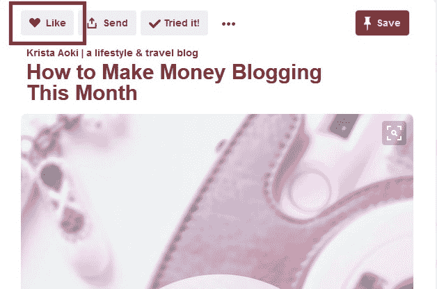
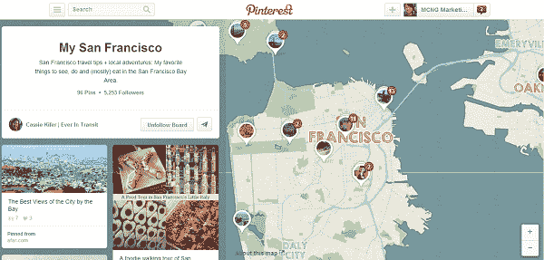
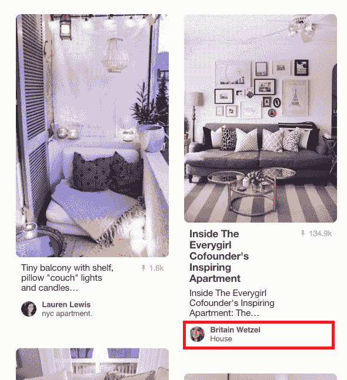
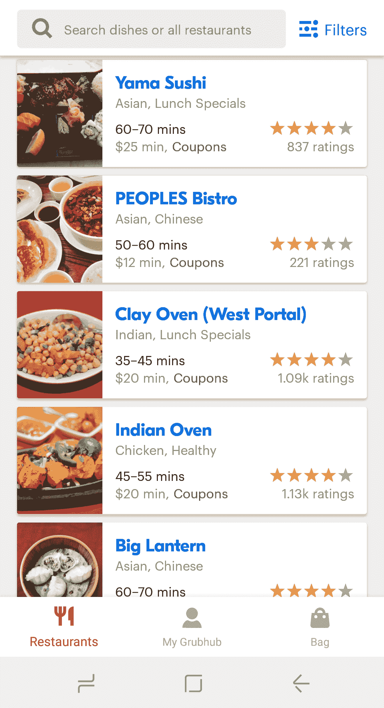
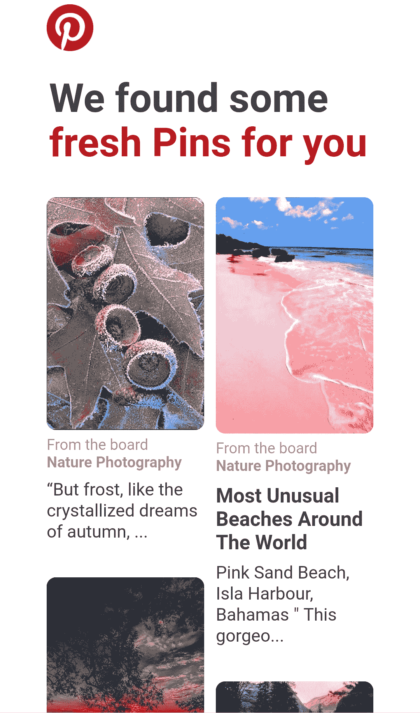

# 功能/产品契合度| Casey 意外

> 原文：<https://caseyaccidental.com/feature-product-fit/?utm_source=wanqu.co&utm_campaign=Wanqu+Daily&utm_medium=website>

通过各种方法，硅谷已经把产品/市场契合的概念钻入了创业者的脑海。马克·安德森说这是唯一重要的事情，布莱恩·鲍尔弗在 T2 有一系列关于如何找到它的帖子。但是你找到产品/市场契合度之后呢？你停止产品工作了吗？我想大多数人会认为肯定不是。在产品/市场适应后，公司必须在创造新产品价值、提高当前产品价值和增加体验当前产品价值的人数之间取得平衡。虽然我已经写了很多关于如何做第三步的文章，甚至写了一篇关于思考[新产品价值](https://caseyaccidental.com/focus-vs-expansion)的文章，但是我还没有写太多关于如何做第二步的文章。

**什么是特性/产品契合度？**
随着时间的推移，每个产品团队都试图让自己的核心产品变得更好。但可悲的是，在大多数公司，这个过程是推出新功能，并希望或假设它们对现有客户有用。公司没有一个很好的标准来理解这个特性对现有产品是否有价值。这一过程应该类似于寻找产品/市场契合度，但也有一些不同。我把这个过程称为特性/产品匹配，我将解释如何找到它。

在产品/市场契合度中，有三个你要寻找的主要成分。我写了[我的产品/市场适应过程](https://caseyaccidental.com/what-are-growth-teams-for-and-what-do-they-work-on/%22)，Brian Balfour、Shaun Clowes 和我已经建立了一个关于保留部分的[完整课程](https://www.reforge.com/retention-engagement-series/)。为了快速回顾一下我的帖子，你需要:

*   保留:一部分用户围绕你的产品的使用建立了一个可预测的习惯
*   货币化:在未来某个时间点将这种使用货币化的能力
*   获取:结合产品的保留和货币化应该创造一个可扩展的和有利可图的获取策略

特性/产品匹配也有类似的过程。我们称之为特性/产品匹配清单:

*   该功能必须为该特定功能保留用户
*   该功能必须有一个可扩展的方式来推动其自身的采用

功能/产品契合度有第三个要求，有点不同:**功能必须提高核心产品的保留率、参与度和/或货币化。**

对于产品团队来说，这最后一部分可能有点难以理解。他们所构建的产品不仅需要经常使用并吸引他们自己的使用才能成功，他们还需要让整个产品体验更好。这是非常困难的，这也是为什么大多数公司内部的功能发布都是失败的。当一个特性被保留和采用，但没有增加公司的保留、参与或收益时会发生什么？这意味着它正在蚕食产品的另一部分。这可能没问题。只要这三个组成部分不减少，运送该功能可能是正确的决定。这方面最著名的例子是网飞在技术生命周期的早期就引入了流媒体，通过邮件业务蚕食了 DVD 业务，但对他们来说更具长远战略意义。

**功能团队的工作是什么？**
当新特性减少了这三个领域中的一个时，你会惊讶地发现有多少核心产品特性被发布了。这是怎么发生的？很简单。开发该功能的团队是受功能使用而不是产品使用的激励，所以他们强迫每个人都去尝试。这使得产品体验变得更加复杂，并且分散了一些具有特性/产品匹配的核心产品领域的注意力。

如果你拥有一个特性(我不是说这是团队拥有特性的正确结构)，你的工作不是让人们使用这个特性。您的工作是找出该功能是否符合功能/产品。您可以通过检查上面列出的与功能保留、功能采用和核心产品保留、参与和货币化相关的三个组成部分来做到这一点。在此过程中，您还需要确定该功能适合哪些用户(提醒:几乎不会有[新用户](https://caseyaccidental.com/you-are-not-your-customer/))。有些功能应该只针对一小部分用户，例如脸书上的商家或 Pinterest 上的内容创建者。只有到那时，你的工作才转移到拥有该功能的使用上。而且在很多团队里，这仍然不是你的工作。然后，该特性成为一种工具，增长团队可以利用它来提高整体产品保留率、参与度和收益。

**特性团队在寻找特性/产品匹配时犯的错误**
特性团队通常会犯错误，在他们测试的一开始就不满足特性/产品匹配的第三个组成部分。

*   错误 1:给你的整个用户群发邮件，告诉他们你的新功能
    你的用户不关心你的功能。他们关心你提供给他们的价值。当你在早期给他们发邮件时，你还没有证明你提供了该功能的价值。在我的职业生涯中，特色邮件的表现总是不如核心产品邮件。这种低劣的性能影响了整个产品的电子邮件渠道的价值，从而降低了产品的整体留存率。
*   **错误#2:在产品顶部为所有用户放置横幅，介绍新功能**
    新功能通常针对特定类型的用户，因此并不与所有用户相关。对于那些试图学习核心产品基础知识的新用户来说，它们尤其无关紧要。这些横幅分散了他们的注意力，降低了激活率。这就像在你的用户还不知道怎么爬的时候问他们是否对波士顿马拉松感兴趣。
*   **错误之三:推出新功能**
    媒体铺天盖地为你的功能做公关感觉很棒，但它不会帮你找到适合的功能/产品。在你测试了功能/产品适合度之后，公关可能是一个很好的接触用户的工具。在你做实验证明特性/产品适合之前，这不应该发生。并且它不会修复没有特性/产品匹配的特性。

**许多功能找不到适合的功能/产品**
产品团队开发的许多功能找不到适合的功能/产品。出现这种情况时，需要删除这些特征。此外，一些旧功能将不再适合功能/产品。如果无法赎回，也需要将其删除。如果您没有衡量功能/产品是否适合旧功能，请返回并这样做。如果他们没有，就删掉。我们在 Pinterest 最有价值的工作就是删除功能和代码。举几个例子:

[T2】](https://secureservercdn.net/50.62.195.160/q3u.d9b.myftpupload.com/wp-content/uploads/2018/04/pinterest-like-button.1493059932.jpg)

[T2】](https://secureservercdn.net/50.62.195.160/q3u.d9b.myftpupload.com/wp-content/uploads/2018/04/Pinterest-Place-Pin-Map.png)

*   **pin ner/Board Attribution in the Grid(RIP 2016):**随着产品从社交网络转向兴趣网络，将 pin 归因于用户及其董事会变得不那么有意义，并且使 UI 变得混乱，阻止我们同时在屏幕上显示更多内容

[T2】](https://secureservercdn.net/50.62.195.160/q3u.d9b.myftpupload.com/wp-content/uploads/2018/04/pinterest-feed-2.png)

**我如何帮助我的功能找到适合的功能/产品？**
所有功能都应作为实验启动，以测试功能/产品的适合性。在这个实验中，您希望将新功能展示给足够多的人，以确定它是否可以开始通过您的功能/产品适合度清单。对于小公司来说，这可能意味着要对你的所有观众进行测试。对于像 Pinterest 这样的公司来说，这可能只从 1%的用户开始。这些实验的受众通常是您当前的用户群，但是如果您正在为不同类型的用户测试功能，也可以通过付费获取来完成。

我会给你一些策略，这些策略帮助我工作过的公司在过去几年里找到了特性/产品的契合点。大多数好的产品开发始于数据分析和用户研究的结合。用户研究应该[在正确的时间](https://caseyaccidental.com/the-right-way-to-involve-a-qualitative-research-team/)参与进来，以增加最大的影响，防止确认偏差，并确定用户正在努力看到哪些组件的价值。例如，当我们推出 Grubhub 移动应用程序时，我们在数据中看到，当人们使用当前位置功能时，他们的交谈率低于输入地址的人。这被证明是一个精度问题，所以我们关闭了那个组件，直到我们能够提高它的精度。

在研究中，我们发现人们很难确定在搜索结果中点击哪家餐馆。在网络上，他们可能会打开多个标签来解决这个问题，但这在应用程序中是不可能的。因此，我们决定哪些信息可以帮助他们决定哪些餐厅适合他们，并开始将这些信息添加到搜索结果页面中。这包括美食，预计送货时间，最低，星级，评级数量，表面上看，页面现在感觉杂乱，但这提高了转化率和保留。

[T2】](https://secureservercdn.net/50.62.195.160/q3u.d9b.myftpupload.com/wp-content/uploads/2018/04/Grubhub-Search-results-Android.png)

由于 Grubhub 是一种交易型产品，我们能够利用**激励**作为一种策略来帮助找到特性/产品的契合度。我们的早期数据显示，开始使用移动应用的人的终身价值是网络用户的两倍。因此，我们为每个人的第一个移动订单提供 10 美元的折扣。这第一次将网络用户转移到了移动设备上，并首先在移动设备上获得了许多用户。这一策略非常成功，尽管有激励措施，但终生价值的提高保持不变。

Grubhub 还利用**人**来帮助寻找功能/产品匹配。由于移动应用在当时是新事物(我们是第一个送餐应用)，我们监控社交媒体上的任何问题，并让我们的客户服务团队立即干预。

 
*不是所有的抱怨都是这种自娱自乐。*

在 Pinterest，我们在 2013 年推出了相关的 pin。对于 Pinterest 来说，我们当时没有一个收入模式，所以围绕激励和人员的策略没有太大意义。相反，我们做的一件事是使用**通知**来推动功能/产品匹配。一旦这个算法被开发出来，在你锁定了某个东西之后，我们现在可以通过电子邮件向你发送更多你可能喜欢的与那个 Pin 相关的 Pin。这些邮件非常成功。

[T2】](https://secureservercdn.net/50.62.195.160/q3u.d9b.myftpupload.com/wp-content/uploads/2018/04/Pinterest-Related-Pins-email.png)

Pinterest 还使用了**产品**来推动功能/产品匹配。我们在 Pin 页面下面启动了算法结果，当人们滚动时，交互非常好。但是很多人没有滚动到图钉下面。因此，我们尝试将它们移动到大头针的右侧，这增加了参与度，并且我们开始将您保存的项目的相关大头针也插入到核心主页 feed 中，这增加了参与度。

**功能/产品匹配清单**
在帮助产品寻找功能/产品匹配时，您应该浏览此清单，以帮助您的功能取得成功:

*   关于该功能的使用，数据告诉了我什么？
*   关于该功能，用户告诉了我什么？
*   我如何使用核心产品来帮助推动特性的采用？
*   我如何使用通知来帮助推动该功能的采用？
*   我如何利用激励措施来推动该特性的采用？
*   我如何利用人员来推动该功能的采用？

确认特性/产品适合时，您需要问:

*   该功能是否显示保留？
*   什么类型的用户会继续使用该功能？
*   我如何限制暴露给那些用户？
*   对于这些用户来说，该特性的可扩展采用策略是什么？
*   这一特性如何推动整个产品的留存率、参与度或货币化？

每个公司都想随着时间的推移改进自己的产品。您需要开始衡量您正在构建的功能是否真的做到了这一点。您还需要衡量现有功能是否增加了价值，如果没有，就开始删除它们。当您构建新功能和衡量旧功能时，询问这些问题将确保您的功能能够找到适合的功能/产品，并为用户和您的企业增加价值。

感谢 Omar Seyal 和 Brian Balfour 阅读本文的初稿。

*目前正在听伊菲简的 [Breaking。](https://open.spotify.com/album/6cx4rPSnsiiLTswQbRt7r0?si=I9gqhWElSCmqzVVUMUSEzw)*