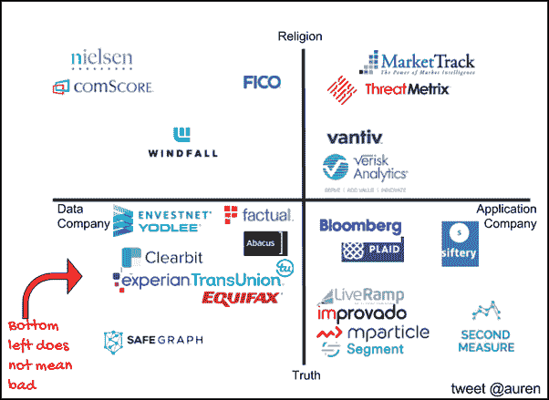

# 真理与宗教——数据公司的四个象限 Auren Hoffman 的总结

> 原文：<https://summation.net/2019/02/24/truth-verses-religion-four-quadrants-of-data-companies/?utm_source=wanqu.co&utm_campaign=Wanqu+Daily&utm_medium=website>

**数据公司分为四个象限:真理与宗教，数据与应用**

如果你正在考虑创办一家数据公司，你必须做出一个非常重要的选择:你将成为一家什么样的公司？数据公司有四种基本类型，它们都可能非常成功……但数据公司犯的最大错误是，它们试图一次做多件事情。

<noscript></noscript>

首先让我们定义 x 和 y 轴…

**真理与宗教**

真相公司是向后看的。它们告诉你发生了什么或什么时候发生了什么，或者关于一个人、一件产品或一件事物的一些事情。这些公司的主要目标是拥有真实的数据。truth 公司的好例子是信用局(如 Experian、Equifax 和 Transunion)、中间件(如 LiveRamp、Segment、Improvado 和 mParticle)和金融服务数据(如彭博的大部分地区)。这些公司通常很缺数据工程师。

宗教公司预测未来。他们根据一组数据告诉你会发生什么。这些公司的主要目标是准确预测未来。宗教公司的好例子是信用评分(如 FICO)、欺诈防范(如 ThreatMetrix)和测量(如 Nielsen，Market Track)。这些公司通常是长数据科学家(有时也是机器学习工程师)。

宗教公司经常从真理公司购买数据。例如，FICO 使用来自信用机构的数据作为其信用评分的核心要素。

**数据与应用**

一旦你有了一套有价值的专有数据，你就必须选择是做一家纯数据公司，还是在你的数据基础上构建一个应用程序。

**数据公司就是卖数据的。**了解你是否是一家数据公司的最好方法是你是否没有 UI 或者 UI 非常有限。数据公司有时直接销售给最终买家，但也经常销售给应用程序(这就是为什么它们不成为应用程序如此重要，因为你不想与你的客户竞争)。数据公司的好例子是金融服务(如 Yodlee、Vantiv)、纯数据合作社(如 Clearbit)、位置(如 SafeGraph)、财富预测(如意外之财数据)等。

应用程序让数据歌唱。要真正从数据中获益，您需要一个应用程序。这些公司会有很好的 UI 和更多的前端工程师。很好的例子是查询层(如 SecondMeasure)、精炼数据合作(如 Verisk 和 Abacus)、集成层(如 Vantiv、Plaid)、B2B 产品使用(如 G2Crowd)等。

**赢家和输家以及赢家通吃的市场**

一家“真实”的公司要想在这个领域占据主导地位，它必须明显比其他任何公司都要好。“更好”意味着它的数据需要是最真实的，市场需要相信它是最真实的。除了真实，广度和价格是很重要的主导。

对于“宗教”公司来说，最重要的因素是品牌。当预测未来时，理想情况下，你希望相信宗教公司的占卜者正在做出准确的预测。虽然有些人可能会陷入贝叶斯逻辑，但大多数人会相信市场感知。这就是为什么有这么多糟糕的预测分析公司，因为人们可以用钱买品牌。

**串联拍并联**

数据公司犯的最大错误是，他们同时攻击多个象限。对于第一个 1 亿美元的收入，你应该只专注于一种业务。

*注:本贴原文为* [*真理与宗教:你是什么样的数据公司？2017 年在 AdExchanger*](https://adexchanger.com/data-driven-thinking/truth-vs-religion-kind-data-company/) *。*

### 像这样:

像 装...