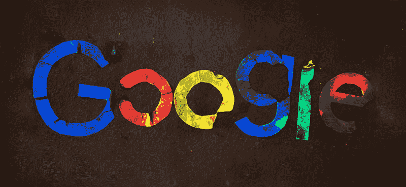
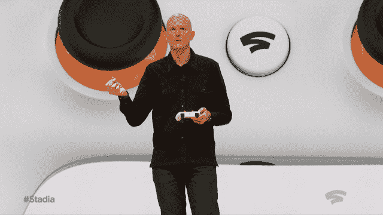

# 谷歌不断的产品停产正在损害其品牌| Ars Technica

> 原文：<https://arstechnica.com/gadgets/2019/04/googles-constant-product-shutdowns-are-damaging-its-brand/?utm_source=wanqu.co&utm_campaign=Wanqu+Daily&utm_medium=website>

[Enlarge](https://cdn.arstechnica.net/wp-content/uploads/2019/04/3.jpg) /

一位艺术家对谷歌当前声誉的渲染。

奥里奇·劳森

现在才 4 月，对于谷歌的产品组合来说，2019 年已经是绝对残酷的一年。Chromecast 音频[于 1 月 11 日](https://arstechnica.com/gadgets/2019/01/google-kills-the-chromecast-audio/)停产。1 月 15 日，[移除并删除了【YouTube 上的注释。2 月 8 日，谷歌光纤](https://support.google.com/youtube/answer/2683267)[打包离开了光纤城市](https://arstechnica.com/information-technology/2019/02/google-fiber-exits-louisville-after-shoddy-installs-left-exposed-wires-in-roads/)。Android Things [于 2 月 13 日放弃物联网支持](https://arstechnica.com/gadgets/2019/02/android-things-is-no-longer-for-things-focuses-on-smart-speakers-and-displays/)。据报道，谷歌的[笔记本电脑和平板电脑部门](https://arstechnica.com/gadgets/2019/03/google-hardware-makes-cuts-to-laptop-and-tablet-development-cancels-products/)于 3 月 12 日被削减。谷歌 Allo 于 3 月 13 日关闭。“聚焦故事”虚拟现实工作室[于 3 月 14 日关门](https://variety.com/2019/digital/news/google-spotlight-stories-shutting-down-1203163117/)。3 月 30 日，goo.gl 网址缩写[被新用户](https://developers.googleblog.com/2018/03/transitioning-google-url-shortener.html)切断。Gmail 的 IFTTT 支持于 3 月 31 日停止工作。

今天，也就是 4 月 2 日，我们将迎来一场谷歌的双重葬礼:谷歌的[+](https://arstechnica.com/gadgets/2019/01/google-shuts-down-april-2-all-data-will-be-deleted/)(面向消费者)*和* [谷歌收件箱](https://arstechnica.com/gadgets/2018/09/google-kills-google-inbox/)都将被埋葬。今年晚些时候，Google Hangouts " [Classic](https://twitter.com/RonAmadeo/status/1070755806264610820) "将[开始降温，](https://arstechnica.com/gadgets/2019/01/the-great-google-hangouts-shutdown-begins-october-2019/)不知何故也计划在 2019 年将 Google Music 的["迁移"](https://arstechnica.com/gadgets/2018/05/youtube-music-will-replace-google-play-music-but-wont-kill-user-uploads/)到 YouTube Music，随后的某个时候 Google 服务将被判死刑。

今年已经过去 91 天了，到目前为止，谷歌的死亡人数达到了前所未有的水平。如果我们只考虑 2019 年已经发生的官方关闭日期，平均每九天就有一个谷歌品牌的产品、功能或服务死亡。

这些产品停产有些是有过渡计划的，有些(像 Google+)代表谷歌完全放弃了一个用户群。不过，具体细节并不重要。重要的是，这些行动中的每一个都对谷歌的品牌产生了负面影响，而几乎持续不断的关闭声明让谷歌看起来比以往任何时候都更加不稳定和不可信。是的，有一次谷歌在九年前杀死了 Google Wave，或者在六年前夺走了 Google Reader 和 T2，但是事情从来没有这么糟糕。

有一段时间，有一小部分人担心谷歌的隐私和反垄断问题，但现在谷歌正在侵蚀其现有客户对该公司的信任。这是个大问题。在过去的几个月里，谷歌已经严重损害了它的品牌，我甚至不确定该公司是否意识到了这一点。

## 谷歌产品*需要*信任和投资

[Enlarge](https://cdn.arstechnica.net/wp-content/uploads/2019/03/26-1.jpg) /

最新一批死气沉沉的谷歌应用。

谷歌是一家平台公司。无论是云计算、应用和扩展生态系统、开发者 API、广告解决方案、操作系统预装，还是用户数据存储，谷歌都不断要求消费者、开发者和合作伙伴公司对其开发的东西进行投资。任何成功的平台都需要这些群体的信任和认同。这些团体需要感觉到他们今天投资的平台明天还会存在，否则他们会转向其他东西。如果这些群体中的任何一个对谷歌失去信心，都可能给该公司带来灾难性的影响。

消费者希望知道他们上传到谷歌的照片、视频和电子邮件会保留下来。如果你购买了 Chromecast 或 Google Home，你需要知道它们所依赖的服务器和生态系统将继续工作，因此它们不会在明天变成花哨的镇纸。如果你花时间把你自己、你的朋友和你的家人转移到一个新的信息服务上，你需要知道两年后 T2 不会关闭。如果你不情愿地加入一个新的社交网络，而这个网络是[强迫你加入的](https://arstechnica.com/information-technology/2013/11/youtube-tries-to-stem-the-flow-of-a-new-kind-of-terrible-comments/)，你需要知道它不会[到处泄露你的数据](https://arstechnica.com/tech-policy/2018/10/google-exposed-non-public-data-for-500k-users-then-kept-it-quiet/)，关闭，几年后[删除你所有的帖子](https://arstechnica.com/gadgets/2019/01/google-shuts-down-april-2-all-data-will-be-deleted/)。

还有企业客户，他们最喜欢与老牌公司进行安全的押注。古老的格言“没有人会因为购买 IBM 而被解雇”在一定程度上是指企业对稳定、稳定、可靠的技术合作伙伴的渴望。谷歌正试图通过其付费 G Suite 程序来应对同样的市场，但就稳定性而言，它所能做的最多是[发布一份日历](https://gsuite.google.com/whatsnew/calendar/)详细描述即将到来的以消费者为导向的变化。有一个更慢的“预定发布轨道”，它推迟了一些功能的推出，但像 Gmail 的[完全改造](https://arstechnica.com/gadgets/2018/04/gmail-coms-massive-redesign-launches-today/)这样的事情最终还是会到来。G Suite 有一个[“核心服务”](https://gsuite.google.com/intl/en/terms/user_features.html)列表，旨在显示对某些产品的信心，但那里的一些条目，如 Hangouts 和 Google Talk，仍然被关闭。

开发者比消费者更看重平台的稳定性。消费者可能会信任某项服务的数据，或者花钱购买硬件，但开发者可能会花费*个月*为某个平台开发应用。他们需要阅读文档，建立 SDK，弄清楚 API 是如何工作的，可能还要支付开发人员启动费，甚至可能还要学习一门新语言。如果他们对平台的长期稳定性没有信心，他们不会做这些事情。

开发者可以围绕付费访问的谷歌 API(如谷歌地图 API)来开发他们的产品，当谷歌做了像[这样的事情，将地图 API 的价格](https://geoawesomeness.com/developers-up-in-arms-over-google-maps-api-insane-price-hike/)提高了[14 倍，用于某些用例](https://www.inderapotheke.de/blog/farewell-google-maps)，这对那些企业来说是难以置信的破坏性，对谷歌的品牌也是有害的。当像 Reddit 客户端这样的应用程序被 Google Play“[每隔一个月](https://www.reddit.com/r/androiddev/comments/96kpsf/more_issues_with_google_play_suspended_for_hate/)标记为显示用户生成内容的罪行，当[不可能与谷歌的人类](https://www.reddit.com/r/androiddev/comments/9n88wv/the_future_of_android_development/)谈论任何事情时，开发者就不太可能投资于你的精神分裂的生态系统。

硬件制造商和其他公司合作伙伴也需要能够信任一家公司。谷歌不断要求硬件开发商制造依赖其服务的设备。这些东西包括与谷歌助手兼容的扬声器和智能显示器，内置 Chromecast 的设备，以及 Android 和 Chrome OS 设备。制造商需要知道他们计划集成的某个产品或功能将存在*年，因为他们需要承诺潜在的多年规划和开发周期，然后它需要存在足够长的时间，以便客户可以获得几年的支持。看着 Android 系统在推出 9 个月后就被市场瓜分，我肯定会对开发任何基于 Android 系统的东西感到紧张。想象一下沃尔沃将[新 Android Auto OS](https://arstechnica.com/gadgets/2019/02/the-volvo-polestar-2-is-the-first-google-android-car/) 集成到其即将发布的 Polestar 2 中所冒的风险:车辆需要大约五年的开发时间，并且在发布后仍需要几年的支持。*

## 谷歌的关闭给整个公司蒙上了一层阴影

随着如此多的关闭，跟踪谷歌的人数已经成为互联网上的一个竞争行业。在维基百科上，[停产的谷歌产品和服务的列表](https://en.wikipedia.org/wiki/List_of_Google_products#Discontinued_products_and_services)开始接近列出的活跃产品和服务的规模。有很多网站专门用来展示停产的谷歌产品，比如 killedbygoogle.com 的，[谷歌墓地](https://gcemetery.co/)，以及 didgoogleshutdown.com 的。

我认为，在最近的谷歌体育场发布会上，我们看到了谷歌受损品牌的许多后果。来自全球最大互联网公司之一的游戏流媒体平台应该是令人兴奋的理由，但相反，谷歌品牌的包袱让人们质疑他们是否可以信任这项服务继续运行。

除了你会在每个相关评论区看到的无尽的迷因和笑话，你也开始在主流报道中看到谷歌的怀疑态度。在 [*《卫报》*](https://www.theguardian.com/games/2019/mar/20/google-stadia-what-developers-think-of-the-game-streaming-service) 上方，这句台词引出了这样一句话:“关于谷歌，一个潜在的棘手事实是，该公司确实习惯于对不太成功的项目失去兴趣。” [IGN](https://www.ign.com/articles/2019/03/19/google-is-better-positioned-for-cloud-streaming-than-anyone-but-dont-expect-the-world-just-yet) 有一整节的报道质疑“谷歌的承诺”来自一个数字代工公司的视频:“谷歌因突然中断通常很好的服务而臭名昭著。”SlashGear 的“需要回答的视距问题”之一是“我能信任你吗，谷歌？”

[Enlarge](https://cdn.arstechnica.net/wp-content/uploads/2019/03/chrome_2019-03-28_13-17-02.png) /

谷歌的菲尔·哈里森谈论新的谷歌视距控制器。

我最喜欢的一个例子来自对谷歌 Stadia 的领导人菲尔·哈里森的采访。在一次音频采访中，该网站向他提出了这个弥天大谎的问题:“我们在评论区经常看到的观点之一是，谷歌有着启动项目然后放弃它们的悠久历史。我认为，有些用户可能会担心谷歌 Stadia 是一个很酷的平台，但如果我连接到这个平台并在这个平台上花钱，我如何确定谷歌还会坚持使用它两、三、五年呢？你们这些人怎么能承诺谷歌会以一种他们没有坚持的方式坚持这一点呢，比如 Google+，或者 Google Hangouts，或者 Google Fiber，Reader，或者谷歌多年来放弃的所有其他东西。”

*Yikes* 。Kotaku 完全有理由问这样的问题，但让你的一位新高管面对“你的新产品什么时候会停产？”对谷歌来说一定很尴尬。

哈里森对这个问题的回答始于一个出人意料的坦诚:“我理解这种担忧。“哈里森，貌似，*中计了*。他似乎明白，在这么多产品停产后，很难再信任谷歌，他知道 Stadia 团队现在面临着一场艰苦的战斗。为了记录在案，哈里森继续列举了谷歌在该项目上的巨额投资，称 Stadia“不是一个微不足道的产品”，是一项“重大的跨公司努力”(同样需要说明的是:几年前，你可以对 Google+说同样的话，当时[几乎每个谷歌员工](https://arstechnica.com/information-technology/2011/06/inside-google-how-the-search-giant-plans-to-go-social/)都拿着报酬在上面工作。现在它死了。)

哈里森和 Stadia 团队的其他成员与谷歌收件箱的关闭，Hangouts 的关闭，或任何其他受欢迎的谷歌产品的删除无关。尽管如此，他们仍然被迫处理与“谷歌产品黑仔”相关的后果。如果 Stadia 是亚马逊的产品，我不认为我们会看到这些何时关闭的问题。微软的游戏流媒体服务 Project xCloud 只面临可行性和吸引力的问题，而不是微软是否会在两年内厌倦并抛弃该项目。